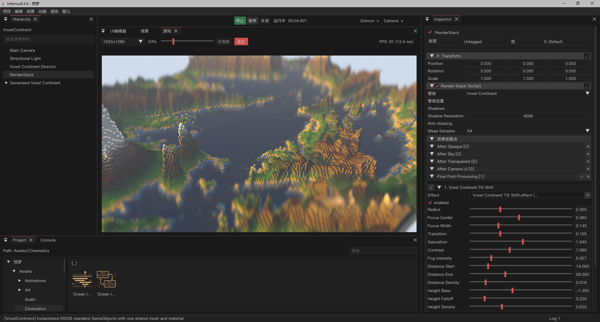

<p align="center">
  
</p>

<h1 align="center">Infernux · 熔炉</h1>

<p align="center">
  <strong>An experimental general-purpose game engine with a C++/GPU runtime and Python as a first-class development interface.</strong>
</p>

<p align="center">
  <a href="LICENSE"></a>
  
  
  
  
  
</p>

<p align="center">
  <a href="README-zh.md">简体中文</a> ·
  <a href="https://infernux-engine.com/">Website</a> ·
  <a href="https://infernux-engine.com/wiki.html">Documentation</a> ·
  <a href="https://infernux-engine.discourse.group/">Forum</a> ·
  <a href="https://github.com/ChenlizheMe/Infernux/releases">Releases</a>
</p>

<p align="center">
  
</p>

The image above is a real editor capture from the 0.3.4 showcase: 65,536
ordinary GameObjects share a mesh and material while a programmable RenderStack
applies lighting, fog, color treatment, tilt-shift depth of field, and MSAA.

## What Infernux is

Infernux is being built as a general-purpose game engine, not as an AI wrapper
around an existing editor. Performance-sensitive runtime work lives in C++17
and Vulkan. Gameplay, components, editor extensions, content workflows,
automation, and render orchestration use Python 3.12 through pybind11.

The long-term thesis is that an engine for the AI era needs more than a chat
panel. Models and agents need explicit access to engine semantics, world state,
high-throughput data, reproducible execution, and governed tools. Infernux has
some useful foundations for that direction today, but most of that system is
still planned work. The project does not claim otherwise.

## 0.3.6

The current public release is a Windows-first development baseline. It can be
used to author and package games on Windows x64, and it establishes a broad but
young set of traditional engine tools. Version 0.3.6 unifies scene and UI
objects in one Hierarchy, restores update discovery in packaged Hub builds, and
publishes independently installable full Hub packages.

| Available now | Planned for the 0.5.2 cycle |
|:--------------|:----------------------------|
| Windows x64 editor and Player export | Android APK/AAB and Web game packages |
| C++17/Vulkan runtime with Python 3.12 APIs | Linux Player and windowless/offscreen execution |
| Scene, components, assets, physics, audio, UI, animation, VFX, and editor workflows | Host-side Torch workflows and platform-specific Player inference |
| Hub, installer, wheel, runtime pack, and standalone game packaging | Authoritative reflection and Command/Query schemas |
| Editor-side MCP development and validation harness | Snapshot/delta, deterministic replay, batch worlds, and tensor data paths |
| Numba opt-in with pure-Python fallback | Permissioned, tested, lifecycle-managed Engine Tools |

Android, Web, and Linux Player builds are **not available in 0.3.6**. Infernux
also does not currently provide a general PyTorch Vulkan backend, arbitrary
Python-package compatibility in exported mobile/Web games, or a finished VLM/
LLM benchmark platform.

## Architecture

| Layer | Responsibility |
|:------|:---------------|
| C++17 / Vulkan | Rendering, resource ownership, scene state, physics, audio, and platform services |
| pybind11 | Typed native handles and APIs exposed to Python |
| Python | Gameplay, components, editor logic, automation, asset pipelines, and render authoring |

The intended boundary is simple: performance-sensitive state belongs to the
native runtime, while the public production workflow remains programmable from
Python. Stable identities, generation checks, document ownership, and explicit
transactions are used where arbitrary Python object lifetime would be unsafe.

Current subsystems include Vulkan Forward/Forward+/Deferred rendering, PBR,
RenderGraph and programmable RenderStack paths; Jolt physics; GUID-based asset
records and import artifacts; 2D/3D animation foundations; runtime Canvas UI;
GPU Particle Graph; prefabs; hot reload; and a multi-panel editor with shared
command, document, save, and undo/redo services.

## Why the next cycle is different

The road from 0.3.6 to 0.5.2 is organized around three connected delivery
tracks:

1. **Ship games beyond Windows.** Android and Web Player packages are the first
   product gate; Linux and headless rendering follow for deployment, CI, and
   simulation. Cross-platform Players may omit Numba and use an explicitly
   documented portable Python subset.
2. **Connect the existing ML ecosystem.** The Host/Editor should use standard
   PyTorch for development, training, and export. Shipped Players should carry
   only a suitable inference runtime and model, not a permanent CUDA Toolkit or
   the complete training stack. Android and Web providers will be selected from
   measured integration spikes rather than promised in advance.
3. **Make worlds and tools machine-usable.** Authoritative schemas,
   snapshot/replay, batched worlds, Torch/DLPack/buffer exchange, and formal
   Engine Tools are meant to serve editor UI, Python users, automation, and
   agents from the same semantics instead of accumulating parallel APIs.

Version 0.5.2 is the convergence point for this development cycle, not 1.0 and
not a claim that Infernux already replaces Unity, Unreal Engine, or Godot. See
the [public roadmap](https://infernux-engine.com/roadmap.html) for milestones.

## Start using the engine

For most users, download the current Windows x64 installer from
[GitHub Releases](https://github.com/ChenlizheMe/Infernux/releases/latest) and
let InfernuxHub install and manage engine versions.

To build from source, use Windows 10/11 x64, Python 3.12+, Vulkan SDK 1.3+,
CMake 3.22+, Visual Studio 2022, and the MSVC v143 toolset:

```bash
git clone --recurse-submodules https://github.com/ChenlizheMe/Infernux.git
cd Infernux
conda create -n infernux python=3.12 -y
conda activate infernux
pip install -r requirements.txt
cmake --preset release
cmake --build --preset release
```

Launch the Hub from source:

```bash
python packaging/launcher.py
```

Run Python and native test suites from the repository root:

```bash
python -m pytest python/test/ -v
cmake --preset native-tests
cmake --build --preset native-tests
ctest --preset native-tests --output-on-failure
```

## Documentation and maintenance

- [Documentation hub](https://infernux-engine.com/wiki.html)
- [API reference](https://infernux-engine.com/wiki/site/en/api/index.html)
- [Release notes](UpdateLog.md)
- [Contributing guide](CONTRIBUTING.md)
- [Repository automation](scripts/README.md)
- [Technical report](https://arxiv.org/pdf/2604.10263)

Repository-level commands live under `scripts/`; website-only deterministic
generators and contract tests live under `docs/tools/`. Build and package output
goes to `out/`, while final local release artifacts go to
`dist/releases/<version>/`.

Regenerate the checked-in API documentation intentionally with:

```bat
scripts\docs\update_api_docs.bat
```

## Citation

```bibtex
@software{chen2026infernux,
  author  = {Chen, Lizhe},
  title   = {Infernux},
  year    = {2026},
  version = {0.3.6},
  url     = {https://github.com/ChenlizheMe/Infernux}
}
```

## Contributing and license

Bug reports, feature requests, reproducible tests, platform bring-up work, and
workflow feedback are welcome. Because the engine is still young, include the
exact engine version, environment, reproduction steps, and affected layer in an
issue. Read [CONTRIBUTING.md](CONTRIBUTING.md), [SECURITY.md](SECURITY.md), and
[SUPPORT.md](SUPPORT.md) before submitting sensitive or large changes.

Infernux is released under the [MIT License](LICENSE).
