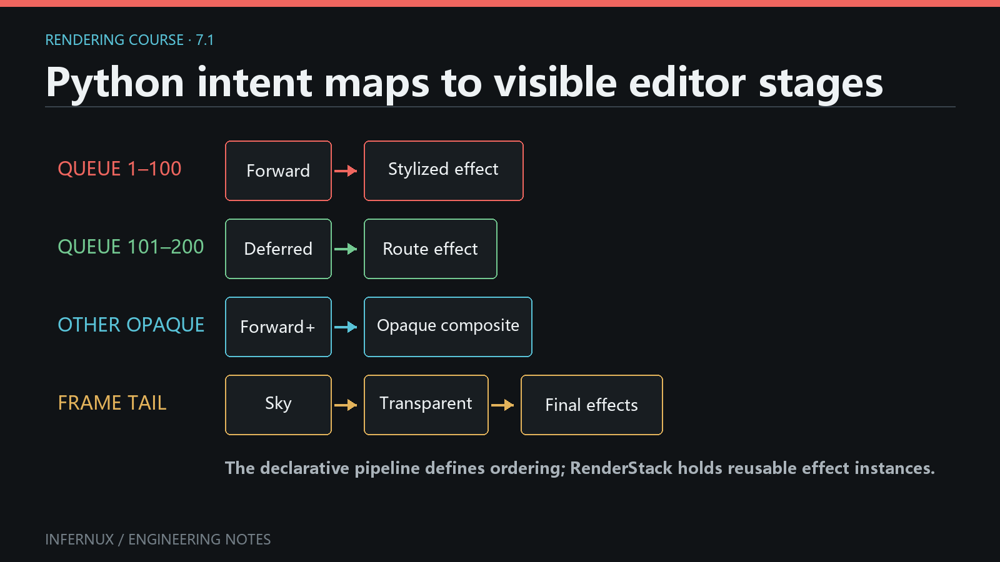

<!-- language:en -->

<span class="mini-tag">Custom Rendering · Chapter 7</span>

# Build a custom render pipeline

For most custom pipelines, start with the Python `RenderPipeline.define()` DSL. It describes frame policy, Material Queue ownership, render paths, composition order, and Effect mount points. The base class lowers that definition into a `RenderGraph`. Chapter 8 covers the lower-level `define_topology(graph)` API for techniques that need explicit resources and passes.

<div class="learn-article-toc"><strong>In this chapter</strong><a href="#discover-pipeline">Discover and select a pipeline</a><a href="#minimal-pipeline">A minimal pipeline</a><a href="#verify-recover">Verify and recover</a><a href="#mixed-pipeline">Mix render paths</a><a href="#route-rules">Queue and otherwise rules</a><a href="#pipeline-parameters">Pipeline parameters</a></div>

<div class="learn-note"><strong>First-pass finish line.</strong><p>Create the minimal Forward pipeline, select it on a RenderStack, and confirm that the baseline Cube, sky, transparent objects, and UI remain visible. A clean Console and a selectable pipeline complete the first pass. Mixed paths, Queue ownership, recovery, and serialized parameters extend that working baseline.</p></div>

<figure class="learn-figure">
  
  <figcaption>Conceptual map of the high-level definition and the stages exposed by RenderStack.</figcaption>
</figure>

## Discover and select a pipeline {#discover-pipeline}

Create `Assets/Rendering/simple_forward_pipeline.py` in the project. No registry call or package `__init__.py` is required: discovery scans the `Assets` tree for `.py` files, reads class inheritance without importing unrelated scripts, then imports files that lead to a `RenderPipeline` subclass. Indirect subclasses and subclasses of the built-in pipelines are included. Files whose names start with `_`, hidden directories, and common build or virtual-environment directories are skipped.

The class needs a non-empty `name` that does not start with `_`:

```python
import infernux as inx


class SimpleForwardPipeline(inx.renderstack.RenderPipeline):
    name = "Simple Forward"

    def define(self, pipeline):
        ...
```

The file uses the public `inx.renderstack.RenderPipeline` base; do not import it through another project script solely to trigger registration. After saving the file, wait for the asset refresh to finish, select the GameObject that owns the scene's `RenderStack` component, then choose **Simple Forward** from **Pipeline** in the RenderStack Inspector. Save the scene after the topology appears. The list shows `name`; the Python class name stays in code.

These names have different jobs:

- `SimpleForwardPipeline` is the Python class name. It identifies the implementation in code.
- `name = "Simple Forward"` is the discovery key, Inspector label, saved pipeline selection, and key for saved pipeline parameters. Keep it unique and stable. Two classes with the same `name` collide in the discovery dictionary; renaming it makes existing scenes look for the old selection.
- Strings passed to `effects()`, such as `"after_opaque"`, are EffectStage stable IDs. They bind saved Effect slots to topology. A stage `label` may change without breaking that binding; changing its stable ID leaves the old slots orphaned until they are remapped.

There is currently no separate stable-ID field for a pipeline. Despite the serialized field name `pipeline_class_name`, RenderStack stores the pipeline's `name` value.

If a candidate module fails to import, Editor discovery keeps the rest of the catalog available and omits the broken class until the script is fixed. Saving, creating, moving, or deleting a pipeline script invalidates the catalog; the active pipeline source is also watched for reload in the Editor.

Use the Editor Console to separate import failures from catalog problems. This diagnostic reads the same discovery functions used by RenderStack:

```python
import infernux as inx

print(sorted(inx.renderstack.discover_pipelines()))
print(inx.renderstack.discovery_import_failures())
```

An import failure entry is keyed by source path and includes the exception type and message. An empty failure map plus a missing name usually means the file was skipped, the class inheritance was not recognized, or `name` is empty or begins with `_`.

Duplicate pipeline names have a narrower current diagnostic boundary. Discovery stores `{pipeline.name: class}` and a later subclass silently replaces an earlier class under the same key. The Pipeline menu shows one entry and emits no collision diagnostic or candidate list. To identify the selected winner in the Console, run:

```python
import inspect
import infernux as inx

pipeline_type = inx.renderstack.discover_pipelines()["Simple Forward"]
print(pipeline_type.__module__, inspect.getsourcefile(pipeline_type))
```

Give every project pipeline a unique, stable `name`. After a rename, select the new name and save the scene again; the old saved selection and its parameter-store key are not migrated automatically.

## A minimal pipeline {#minimal-pipeline}

```python
import infernux as inx


class SimpleForwardPipeline(inx.renderstack.RenderPipeline):
    name = "Simple Forward"

    def define(self, pipeline):
        pipeline.frame(hdr=True, msaa=4)
        pipeline.shadows(resolution=4096)
        pipeline.lighting(clustered=False)

        with pipeline.opaque() as opaque:
            opaque.otherwise().forward()

        pipeline.effects("after_opaque", label="After Opaque")
        pipeline.sky()

        with pipeline.transparent() as transparent:
            transparent.otherwise().forward()

        pipeline.effects("final", label="Final Post Processing")
        pipeline.screen_ui()
```

`define()` records operations in order. `screen_ui()` must be the final DSL operation; it closes the standard Camera UI, post-process, display-encoding, and Screen UI tail. `frame()` accepts MSAA values `1`, `2`, `4`, or `8`. `lighting(clustered=True)` prepares the light data used by Forward+ routes.

This is the high-level API. Direct `graph.create_texture()` and `graph.add_pass()` calls belong in `define_topology(graph)`: the argument to `define()` is a `PipelineBuilder`. Choose one entry point for a pipeline.

## Verify and recover {#verify-recover}

Use a small scene with an active Camera, one RenderStack, one visible opaque renderer whose Material Queue is inside `0..2500`, and one visible transparent renderer whose queue is inside `2501..5000`.

1. Select **Simple Forward**. Both renderers should remain visible, and the RenderStack topology should list **After Opaque** and **Final Post Processing**.
2. Temporarily remove the transparent block, save the pipeline, and let the active pipeline reload. The transparent test renderer should disappear while the opaque renderer remains. Restore the block and save again.
3. Change `name` only as a separate migration test. The old selection will fall back because RenderStack serializes the display name; choose the new entry and save the scene.
4. Make one reversible syntax error and save. The script transaction rejects the new module. Check the Console, repair the file, and save again.

The recovery result depends on when failure occurs. A rejected script import does not publish the edited module. If a published topology rebuild then fails and this RenderStack already has a valid graph, the Console reports `Pipeline graph rebuild rejected` and the last valid graph keeps rendering until another invalidation. On the first Editor build, failure attempts `DefaultForwardPipeline`; a packaged Player reports the missing or failed custom pipeline and does not substitute Default Forward. Fixing and saving the active source invalidates the failed state and requests another build.

## Mix Forward, Forward+, and Deferred {#mixed-pipeline}

```python
import infernux as inx


class MixedArtPipeline(inx.renderstack.RenderPipeline):
    name = "Mixed Art Pipeline"

    def define(self, pipeline):
        pipeline.frame(hdr=True, msaa=4)
        pipeline.shadows()
        pipeline.lighting(clustered=True)

        with pipeline.opaque() as opaque:
            with opaque.layer("Stylized Objects") as layer:
                layer.forward(
                    inx.renderstack.Queue(1, 100),
                ).effects("low_queue", label="Stylized Forward")

                layer.deferred(
                    inx.renderstack.Queue(101, 200),
                    fallback=inx.renderstack.Path.FORWARD_PLUS,
                ).effects("middle_queue", label="Deferred Objects")

                layer.effects("stylized_combined", label="Stylized Combined")

            opaque.otherwise().forward_plus()
            opaque.effects("opaque_only", label="All Opaque")

        pipeline.effects("after_opaque", label="After Opaque Composite")
        pipeline.sky()

        with pipeline.transparent() as transparent:
            transparent.otherwise().forward_plus()

        pipeline.effects("final", label="Final Post Processing")
        pipeline.screen_ui()
```

Forward, Forward+, and Deferred select render paths; all three use the same material language. A compatible ShadingModel keeps the same `shading()` implementation. With MSAA greater than `1`, a Deferred route must declare `fallback=Path.FORWARD` or `Path.FORWARD_PLUS`; the compiler uses that fallback for the whole route.

Route effects see the route result. A layer effect sees the routes combined in that layer, a domain effect sees the domain result, and `pipeline.effects()` sees the accumulated scene composite at that position.

<figure class="learn-figure learn-figure-wide">
  
  <figcaption>Captured from the matching Infernux rendering setup. It shows the kind of deliberately split art direction that a project pipeline can compose.</figcaption>
</figure>

## Queue and otherwise rules {#route-rules}

Material Queue values are inclusive integers from `0` through `9999`, while the high-level DSL currently exposes two fixed domains: opaque is `0..2500`, and transparent is `2501..5000`. A selector must fit completely inside its domain. For example, `Queue(2400, 2600)` is rejected in both domains, and queues above `5000` have no standard domain in this DSL.

- Explicit Queue ranges cannot overlap anywhere in the same domain. Routes inside different layers still share that domain's ownership table.
- `forward()` or `forward_plus()` without a `Queue` selects the whole domain. It therefore cannot coexist with another explicit route in that domain.
- When a domain has no `otherwise()` route, unclaimed Queue values are left undrawn.
- `otherwise()` computes the complement of every explicit claim in the domain. It can produce several disjoint segments, all rendered by the one otherwise route.
- Only one `otherwise()` route is allowed across a domain, including all of its layers. Its position still controls when its contribution is composed; Queue ownership comes from the domain-wide complement.
- EffectStage stable IDs must be unique across the whole pipeline.

For example, explicit claims `Queue(1, 100)` and `Queue(201, 300)` in the opaque domain make `otherwise()` own `0`, `101..200`, and `301..2500`. The compiler rejects overlapping or out-of-domain ownership while building the topology.

Shadow casting uses its own queue. The declarative compiler draws shadow casters for Queue `0..2999`, and the built-in pipelines read the same defaults from `EngineConfig` (`shadow_caster_queue_min/max`). Materials with Queue `3000..9999` therefore do not cast shadows under the default settings, and route ownership does not change that. A project can adjust the engine queue bounds through `EngineConfig`; the DSL compiler currently keeps its own fixed range.

Two failure probes make the edge behavior reproducible:

```python
with pipeline.opaque() as opaque:
    opaque.forward(inx.renderstack.Queue(1, 100))
    opaque.forward_plus(inx.renderstack.Queue(100, 200))  # ValueError: routes overlap
```

The shared endpoint `100` is enough to overlap because ranges are inclusive. `Queue(20, 10)` is rejected when the selector is created because its minimum exceeds its maximum.

```python
with pipeline.opaque() as opaque:
    opaque.forward(inx.renderstack.Queue(0, 2500))
    opaque.otherwise().forward_plus()  # accepted, complement is empty
```

An empty `otherwise()` complement is currently accepted and contributes zero draw segments. Its route operation and any attached EffectStage can still be compiled, so remove an empty route instead of relying on it as a disabled branch. A domain with no routes also draws none of that domain; later sky, effects, and the frame tail can still run.

## Pipeline parameters {#pipeline-parameters}

Pipeline policy can be edited below the selected pipeline in the RenderStack Inspector:

```python
from enum import IntEnum

import infernux as inx


class Samples(IntEnum):
    OFF = 1
    X2 = 2
    X4 = 4
    X8 = 8


class AdjustablePipeline(inx.renderstack.RenderPipeline):
    name = "Adjustable Pipeline"

    msaa: Samples = inx.serialized_field(
        default=Samples.X4,
        enum_labels=["Off", "2x", "4x", "8x"],
        header="Anti-Aliasing",
    )

    def define(self, pipeline):
        pipeline.frame(hdr=True, msaa=int(self.msaa))
        with pipeline.opaque() as opaque:
            opaque.otherwise().forward()
        pipeline.screen_ui()
```

RenderStack saves parameter values under the pipeline `name`. A parameter edit invalidates the graph so topology and per-camera resources can be rebuilt. Values that belong to an Effect, such as intensity or tint, should remain in the `.effect` asset; changing them should not require a pipeline rebuild.

<div class="learn-note"><strong>Use the DSL until the technique needs more.</strong><p>Queue routing, route/layer/domain effects, sky, shadows, lighting policy, and the standard frame tail belong in <code>define()</code>. Move to <code>define_topology(graph)</code> when the technique needs a resource or pass relationship outside that vocabulary.</p></div>

<!-- language:zh -->

<span class="mini-tag">自定义渲染 · 第 7 章</span>

# 编写自定义渲染管线

多数自定义管线应从 Python `RenderPipeline.define()` DSL 开始。它负责描述帧策略、Material Queue 所有权、渲染路径、合成顺序与 Effect 挂载点。基类会把这份定义编译成 `RenderGraph`。需要显式资源和 Pass 的技术，再进入第 8 章介绍的低层 `define_topology(graph)` API。

<div class="learn-article-toc"><strong>本章内容</strong><a href="#discover-pipeline_1">发现并选择管线</a><a href="#minimal-pipeline_1">最小管线</a><a href="#verify-recover_1">验证与恢复</a><a href="#mixed-pipeline_1">混合渲染路径</a><a href="#route-rules_1">Queue 与 otherwise</a><a href="#pipeline-parameters_1">管线参数</a></div>

<div class="learn-note"><strong>第一次阅读的完成点。</strong><p>创建最小 Forward 管线，在 RenderStack 中选中它，确认基线 Cube、天空、透明物体与 UI 都能继续显示。管线可被选择且 Console 干净，就完成了第一轮；混合路径、Queue 所有权、失败恢复和序列化参数都从这条可用基线继续扩展。</p></div>

<figure class="learn-figure">
  
  <figcaption>概念示意：高层定义如何对应 RenderStack 暴露的各个阶段。</figcaption>
</figure>

## 发现并选择管线 {#discover-pipeline_1}

在项目中创建 `Assets/Rendering/simple_forward_pipeline.py`。无需注册调用，也无需添加包级 `__init__.py`：发现器会扫描 `Assets` 目录树，先读取 `.py` 文件中的类继承关系，不导入无关脚本；确认某个文件通向 `RenderPipeline` 子类后，才会导入它。间接继承的子类、继承内置管线的子类也能被发现。以下划线开头的文件、隐藏目录，以及常见的构建目录和虚拟环境目录会被跳过。

类必须提供非空且不以下划线开头的 `name`：

```python
import infernux as inx


class SimpleForwardPipeline(inx.renderstack.RenderPipeline):
    name = "Simple Forward"

    def define(self, pipeline):
        ...
```

文件应通过 `inx.renderstack.RenderPipeline` 使用公开基类；不要仅为触发注册而经由另一个项目脚本转接导入。保存后等待资产刷新完成，选中场景中挂有 `RenderStack` 组件的 GameObject，在 RenderStack Inspector 的 **Pipeline** 下拉框中选择 **Simple Forward**。拓扑显示后保存场景。列表显示 `name`；Python 类名留在代码中。

这三个名字各有用途：

- `SimpleForwardPipeline` 是 Python 类名，用于在代码中标识实现。
- `name = "Simple Forward"` 是发现键、Inspector 标签、场景保存的管线选择，也是管线参数的保存键。它应当全项目唯一并保持稳定。两个类使用同一个 `name` 会在发现字典中冲突；修改 `name` 后，旧场景仍会查找原来的值。
- `effects()` 的第一个字符串，例如 `"after_opaque"`，是 EffectStage 稳定 ID。场景靠它把已保存的 Effect Slot 重新挂到拓扑上。`label` 可以改而不破坏绑定；稳定 ID 改名后，旧 Slot 会成为 orphan，直到显式重映射。

当前管线本身没有另一套 stable ID。虽然序列化字段名叫 `pipeline_class_name`，RenderStack 实际保存的是管线 `name`。

候选模块导入失败时，Editor 仍会保留其它可用管线，只暂时不列出出错的类。修好脚本后再次保存即可重新发现。创建、保存、移动或删除管线脚本都会使目录缓存失效；Editor 也会监听当前管线源码并重新加载。

可以在 Editor Console 中运行下列代码，把导入失败与目录问题分开检查。这些函数也由 RenderStack 的发现流程使用：

```python
import infernux as inx

print(sorted(inx.renderstack.discover_pipelines()))
print(inx.renderstack.discovery_import_failures())
```

导入失败表以源码路径为键，值中包含异常类型和消息。失败表为空且名称缺失时，应检查文件是否被跳过、类继承能否被识别，以及 `name` 是否为空或以下划线开头。

同名管线的当前诊断范围更窄。发现结果保存为 `{pipeline.name: class}`，后遍历到的子类会静默覆盖同一个键中的早期子类。Pipeline 菜单只显示一项，也不会给出冲突诊断或候选列表。可在 Console 中确认当前胜出的类型与源码路径：

```python
import inspect
import infernux as inx

pipeline_type = inx.renderstack.discover_pipelines()["Simple Forward"]
print(pipeline_type.__module__, inspect.getsourcefile(pipeline_type))
```

项目中的每条管线都应使用唯一且稳定的 `name`。改名后需要选择新名称并重新保存场景；旧选择与旧参数存储键不会自动迁移。

## 最小管线 {#minimal-pipeline_1}

```python
import infernux as inx


class SimpleForwardPipeline(inx.renderstack.RenderPipeline):
    name = "Simple Forward"

    def define(self, pipeline):
        pipeline.frame(hdr=True, msaa=4)
        pipeline.shadows(resolution=4096)
        pipeline.lighting(clustered=False)

        with pipeline.opaque() as opaque:
            opaque.otherwise().forward()

        pipeline.effects("after_opaque", label="After Opaque")
        pipeline.sky()

        with pipeline.transparent() as transparent:
            transparent.otherwise().forward()

        pipeline.effects("final", label="Final Post Processing")
        pipeline.screen_ui()
```

`define()` 按书写顺序记录操作。`screen_ui()` 必须是 DSL 的最后一步，它会结束统一的 Camera UI、后处理、显示编码与 Screen UI 帧尾。`frame()` 接受 `1`、`2`、`4`、`8` 倍 MSAA；`lighting(clustered=True)` 则准备 Forward+ Route 使用的光照数据。

这是高层 API。`graph.create_texture()` 和 `graph.add_pass()` 这类直接调用属于 `define_topology(graph)`；`define()` 收到的参数类型是 `PipelineBuilder`。一条管线选择一个入口即可。

## 验证与恢复 {#verify-recover_1}

准备一个小场景：一台活动 Camera、一个 RenderStack、一个可见的不透明 Renderer（Material Queue 位于 `0..2500`），以及一个可见的透明 Renderer（Queue 位于 `2501..5000`）。

1. 选择 **Simple Forward**。两个 Renderer 都应保持可见，RenderStack 拓扑中应出现 **After Opaque** 与 **Final Post Processing**。
2. 暂时删除透明 Domain 代码并保存，等待活动管线重载。透明测试对象应消失，不透明对象仍可见。恢复代码后再次保存。
3. 只在单独的迁移测试中修改 `name`。RenderStack 保存的是显示名称，旧选择会进入回退流程；选择新条目并保存场景。
4. 制造一个容易撤销的语法错误并保存。脚本事务会拒绝新模块。查看 Console，修复文件，再次保存。

恢复结果取决于失败时机。脚本导入被拒绝时，编辑后的模块不会发布。已发布的拓扑重建失败且当前 RenderStack 已有有效 Graph 时，Console 会报告 `Pipeline graph rebuild rejected`，上一份有效 Graph 会继续渲染，直到下一次失效触发。Editor 首次构建失败时会尝试 `DefaultForwardPipeline`；打包 Player 会报告自定义管线缺失或失败，并保持错误可见，不会替换成 Default Forward。修复并保存活动源码会清除失败状态并请求再次构建。

## 混合 Forward、Forward+ 与 Deferred {#mixed-pipeline_1}

```python
import infernux as inx


class MixedArtPipeline(inx.renderstack.RenderPipeline):
    name = "Mixed Art Pipeline"

    def define(self, pipeline):
        pipeline.frame(hdr=True, msaa=4)
        pipeline.shadows()
        pipeline.lighting(clustered=True)

        with pipeline.opaque() as opaque:
            with opaque.layer("Stylized Objects") as layer:
                layer.forward(
                    inx.renderstack.Queue(1, 100),
                ).effects("low_queue", label="Stylized Forward")

                layer.deferred(
                    inx.renderstack.Queue(101, 200),
                    fallback=inx.renderstack.Path.FORWARD_PLUS,
                ).effects("middle_queue", label="Deferred Objects")

                layer.effects("stylized_combined", label="Stylized Combined")

            opaque.otherwise().forward_plus()
            opaque.effects("opaque_only", label="All Opaque")

        pipeline.effects("after_opaque", label="After Opaque Composite")
        pipeline.sky()

        with pipeline.transparent() as transparent:
            transparent.otherwise().forward_plus()

        pipeline.effects("final", label="Final Post Processing")
        pipeline.screen_ui()
```

Forward、Forward+ 与 Deferred 选择三条渲染路径，并共用一套材质语言。兼容的 ShadingModel 仍使用同一个 `shading()`。当 MSAA 大于 `1` 时，Deferred Route 必须显式提供 `fallback=Path.FORWARD` 或 `Path.FORWARD_PLUS`；编译器会让整条 Route 使用该回退路径。

Route Effect 读取该 Route 的结果；Layer Effect 读取该 Layer 内路由的合并结果；Domain Effect 读取整个 Domain；`pipeline.effects()` 则读取执行到当前位置时累计的场景 Composite。

<figure class="learn-figure learn-figure-wide">
  
  <figcaption>画面来自对应的 Infernux 渲染配置，用于展示项目管线可以组合出的割裂式美术风格。</figcaption>
</figure>

## Queue 与 otherwise 规则 {#route-rules_1}

Material Queue 的合法值是 `0..9999` 的闭区间整数；高层 DSL 当前提供两个固定 Domain：不透明是 `0..2500`，透明是 `2501..5000`。选择器必须完整落在所属 Domain 内。例如，`Queue(2400, 2600)` 放在哪个 Domain 都会被拒绝；`5000` 以上的 Queue 在这套 DSL 中也没有标准 Domain。

- 同一 Domain 内的显式 Queue 区间不能在任何位置重叠。即使 Route 位于不同 Layer，它们仍共用这张所有权表。
- 不带 `Queue` 的 `forward()` 或 `forward_plus()` 会选择整个 Domain，因此不能再与该 Domain 的其它显式 Route 共存。
- Domain 没有声明 `otherwise()` 时，无人领取的 Queue 不会被绘制。
- `otherwise()` 领取 Domain 内所有显式区间的补集。补集可以分成多段，但都由同一条 otherwise Route 渲染。
- 一个 Domain 连同其中所有 Layer 最多只能有一条 `otherwise()`。它的书写位置会影响合成时机；Queue 所有权由整个 Domain 的补集决定。
- EffectStage 稳定 ID 在整条管线中必须唯一。

例如，不透明 Domain 中显式领取 `Queue(1, 100)` 与 `Queue(201, 300)` 后，`otherwise()` 会领取 `0`、`101..200`、`301..2500`。重叠或越过 Domain 边界的所有权会在拓扑构建时直接报错。

阴影投射使用独立的队列区间。声明式编译器为 Queue `0..2999` 绘制阴影投射体，内置管线从 `EngineConfig`（`shadow_caster_queue_min/max`）读取相同默认值。因此默认设置下 Queue `3000..9999` 的材质不投射阴影，路由归属不会改变这一点。项目可以通过 `EngineConfig` 调整引擎队列边界；DSL 编译器目前使用自己的固定区间。

下面两个探针可以复现边界行为：

```python
with pipeline.opaque() as opaque:
    opaque.forward(inx.renderstack.Queue(1, 100))
    opaque.forward_plus(inx.renderstack.Queue(100, 200))  # ValueError: routes overlap
```

区间采用闭区间，公共端点 `100` 已构成重叠。`Queue(20, 10)` 会在创建 Selector 时被拒绝，因为最小值大于最大值。

```python
with pipeline.opaque() as opaque:
    opaque.forward(inx.renderstack.Queue(0, 2500))
    opaque.otherwise().forward_plus()  # 合法，但补集为空
```

空的 `otherwise()` 补集当前会通过校验，并贡献零个 Draw Segment。对应 Route 操作及其 EffectStage 仍可能进入编译流程，因此应删除空 Route，不要把它当作关闭分支的方式。Domain 中完全没有 Route 时，该 Domain 不绘制对象；后续天空、Effect 与帧尾仍可运行。

## 管线参数 {#pipeline-parameters_1}

管线策略可以显示在 RenderStack Inspector 的所选管线下方：

```python
from enum import IntEnum

import infernux as inx


class Samples(IntEnum):
    OFF = 1
    X2 = 2
    X4 = 4
    X8 = 8


class AdjustablePipeline(inx.renderstack.RenderPipeline):
    name = "Adjustable Pipeline"

    msaa: Samples = inx.serialized_field(
        default=Samples.X4,
        enum_labels=["Off", "2x", "4x", "8x"],
        header="Anti-Aliasing",
    )

    def define(self, pipeline):
        pipeline.frame(hdr=True, msaa=int(self.msaa))
        with pipeline.opaque() as opaque:
            opaque.otherwise().forward()
        pipeline.screen_ui()
```

RenderStack 以管线 `name` 为键保存参数。参数变化会使 Graph 失效，以便重建拓扑和每相机资源。强度、色调这类属于 Effect 的值应继续保存在 `.effect` 资产中；修改它们不应要求重建管线。

<div class="learn-note"><strong>先用 DSL，直到技术确实需要更多控制。</strong><p>Queue 路由、Route/Layer/Domain Effect、天空、阴影、光照策略和标准帧尾都属于 <code>define()</code>。技术需要 DSL 词汇之外的资源或 Pass 关系时，再进入 <code>define_topology(graph)</code>。</p></div>
