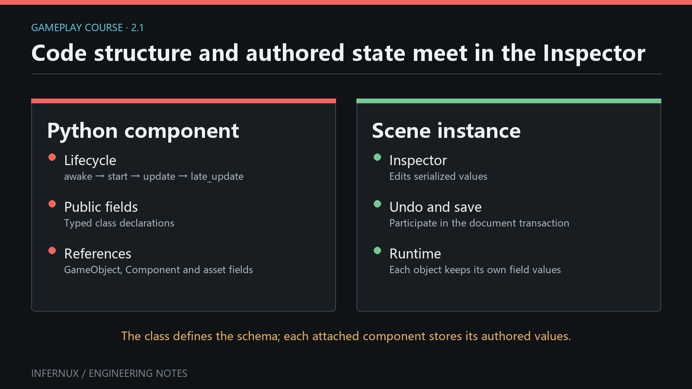

<!-- language:en -->

<span class="mini-tag">Gameplay Scripting · Chapter 2</span>

# GameObjects, components, and authored fields

The first component ran with values fixed in code. This chapter turns those values into scene-authored data, connects objects through Inspector references, and declares which component combinations are valid.

<div class="learn-article-toc"><strong>In this chapter</strong><a href="#build-the-component">Build the component</a><a href="#author-the-scene">Author the scene</a><a href="#fields">Serialized fields</a><a href="#references">Inspector references</a><a href="#constraints">Constraints</a><a href="#verify">Verify</a></div>

<figure class="learn-figure">
  
  <figcaption>Serialized fields preserve authored values; reference slots preserve scene identities and resolve them when the script reads the field.</figcaption>
</figure>

## Build the component {#build-the-component}

Create `TargetReporter.py` under `Assets` and use this complete script:

```python
from typing import Annotated

import infernux as inx


@inx.disallow_multiple
@inx.require_component(inx.Rigidbody)
class TargetReporter(inx.InxComponent):
    speed: Annotated[
        float,
        inx.components.Header("Movement"),
        inx.components.Range(0.0, 12.0),
        inx.components.Tooltip("Maximum movement speed in units per second."),
    ] = 3.0

    target: Annotated[
        inx.GameObject,
        inx.components.Header("References"),
        inx.components.RequiredComponent("MeshRenderer"),
        inx.components.Tooltip("Target must have a MeshRenderer."),
    ]

    body: inx.Rigidbody = inx.component_field(
        component_type="Rigidbody",
        tooltip="Rigidbody used by this reporter.",
    )

    def start(self) -> None:
        if self.target is None or self.body is None:
            inx.Debug.log_warning("TargetReporter has an unassigned reference.", self)
            return

        inx.Debug.log(
            f"{self.game_object.name} -> {self.target.name}; speed={self.speed}",
            self,
        )
```

The imports and declarations above are public APIs. `Annotated` metadata controls Inspector presentation and validation. `component_field()` creates a typed component-reference slot.

## Author the scene {#author-the-scene}

1. Create a **Cube** in Hierarchy and name it `Target`. Keep its `MeshRenderer`.
2. Create an empty GameObject named `Reporter`.
3. Select `Reporter`, click **Add Component**, and add **Rigidbody** first.
4. Add **TargetReporter**. Its `@require_component(Rigidbody)` requirement is satisfied. Skipping step 3 also works: the engine auto-adds a missing required component during attachment.
5. Set **Speed** to `6`. Drag `Target` from Hierarchy into **Target**. Drag `Reporter` into **Body**; the slot resolves its `Rigidbody`.
6. Save the scene, clear the Console, and enter Play mode.

The expected log is `Reporter -> Target; speed=6.0`. The exact numeric formatting follows Python's float formatting.

## Serialized fields {#fields}

Supported public annotations include `int`, `float`, `bool`, `str`, vectors, enums, known asset references, `GameObject`, component subclasses, lists of supported types, and serializable objects. A supported public class attribute is collected as a serialized field. Explicit `serialized_field(...)` remains useful when keyword metadata is clearer.

`Range(0.0, 12.0)` supplies a slider and enforces the numeric bounds on Inspector edits, deserialization, and script assignment. `Header` adds a section label and `Tooltip` adds hover help. The scene stores the edited value, so changing the class default later does not overwrite an already-authored scene value.

Use private `_name` attributes for transient state. Use `serialized_field(..., hidden=True)` when data must be saved but omitted from the Inspector. Regular mutable runtime caches should be rebuilt in lifecycle callbacks and kept out of serialized fields.

Under the hood, numeric fields (`int`, `float`, `bool`, `Vector2/3/4`) are backed by the native ComponentDataStore, a column store that keeps script data cache-friendly and outside Python objects; other field kinds live in the Python descriptor. The Inspector reads the same collected metadata to build its controls, and the scene document stores the values on save. Runtime assignments change the in-memory value only; Play mode restores the authored scene from its snapshot when you stop, so a script that writes a serialized field does not persist that write unless the scene is saved.

## Inspector references {#references}

`target` is a GameObject field. Its stored form is a persistent scene-object reference; reading `self.target` resolves and returns the live `GameObject`, or `None` when the target is missing or destroyed. `RequiredComponent("MeshRenderer")` filters the picker and rejects Hierarchy drops whose object has no matching component.

`body` stores a component reference constrained to `Rigidbody`. Reading `self.body` returns the resolved component wrapper or `None`. A reference field does not add the referenced component and does not keep a destroyed object alive. Always handle `None`, especially for optional targets or objects that can be destroyed during play.

Scene-object and component slots accept Hierarchy selections through drag-and-drop or their picker. Save the scene after assignment so the persistent IDs are written to the scene document.

## Component constraints {#constraints}

The two class decorators govern attachment:

- `@require_component(Rigidbody)` declares that `TargetReporter` depends on a `Rigidbody` on the same GameObject. When the dependency is missing, the engine adds it automatically during attachment; if any required component cannot be added, the whole operation rolls back and returns `None` with a warning. Removing a component that another component still requires is blocked.
- `@disallow_multiple` allows one `TargetReporter` instance per GameObject. A second add attempt is rejected.

These decorators constrain the owner's component set. `RequiredComponent("MeshRenderer")` belongs to a GameObject reference field and constrains which target can be assigned. The two mechanisms solve different authoring problems.

## Verify the contracts {#verify}

Run these checks in order:

1. On a fresh empty GameObject, add `TargetReporter` before `Rigidbody`. The engine auto-adds the missing `Rigidbody`, and both components appear in the list.
2. Try to remove `Rigidbody` while `TargetReporter` still exists. The removal is blocked with a warning because another component requires it.
3. Try to add `TargetReporter` again. The second instance should be refused.
4. Try to assign an empty GameObject to **Target**. The reference should remain unchanged because the object has no `MeshRenderer`.
5. Assign the Cube and the Reporter Rigidbody, set Speed to `6`, save, leave and re-open the scene, and confirm all three authored values remain.
6. Enter Play. Confirm the single expected log and no warning about unassigned references.

## Common errors

- **Rigidbody appeared when adding TargetReporter.** `@require_component` auto-adds missing dependencies; add the dependency manually first when that behavior is unwanted.
- **A target drop is ignored.** The selected object must contain a `MeshRenderer`; the field constraint checks the component type name exactly.
- **The code sees `None`.** Assign and save the slot, and make sure the referenced scene object or component still exists.
- **A field is absent from Inspector.** Keep it public, use a supported annotation or `serialized_field`, and inspect the Console for an annotation/import failure.
- **A value never exceeds the Range maximum.** Range is enforced as a data constraint, including assignments from Python.
- **The scene has stale values after a default changes.** Existing serialized values win. Reset or edit the component when you want new authored data.

## Next chapter

[Input, time, and movement](gameplay-input-movement.html) uses these authored values and component lookups to build frame-rate-independent control.

<!-- language:zh -->

<span class="mini-tag">玩法脚本 · 第 2 章</span>

# GameObject、组件与可编辑字段

上一章把固定值写在代码里。本章会把这些值变成场景可编辑数据，通过 Inspector 引用连接物体，并声明有效的组件组合。

<div class="learn-article-toc"><strong>本章内容</strong><a href="#build-the-component_1">编写组件</a><a href="#author-the-scene_1">编辑场景</a><a href="#fields_1">序列化字段</a><a href="#references_1">Inspector 引用</a><a href="#constraints_1">组件约束</a><a href="#verify_1">验证结果</a></div>

<figure class="learn-figure">
  
  <figcaption>序列化字段保存编辑值；引用槽保存场景身份，脚本读取字段时再解析实时对象。</figcaption>
</figure>

## 编写组件 {#build-the-component_1}

在 `Assets` 下创建 `TargetReporter.py`，写入下面的完整脚本：

```python
from typing import Annotated

import infernux as inx


@inx.disallow_multiple
@inx.require_component(inx.Rigidbody)
class TargetReporter(inx.InxComponent):
    speed: Annotated[
        float,
        inx.components.Header("Movement"),
        inx.components.Range(0.0, 12.0),
        inx.components.Tooltip("Maximum movement speed in units per second."),
    ] = 3.0

    target: Annotated[
        inx.GameObject,
        inx.components.Header("References"),
        inx.components.RequiredComponent("MeshRenderer"),
        inx.components.Tooltip("Target must have a MeshRenderer."),
    ]

    body: inx.Rigidbody = inx.component_field(
        component_type="Rigidbody",
        tooltip="Rigidbody used by this reporter.",
    )

    def start(self) -> None:
        if self.target is None or self.body is None:
            inx.Debug.log_warning("TargetReporter has an unassigned reference.", self)
            return

        inx.Debug.log(
            f"{self.game_object.name} -> {self.target.name}; speed={self.speed}",
            self,
        )
```

这里的导入和声明都来自公开 API。`Annotated` 元数据控制 Inspector 展示与校验，`component_field()` 创建带类型筛选的组件引用槽。

## 编辑场景 {#author-the-scene_1}

1. 在 Hierarchy 中创建 **Cube**，命名为 `Target`，保留它的 `MeshRenderer`。
2. 创建空 GameObject，命名为 `Reporter`。
3. 选中 `Reporter`，点击 **Add Component**，先添加 **Rigidbody**。
4. 添加 **TargetReporter**。此时它的 `@require_component(Rigidbody)` 条件已经满足。跳过第 3 步也可以：引擎会在挂载时自动补上缺失的依赖组件。
5. 把 **Speed** 设为 `6`。从 Hierarchy 把 `Target` 拖入 **Target**；把 `Reporter` 拖入 **Body**，该槽会解析它的 `Rigidbody`。
6. 保存场景，清空 Console，进入 Play 模式。

预期日志为 `Reporter -> Target; speed=6.0`。具体数值格式遵循 Python 的浮点格式化结果。

## 序列化字段 {#fields_1}

公开注解支持 `int`、`float`、`bool`、`str`、向量、枚举、已知资产引用、`GameObject`、组件子类、受支持类型的列表和可序列化对象。带受支持类型的公开类属性会被收集为序列化字段。需要用关键字集中表达元数据时，可以显式使用 `serialized_field(...)`。

`Range(0.0, 12.0)` 提供滑块，并对 Inspector 编辑、反序列化和脚本赋值统一执行数值边界。`Header` 添加分区标题，`Tooltip` 添加悬停提示。场景会保存编辑后的值；以后修改类默认值，不会覆盖场景里已经写入的值。

临时状态适合放在私有 `_name` 属性中。数据需要保存且无需出现在 Inspector 时，使用 `serialized_field(..., hidden=True)`。普通运行时缓存应在生命周期回调中重建，并避开序列化字段。

底层实现上，数值字段（`int`、`float`、`bool`、`Vector2/3/4`）由原生 ComponentDataStore 支撑，这是一种列式存储，让脚本数据留在 Python 对象之外、访问更快；其余字段种类存在 Python 描述符里。Inspector 读取同一份收集到的元数据来生成控件，保存场景时这些值写入场景文档。运行时赋值只改变内存中的值；停止 Play 时引擎从快照恢复已编辑的场景，脚本对序列化字段的写入只有保存场景后才会落盘。

## Inspector 引用 {#references_1}

`target` 是 GameObject 字段。存储层保存持久场景物体引用；读取 `self.target` 时会解析并返回实时 `GameObject`，目标缺失或已销毁时返回 `None`。`RequiredComponent("MeshRenderer")` 会筛选选择器，并拒绝缺少对应组件的 Hierarchy 拖放对象。

`body` 保存限定为 `Rigidbody` 的组件引用。读取 `self.body` 会得到解析后的组件包装器，无法解析时返回 `None`。引用字段不会添加目标组件，也不会让已销毁物体继续存活。可选目标或运行中可能销毁的物体都要处理 `None`。

场景物体槽与组件槽支持从 Hierarchy 拖放，也可以使用选择器。赋值后保存场景，持久 ID 才会写入场景文档。

## 组件约束 {#constraints_1}

两个类装饰器控制挂载规则：

- `@require_component(Rigidbody)` 声明 `TargetReporter` 依赖同一 GameObject 上的 `Rigidbody`。依赖缺失时，引擎会在挂载过程中自动补加；任何必需组件无法添加时，整个操作回滚并返回 `None`，同时给出警告。删除仍被其他组件依赖的组件会被阻止。
- `@disallow_multiple` 让每个 GameObject 最多拥有一个 `TargetReporter`，第二次添加会被拒绝。

这两个装饰器约束所属物体的组件集合。`RequiredComponent("MeshRenderer")` 用在 GameObject 引用字段上，负责限制可赋值目标。两类机制处理不同的编辑关系。

## 验证约束与保存结果 {#verify_1}

按顺序完成以下检查：

1. 在新的空 GameObject 上，先添加 `TargetReporter`。引擎会自动补上缺失的 `Rigidbody`，两个组件都应出现在列表中。
2. 在 `TargetReporter` 仍然存在时尝试删除 `Rigidbody`。删除会被阻止，并给出组件仍被依赖的警告。
3. 再添加一次 `TargetReporter`。第二个实例应被拒绝。
4. 尝试把空 GameObject 赋给 **Target**。该物体没有 `MeshRenderer`，引用应保持原值。
5. 赋值 Cube 与 Reporter 的 Rigidbody，把 Speed 设为 `6`，保存并重新打开场景，确认三个编辑值都还在。
6. 进入 Play，确认只出现一条预期日志，且没有未赋值引用警告。

## 常见错误

- **添加 TargetReporter 时 Rigidbody 意外出现。** `@require_component` 会在依赖缺失时自动补加；不需要自动行为时，先手动添加依赖组件。
- **拖放目标没有反应。** 目标物体必须包含 `MeshRenderer`；字段约束会准确匹配组件类型名。
- **代码读到 `None`。** 给槽位赋值并保存，同时确认引用的场景物体或组件仍然存在。
- **Inspector 没有显示字段。** 保持字段公开，使用受支持注解或 `serialized_field`，并检查 Console 中的注解或导入错误。
- **数值始终无法超过 Range 上限。** Range 同时是数据约束，Python 赋值也会执行该范围。
- **默认值修改后场景仍显示旧值。** 已保存的序列化值优先。需要新值时，在 Inspector 中编辑或重置组件。

## 下一章

[输入、时间与移动](gameplay-input-movement.html)会使用这些编辑值与组件查询，构建不受帧率影响的控制逻辑。
