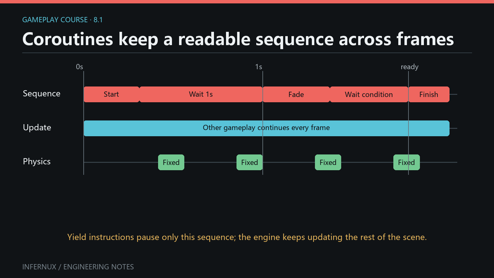

<!-- language:en -->

<span class="mini-tag">Gameplay · Chapter 8</span>

# Coroutines and multi-frame sequences

Some gameplay reactions have a clear order but span several frames: wait, hand work to physics, watch a condition, then finish an effect. Infernux coroutines let an `InxComponent` write that order as a Python generator. A yielded instruction pauses only that generator while the rest of the scene continues to update.

<div class="learn-article-toc"><strong>In this chapter</strong><a href="#coroutine-model">Coroutine model</a><a href="#editor-setup">Editor setup</a><a href="#complete-tour">Complete tour</a><a href="#wait-semantics">Wait semantics</a><a href="#handles-cancellation">Handles and cancellation</a><a href="#lifetime">Lifetime rules</a><a href="#verify">Verify the result</a><a href="#common-errors">Common errors</a><a href="#next">Where to go next</a></div>

<figure class="learn-figure">
  
  <figcaption>A coroutine preserves sequence order across frames; it does not block Update, physics, or other coroutines.</figcaption>
</figure>

## The generator model {#coroutine-model}

A coroutine method contains `yield`, so calling it creates a generator. Pass that generator object to `start_coroutine()`:

```python
def start(self):
    self._handle = self.start_coroutine(self.flash())

def flash(self):
    inx.Debug.log("flash starts")
    yield inx.WaitForSeconds(0.5)
    inx.Debug.log("flash ends")
```

`start_coroutine()` runs the generator immediately until its first `yield`. In the example, `flash starts` is logged inside `start()`. The returned `Coroutine` handle represents the scheduled continuation. Its `is_finished` property becomes `True` after normal completion or cancellation.

The scheduler is cooperative and belongs to the component. A coroutine must yield for other phases to advance it; it should not contain a long blocking loop, `time.sleep()`, file wait, or busy polling.

## Prepare the Editor {#editor-setup}

1. Create an empty GameObject named `CoroutineLab`.
2. Create `Assets/Scripts/coroutine_tour.py` and paste the complete component below.
3. Attach `CoroutineTour` to `CoroutineLab`.
4. Open **Console**, clear old messages, and enter Play mode.

The example needs no Collider or Rigidbody. `inx.WaitForFixedUpdate()` waits for the engine's next fixed-update phase even when this component does not override `fixed_update()`.

## Run every wait type {#complete-tour}

```python
import infernux as inx


class CoroutineTour(inx.InxComponent):
    def awake(self):
        self._sequence_handle = None
        self._gate_open = False
        self._busy = False

    def start(self):
        self._sequence_handle = self.start_coroutine(self.run_sequence())

    def run_sequence(self):
        inx.Debug.log("1. sequence started immediately", self)

        yield None
        inx.Debug.log("2. one update frame passed", self)

        yield inx.WaitForFrames(2)
        inx.Debug.log("3. two more update frames passed", self)

        yield inx.WaitForSeconds(0.5)
        inx.Debug.log("4. 0.5 scaled seconds passed", self)

        yield inx.WaitForSecondsRealtime(0.25)
        inx.Debug.log("5. 0.25 real seconds passed", self)

        yield inx.WaitForFixedUpdate()
        inx.Debug.log("6. resumed in fixed update", self)

        yield inx.WaitForEndOfFrame(2)
        inx.Debug.log("7. two late-update phases passed", self)

        self._gate_open = False
        self.start_coroutine(self.open_gate_later())
        yield inx.WaitUntil(lambda: self._gate_open)
        inx.Debug.log("8. WaitUntil observed an open gate", self)

        self._busy = True
        self.start_coroutine(self.clear_busy_later())
        yield inx.WaitWhile(lambda: self._busy)
        inx.Debug.log("9. WaitWhile observed idle state", self)

        child = self.start_coroutine(self.child_sequence())
        yield child
        inx.Debug.log("10. child finished; parent finished", self)

    def open_gate_later(self):
        yield inx.WaitForSeconds(0.2)
        self._gate_open = True

    def clear_busy_later(self):
        yield inx.WaitForFrames(2)
        self._busy = False

    def child_sequence(self):
        inx.Debug.log("child started immediately", self)
        yield inx.WaitForSeconds(0.2)
        inx.Debug.log("child completed", self)

    def cancel_sequence(self):
        """May be bound to a UI Button."""
        handle = self._sequence_handle
        if handle is not None and not handle.is_finished:
            self.stop_coroutine(handle)

    def cancel_everything(self):
        """Stops the parent and every helper owned by this component."""
        self.stop_all_coroutines()
```

The helper generators make the predicates change without input. In a game, those flags can be set by animation callbacks, collision events, UI actions, loading completion, or another component.

## Complete waiting semantics {#wait-semantics}

Each yielded value selects the phase that will check the coroutine next.

| Yielded value | Resume rule | Check phase |
| --- | --- | --- |
| `yield None` or bare `yield` | Wait one update frame. | `update` |
| `inx.WaitForFrames(n)` | Resume after exactly `n` update-phase checks. `n` must be an integer of at least 1; `bool` is rejected. | `update` |
| `inx.WaitForSeconds(seconds)` | Accumulate the update-phase frame delta until it reaches `seconds`. | `update` |
| `inx.WaitForSecondsRealtime(seconds)` | Resume on the first update check at or after its wall-clock target. | `update` |
| `inx.WaitForFixedUpdate()` | Resume on the next fixed-update scheduler pass. | `fixed_update` |
| `inx.WaitForEndOfFrame(n)` | Resume after `n` late-update scheduler passes. `n` has the same integer validation as `WaitForFrames`. | `late_update` |
| `inx.WaitUntil(predicate)` | Call `predicate()` on update checks and resume when its result is truthy. | `update` |
| `inx.WaitWhile(predicate)` | Call `predicate()` on update checks and resume when its result becomes falsy. | `update` |
| a `Coroutine` handle | Resume after that handle is finished, including when it was stopped. | `update` |
| any unsupported value | Current runtime treats it like a one-update-frame wait. | `update` |

`WaitForSeconds` accumulates the frame delta handed to the coroutine scheduler. The scheduler currently forwards the same raw, unscaled delta that `update()` receives, so `Time.time_scale` does not slow this wait today; the instruction's docstring still describes scaled time, which the current call path does not deliver. `WaitForSecondsRealtime` uses wall-clock time, though it can only resume when an update check occurs. Construct realtime waits immediately before yielding them because their target time is set in the constructor.

`WaitForEndOfFrame` means the coroutine scheduler's late-update phase. It does not promise that rendering, presentation, or a screenshot has completed.

Zero or negative values are accepted by the two seconds-based instructions and become ready at the next update check. Frame-based instructions reject values below 1. For clear intent, use `yield None` when you want one frame.

Wait instructions carry mutable elapsed, target, or remaining state. Create a fresh `WaitForSeconds`, `WaitForSecondsRealtime`, `WaitForFrames`, or `WaitForEndOfFrame` for each wait instead of caching one instance across coroutines.

## Handles, children, and cancellation {#handles-cancellation}

The component API has three operations:

| API | Effect |
| --- | --- |
| `start_coroutine(generator)` | Starts immediately, returns a `Coroutine` handle. |
| `stop_coroutine(handle)` | Stops that handle and closes its generator. |
| `stop_all_coroutines()` | Stops and closes every coroutine owned by this component. |

To wait for a child, start it and yield the returned handle:

```python
child = self.start_coroutine(self.child_sequence())
yield child
```

Yielding `self.child_sequence()` directly produces an unsupported generator value. The current fallback waits one update frame and never schedules that generator. Always use `start_coroutine()` when the child needs independent scheduling and a handle.

Stopping a generator marks its handle finished and calls `close()`. Put essential generator-local cleanup in `finally`:

```python
def temporary_state(self):
    self._busy = True
    try:
        yield inx.WaitForSeconds(5.0)
    finally:
        self._busy = False
```

The public handle also exposes `creation_epoch`, `creation_epoch_id`, and `is_legacy` for runtime-reload diagnostics. Gameplay flow normally needs only `is_finished`.

Stopping only the parent does not automatically stop helper coroutines that were started separately. Use `stop_all_coroutines()` when the whole component-owned sequence should end together, or retain and stop each helper handle explicitly.

## Component lifetime rules {#lifetime}

- Disabling an `InxComponent` does not stop its Unity-style coroutines. Call a stop method in `on_disable()` when your design requires that behavior.
- Deactivating the owning GameObject stops all of its component's coroutines and discards that component scheduler.
- A completed or stopped coroutine stays represented by its handle with `is_finished == True`.
- Starting a generator that completes before its first useful wait returns an already-finished handle.
- An exception raised while advancing coroutine body code ends that coroutine and is routed to the Editor Console with the component as context.

These rules make cancellation explicit at the component boundary and prevent a deactivated object from retaining scheduled gameplay work.

## Verify the result {#verify}

1. Enter Play mode and watch Console. Message 1 should appear immediately during `start()`; messages 2–10 should remain in numeric order.
2. Confirm that messages 2 and 3 are separated by update frames, then observe the scaled-time and real-time delays.
3. Message 6 should follow a fixed-update pass. Message 7 should appear after two late-update passes.
4. The gate and busy helpers should allow messages 8 and 9 to appear without input.
5. `child started immediately` should appear before its delay, followed by `child completed`, then parent message 10 on a later update check.
6. Bind a UI Button to `cancel_sequence()` and press it before completion. The parent handle should finish with no later parent messages. Run again and bind `cancel_everything()` to stop parent and helpers together.

To inspect a handle during development, log `self._sequence_handle.is_finished`. Remove per-frame diagnostic logging after the check so Console remains useful.

## Common errors {#common-errors}

- **Passing the method instead of its generator**: call `self.start_coroutine(self.run_sequence())`, including the final parentheses.
- **Using `time.sleep()`**: it blocks the thread and freezes other engine work. Yield `inx.WaitForSecondsRealtime()` for a wall-clock delay.
- **Expecting an exact timestamp**: waits resume on scheduler checks, so a duration is a minimum and can overshoot by part of a frame.
- **Expecting `WaitForSeconds` to respect pause**: the current scheduler feeds the raw update delta, so `time_scale` does not change this wait. Use realtime waiting for wall-clock delays, and accumulate `Time.delta_time` manually when a sequence must follow the game clock.
- **Treating `WaitForEndOfFrame` as post-render capture**: it maps to late update in the current scheduler.
- **Reusing one wait instance**: elapsed and remaining fields belong to that object. Construct a new instruction at each `yield`.
- **Yielding a generator directly**: start it first and yield its `Coroutine` handle.
- **Cancelling the parent and leaving helpers active**: retain helper handles or stop all component-owned coroutines.
- **Assuming component disable cancels work**: add explicit `on_disable()` cleanup when that is the intended lifetime.
- **Writing a loop with no `yield`**: the generator never returns control to the scheduler and can stall the frame.

## Where to go next {#next}

You now have the complete gameplay foundation: components, authored fields, input, runtime object lifetime, physics callbacks, UI and scene flow, audio signals, and multi-frame sequences. Combine them by keeping immediate state transitions in events and moving readable, cancellable follow-up sequences into coroutines.

<!-- language:zh -->

<span class="mini-tag">游戏玩法 · 第 8 章</span>

# 协程与跨帧流程

一些游戏反应有明确顺序，同时会跨越多个帧：等待、把工作交给物理阶段、观察条件，再结束效果。Infernux 协程允许 `InxComponent` 用 Python 生成器表达这段顺序。等待指令只暂停当前生成器，场景中的其他更新会继续运行。

<div class="learn-article-toc"><strong>本章内容</strong><a href="#zh-coroutine-model">协程模型</a><a href="#zh-editor-setup">编辑器设置</a><a href="#zh-complete-tour">完整演练</a><a href="#zh-wait-semantics">等待语义</a><a href="#zh-handles-cancellation">句柄与取消</a><a href="#zh-lifetime">生命周期</a><a href="#zh-verify">验证结果</a><a href="#zh-common-errors">常见错误</a><a href="#zh-next">后续实践</a></div>

<figure class="learn-figure">
  
  <figcaption>协程把跨帧步骤保持为可读顺序，同时允许 Update、物理和其他协程继续运行。</figcaption>
</figure>

## 生成器模型 {#zh-coroutine-model}

协程方法包含 `yield`，调用后会创建生成器。把这个生成器对象传给 `start_coroutine()`：

```python
def start(self):
    self._handle = self.start_coroutine(self.flash())

def flash(self):
    inx.Debug.log("flash starts")
    yield inx.WaitForSeconds(0.5)
    inx.Debug.log("flash ends")
```

`start_coroutine()` 会立即运行生成器，直到遇到第一个 `yield`。上例中的 `flash starts` 会在 `start()` 内记录。返回的 `Coroutine` 句柄代表后续调度；正常结束或取消后，`is_finished` 都会变成 `True`。

调度器采用协作式执行，每个组件各自持有。协程需要主动 `yield`，调度器才能在后续阶段继续推进。协程中不应放入耗时阻塞循环、`time.sleep()`、同步文件等待或忙轮询。

## 准备编辑器 {#zh-editor-setup}

1. 创建名为 `CoroutineLab` 的空 GameObject。
2. 创建 `Assets/Scripts/coroutine_tour.py`，粘贴下面的完整组件。
3. 把 `CoroutineTour` 挂到 `CoroutineLab`。
4. 打开 **Console**，清除旧消息，再进入 Play 模式。

示例不需要 Collider 或 Rigidbody。即使组件没有重写 `fixed_update()`，`inx.WaitForFixedUpdate()` 仍会等待引擎的下一个固定更新阶段。

## 运行全部等待类型 {#zh-complete-tour}

```python
import infernux as inx


class CoroutineTour(inx.InxComponent):
    def awake(self):
        self._sequence_handle = None
        self._gate_open = False
        self._busy = False

    def start(self):
        self._sequence_handle = self.start_coroutine(self.run_sequence())

    def run_sequence(self):
        inx.Debug.log("1. sequence started immediately", self)

        yield None
        inx.Debug.log("2. one update frame passed", self)

        yield inx.WaitForFrames(2)
        inx.Debug.log("3. two more update frames passed", self)

        yield inx.WaitForSeconds(0.5)
        inx.Debug.log("4. 0.5 scaled seconds passed", self)

        yield inx.WaitForSecondsRealtime(0.25)
        inx.Debug.log("5. 0.25 real seconds passed", self)

        yield inx.WaitForFixedUpdate()
        inx.Debug.log("6. resumed in fixed update", self)

        yield inx.WaitForEndOfFrame(2)
        inx.Debug.log("7. two late-update phases passed", self)

        self._gate_open = False
        self.start_coroutine(self.open_gate_later())
        yield inx.WaitUntil(lambda: self._gate_open)
        inx.Debug.log("8. WaitUntil observed an open gate", self)

        self._busy = True
        self.start_coroutine(self.clear_busy_later())
        yield inx.WaitWhile(lambda: self._busy)
        inx.Debug.log("9. WaitWhile observed idle state", self)

        child = self.start_coroutine(self.child_sequence())
        yield child
        inx.Debug.log("10. child finished; parent finished", self)

    def open_gate_later(self):
        yield inx.WaitForSeconds(0.2)
        self._gate_open = True

    def clear_busy_later(self):
        yield inx.WaitForFrames(2)
        self._busy = False

    def child_sequence(self):
        inx.Debug.log("child started immediately", self)
        yield inx.WaitForSeconds(0.2)
        inx.Debug.log("child completed", self)

    def cancel_sequence(self):
        """可绑定到 UI Button。"""
        handle = self._sequence_handle
        if handle is not None and not handle.is_finished:
            self.stop_coroutine(handle)

    def cancel_everything(self):
        """停止此组件持有的父流程和全部辅助流程。"""
        self.stop_all_coroutines()
```

辅助生成器会自动改变条件，无需输入。实际项目中的标志可以由动画回调、碰撞事件、UI 操作、加载完成信号或其他组件设置。

## 完整等待语义 {#zh-wait-semantics}

每个 `yield` 值都会决定调度器下一次检查协程的阶段。

| `yield` 值 | 恢复规则 | 检查阶段 |
| --- | --- | --- |
| `yield None` 或单独 `yield` | 等待一个更新帧。 | `update` |
| `inx.WaitForFrames(n)` | 经过恰好 `n` 次更新阶段检查后恢复。`n` 必须是至少为 1 的整数，`bool` 会被拒绝。 | `update` |
| `inx.WaitForSeconds(seconds)` | 累加更新阶段的帧间隔，达到 `seconds` 后恢复。 | `update` |
| `inx.WaitForSecondsRealtime(seconds)` | 墙钟时间达到目标后，在首次更新检查时恢复。 | `update` |
| `inx.WaitForFixedUpdate()` | 在下一次固定更新调度中恢复。 | `fixed_update` |
| `inx.WaitForEndOfFrame(n)` | 经过 `n` 次后期更新调度后恢复。`n` 与 `WaitForFrames` 使用相同的整数校验。 | `late_update` |
| `inx.WaitUntil(predicate)` | 每次更新检查都调用 `predicate()`，结果为真时恢复。 | `update` |
| `inx.WaitWhile(predicate)` | 每次更新检查都调用 `predicate()`，结果变为假时恢复。 | `update` |
| `Coroutine` 句柄 | 句柄结束后恢复，被停止的句柄也算结束。 | `update` |
| 任意不支持的值 | 当前运行时把它当作等待一个更新帧。 | `update` |

`WaitForSeconds` 累加协程调度器收到的帧间隔。调度器目前把 `update()` 收到的同一份原始未缩放 delta 转给协程，因此 `Time.time_scale` 今天不会减慢这个等待；该指令的 docstring 仍描述为缩放时间，当前调用路径并没有提供缩放值。`WaitForSecondsRealtime` 使用墙钟时间，但仍需等到更新检查才能恢复。实时等待的目标时间在构造函数中确定，因此应在 `yield` 前即时创建。

`WaitForEndOfFrame` 对应当前协程调度器的 `late_update` 阶段，不承诺渲染、画面呈现或截图已经完成。

两种秒数等待允许 0 和负数，并会在下一次更新检查时就绪。帧数等待会拒绝小于 1 的值。需要明确等待一帧时，使用 `yield None`。

等待指令会保存累计时间、目标时间或剩余次数。每次等待都应创建新的 `WaitForSeconds`、`WaitForSecondsRealtime`、`WaitForFrames` 或 `WaitForEndOfFrame`，避免跨协程缓存同一实例。

## 句柄、子流程与取消 {#zh-handles-cancellation}

组件提供三个协程操作：

| API | 效果 |
| --- | --- |
| `start_coroutine(generator)` | 立即启动生成器，返回 `Coroutine` 句柄。 |
| `stop_coroutine(handle)` | 停止指定句柄并关闭它的生成器。 |
| `stop_all_coroutines()` | 停止并关闭此组件持有的全部协程。 |

等待子流程时，先启动它，再 `yield` 返回的句柄：

```python
child = self.start_coroutine(self.child_sequence())
yield child
```

直接 `yield self.child_sequence()` 会产生调度器不支持的生成器值。当前回退行为只等待一个更新帧，该生成器不会被调度。需要独立调度和句柄时，必须调用 `start_coroutine()`。

停止操作会把句柄标记为完成，并调用生成器的 `close()`。生成器内部的重要清理可放在 `finally` 中：

```python
def temporary_state(self):
    self._busy = True
    try:
        yield inx.WaitForSeconds(5.0)
    finally:
        self._busy = False
```

公开句柄还提供 `creation_epoch`、`creation_epoch_id` 与 `is_legacy`，供运行时重载诊断使用。一般游戏流程只需检查 `is_finished`。

只停止父流程不会自动停止那些单独启动的辅助协程。整个组件流程需要一起结束时，可调用 `stop_all_coroutines()`；也可以保存每个辅助句柄并逐一停止。

## 组件生命周期规则 {#zh-lifetime}

- 禁用 `InxComponent` 不会停止其 Unity 风格协程。设计需要同步停止时，可在 `on_disable()` 中调用停止方法。
- 停用所属 GameObject 会停止该组件的全部协程，并丢弃该组件调度器。
- 协程正常完成或被停止后，原句柄仍可使用，且 `is_finished == True`。
- 生成器在首次有效等待前就结束时，`start_coroutine()` 会返回已经完成的句柄。
- 推进协程主体时出现异常，会结束该协程，并以组件为上下文写入 Editor Console。

这些规则让取消行为清晰地落在组件边界，也能防止已停用对象继续保留游戏调度工作。

## 验证结果 {#zh-verify}

1. 进入 Play 模式并观察 Console。消息 1 应在 `start()` 内立即出现，消息 2 到 10 应保持数字顺序。
2. 确认消息 2 与消息 3 之间隔着更新帧，再观察缩放时间和真实时间延时。
3. 消息 6 应出现在一次固定更新之后。消息 7 应在两次后期更新之后出现。
4. gate 与 busy 辅助流程应在没有输入的情况下让消息 8 和 9 出现。
5. `child started immediately` 应先出现，延时后出现 `child completed`，父流程消息 10 再于后续更新检查中出现。
6. 把 UI Button 绑定到 `cancel_sequence()`，在流程完成前点击。父句柄应结束，后续父流程消息不再出现。重新运行，再把按钮绑定到 `cancel_everything()`，可同时停止父流程与辅助流程。

开发期间可记录 `self._sequence_handle.is_finished` 检查句柄。验证后删除逐帧诊断日志，让 Console 保持清晰。

## 常见错误 {#zh-common-errors}

- **传入方法本身**：应写成 `self.start_coroutine(self.run_sequence())`，末尾括号不能省略。
- **使用 `time.sleep()`**：它会阻塞线程并冻结其他引擎工作。墙钟延时请 `yield inx.WaitForSecondsRealtime()`。
- **期待精确时间点**：等待只能在调度检查时恢复，所以指定时长是下限，可能多出一小段帧时间。
- **期待 `WaitForSeconds` 响应暂停**：当前调度器传入的是原始更新 delta，`time_scale` 不会改变这个等待。墙钟延时用实时等待；流程必须跟随游戏时钟时，请自行累计 `Time.delta_time`。
- **把 `WaitForEndOfFrame` 当成渲染后截图点**：当前调度器把它映射到后期更新。
- **复用同一个等待实例**：累计值和剩余次数保存在对象中。每个 `yield` 都应构造新指令。
- **直接 `yield` 生成器**：先启动生成器，再 `yield` 它的 `Coroutine` 句柄。
- **取消父流程后留下辅助流程**：保存辅助句柄，或停止此组件的全部协程。
- **认为禁用组件会自动取消**：需要这种生命周期时，在 `on_disable()` 中明确清理。
- **循环中没有 `yield`**：生成器无法把控制权交回调度器，可能卡住当前帧。

## 后续实践 {#zh-next}

至此，你已经具备完整的游戏玩法基础：组件、可编辑字段、输入、运行时对象生命周期、物理回调、UI 与场景流程、音频信号，以及跨帧顺序。即时状态变化可保留在事件中，后续多步反应则适合整理成可读、可取消的协程。
