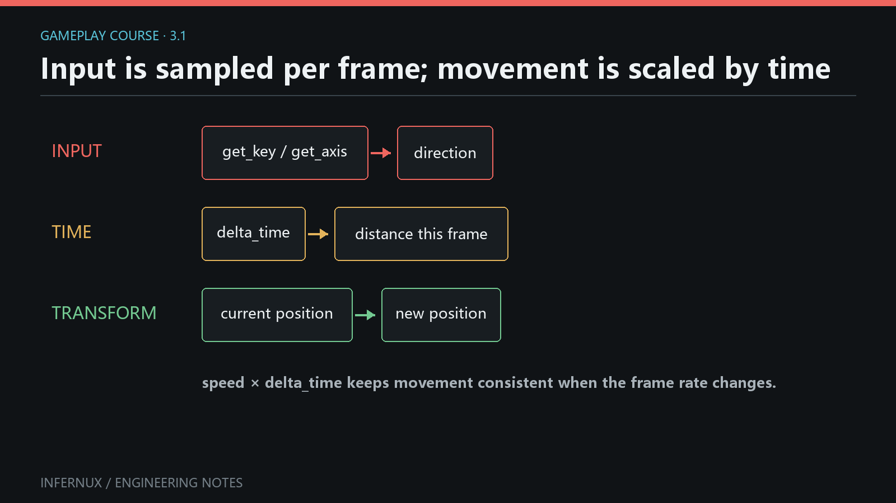

<!-- language:en -->

<span class="mini-tag">Gameplay · Chapter 3</span>

# Input, time, and movement

Movement begins with three small contracts: `Input` reports state for the current frame, `update(delta_time)` supplies the frame duration in seconds, and `Transform` stores where the GameObject is. This chapter combines them into a keyboard-controlled object whose speed stays stable when the frame rate changes.

<div class="learn-article-toc"><strong>In this chapter</strong><a href="#build-the-mover">Build the mover</a><a href="#read-input-state">Read input state</a><a href="#use-delta-time">Use delta time</a><a href="#choose-transform-space">Choose Transform space</a><a href="#input-movement-errors">Common errors</a><a href="#verify-input-movement">Verify the result</a></div>

<figure class="learn-figure">
  
  <figcaption>Input chooses a direction each frame; delta time turns speed into a frame distance; Transform applies the result.</figcaption>
</figure>

## Build a keyboard mover {#build-the-mover}

**Prerequisites.** Continue from Chapter 2 with an open project, a saved scene, and the Hierarchy, Project, Inspector, Game, and Console panels visible. The scene needs an enabled Camera that can see the origin.

1. In **Hierarchy**, right-click empty space and choose **Create 3D Object > Cube**. Rename it `Player` and set its Transform position to `(0, 0, 0)`.
2. In **Project**, open an `Assets` folder, right-click empty space, and choose **Create > Script (.py)**. Name the script `KeyboardMover`.
3. Open `KeyboardMover.py` and replace its contents with the code below.
4. Return to the editor and wait for script import to finish. Select `Player`, click **Add Component** in the Inspector, and add `KeyboardMover`.
5. Leave **Speed** at `4`, save the scene, and keep the Game panel visible.

```python
from math import sqrt

import infernux as inx


class KeyboardMover(inx.InxComponent):
    speed: float = inx.serialized_field(default=4.0, range=(0.0, 20.0))

    def update(self, delta_time: float):
        x = 0.0
        z = 0.0

        if inx.input.Input.get_key(inx.input.KeyCode.A) or inx.input.Input.get_key(inx.input.KeyCode.LEFT_ARROW):
            x -= 1.0
        if inx.input.Input.get_key(inx.input.KeyCode.D) or inx.input.Input.get_key(inx.input.KeyCode.RIGHT_ARROW):
            x += 1.0
        if inx.input.Input.get_key(inx.input.KeyCode.S) or inx.input.Input.get_key(inx.input.KeyCode.DOWN_ARROW):
            z -= 1.0
        if inx.input.Input.get_key(inx.input.KeyCode.W) or inx.input.Input.get_key(inx.input.KeyCode.UP_ARROW):
            z += 1.0

        length_squared = x * x + z * z
        if length_squared > 1.0:
            inverse_length = 1.0 / sqrt(length_squared)
            x *= inverse_length
            z *= inverse_length

        frame_distance = self.speed * delta_time
        position = self.transform.position
        self.transform.position = inx.Vector3(
            position.x + x * frame_distance,
            position.y,
            position.z + z * frame_distance,
        )
```

Enter Play mode, click inside the **Game** panel to give it game-input focus, then hold WASD or the arrow keys. The normalization block keeps diagonal movement at the same maximum speed as movement along one axis.

## Read held, pressed, and released state {#read-input-state}

`Input` is a static API. Call its methods on the class; do not create an `Input()` instance. A key can be a `KeyCode` integer constant or a string name such as `"space"`.

| Query | Result during a press | Typical use |
| --- | --- | --- |
| `Input.get_key(KeyCode.W)` | `True` on every frame while held | Continuous movement |
| `Input.get_key_down(KeyCode.SPACE)` | `True` on the transition frame | Jump, fire, open |
| `Input.get_key_up(KeyCode.SPACE)` | `True` on the release frame | Charge release, stop drag |

The built-in virtual axes are also current public API. `Input.get_axis("Horizontal")` reads A/D and Left/Right; `Input.get_axis("Vertical")` reads S/W and Down/Up. Values are `-1.0`, `0.0`, or `1.0`, and `get_axis_raw()` is currently an alias with the same unsmoothed behavior.

Mouse state follows the same frame model. This component logs the Game-viewport position on the first frame of each left click:

```python
import infernux as inx


class ClickProbe(inx.InxComponent):
    def update(self, delta_time: float):
        if inx.input.Input.get_mouse_button_down(0):
            x, y = inx.input.Input.game_mouse_position
            inx.Debug.log(f"Game click: ({x:.0f}, {y:.0f})")
```

Button indices are `0` for left, `1` for right, and `2` for middle. `Input.mouse_position` uses window pixels; `Input.game_mouse_position` is relative to the top-left of the rendered Game image. Both are class properties, so they have no parentheses.

<div class="learn-note"><strong>Focus is part of the contract.</strong><p>In the editor, gameplay queries return idle values when the Game view does not accept game input. Click the Game panel after entering Play mode before diagnosing a keyboard or mouse script.</p></div>

## Turn speed into frame distance {#use-delta-time}

`speed` is measured in world units per second. Multiplying it by the current frame duration produces the distance for one update:

```text
frame distance = units per second × seconds this frame
```

At 4 units per second, a `0.025` second frame moves `0.1` units. Four such frames still cover `0.4` units. Faster frames produce smaller individual steps and more of them, so distance over the same elapsed time stays consistent.

The current lifecycle contract distinguishes two time values:

- The `delta_time` argument passed to `update()` and `late_update()` is the raw, unscaled frame delta from the engine.
- `Time.delta_time` is the clamped, scaled delta and follows `Time.time_scale`.

The mover above uses the callback argument, so it continues to use unscaled frame time. For movement that should pause when `inx.Time.time_scale` becomes `0`, use `inx.Time.delta_time` for `frame_distance`:

```python
import infernux as inx

frame_distance = self.speed * inx.Time.delta_time
```

Use one time source for one calculation. Multiplying by both values applies frame duration twice.

## Choose world or local Transform space {#choose-transform-space}

Every `InxComponent` exposes `self.transform`, a shortcut to `self.game_object.transform`.

- `transform.position` is world-space position.
- `transform.local_position` is position relative to the parent.
- `transform.forward`, `right`, and `up` are read-only world-space direction vectors.
- `transform.local_forward`, `local_right`, and `local_up` are their local-space counterparts.

The tutorial writes a fresh `Vector3` back to `position`, making the complete state change visible in one assignment. If `Player` is parented below a moving platform, world-space movement still follows the world X/Z axes. Change the read and write to `local_position` when the parent's coordinate system should define the motion.

## Common errors {#input-movement-errors}

**The object does not move.** Enter Play mode, click the Game panel, confirm that `KeyboardMover` is enabled on `Player`, and read the Console for import or callback errors.

**Movement happens only once per press.** Continuous movement needs `get_key()`. `get_key_down()` reports one transition frame.

**Movement changes with frame rate.** Confirm that the displacement is multiplied by exactly one delta-time value. A fixed amount added in every `update()` is measured in units per frame.

**Diagonal movement is too fast.** Normalize the two input components when their squared length exceeds `1`, as the complete example does.

**A child moves along unexpected axes.** Decide whether the design needs world `position` or parent-relative `local_position`, then use that space consistently for both the read and write.

**`KeyCode.UpArrow` fails.** Public constants use uppercase snake case, such as `KeyCode.UP_ARROW`, `KeyCode.LEFT_SHIFT`, and `KeyCode.SPACE`. Import them from `Infernux.input`.

## Verify the result {#verify-input-movement}

The chapter passes when all of these checks succeed:

1. Holding W, A, S, D, or an arrow key moves `Player` continuously after the Game view receives focus.
2. Holding two perpendicular keys produces no visible diagonal speed boost.
3. Raising **Speed** in the Inspector increases distance per second without changing the script.
4. The Transform values change during Play mode and return to the authored scene values after leaving Play mode.
5. Adding `ClickProbe` to any GameObject produces one Console line per left-button press, with coordinates relative to the Game image.

You now have a frame-rate-independent control loop and a clear choice between world and local movement. [Chapter 4: Prefabs and runtime object lifetime](gameplay-prefabs-runtime.html) uses the same one-frame input events to create and remove scene objects during Play mode.

<!-- language:zh -->

<span class="mini-tag">Gameplay · 第 3 章</span>

# 输入、时间与移动

移动建立在三个小契约上：`Input` 给出当前帧的输入状态，`update(delta_time)` 提供以秒为单位的帧时长，`Transform` 保存 GameObject 的位置。本章会把它们组合成键盘控制组件，让移动速度在帧率变化时保持稳定。

<div class="learn-article-toc"><strong>本章内容</strong><a href="#build-the-mover_1">制作移动组件</a><a href="#read-input-state_1">读取输入状态</a><a href="#use-delta-time_1">使用 delta time</a><a href="#choose-transform-space_1">选择 Transform 空间</a><a href="#input-movement-errors_1">常见错误</a><a href="#verify-input-movement_1">验证结果</a></div>

<figure class="learn-figure">
  
  <figcaption>每帧由输入选择方向，delta time 把速度换算为本帧距离，Transform 再应用结果。</figcaption>
</figure>

## 制作键盘移动组件 {#build-the-mover_1}

**准备条件。** 从第 2 章的项目继续，打开一份已保存场景，并显示 Hierarchy、Project、Inspector、Game 与 Console 面板。场景中需要一台能看到原点的已启用 Camera。

1. 在 **Hierarchy** 空白处右键，选择 **创建 3D 对象 > Cube**。把它命名为 `Player`，Transform 位置设为 `(0, 0, 0)`。
2. 在 **Project** 中打开一个 `Assets` 目录，在空白处右键，选择 **创建 > 脚本 (.py)**，命名为 `KeyboardMover`。
3. 打开 `KeyboardMover.py`，用下面的代码替换文件内容。
4. 回到编辑器，等待脚本导入完成。选中 `Player`，在 Inspector 中点击 **添加组件**，加入 `KeyboardMover`。
5. 保持 **Speed** 为 `4`，保存场景，并让 Game 面板保持可见。

```python
from math import sqrt

import infernux as inx


class KeyboardMover(inx.InxComponent):
    speed: float = inx.serialized_field(default=4.0, range=(0.0, 20.0))

    def update(self, delta_time: float):
        x = 0.0
        z = 0.0

        if inx.input.Input.get_key(inx.input.KeyCode.A) or inx.input.Input.get_key(inx.input.KeyCode.LEFT_ARROW):
            x -= 1.0
        if inx.input.Input.get_key(inx.input.KeyCode.D) or inx.input.Input.get_key(inx.input.KeyCode.RIGHT_ARROW):
            x += 1.0
        if inx.input.Input.get_key(inx.input.KeyCode.S) or inx.input.Input.get_key(inx.input.KeyCode.DOWN_ARROW):
            z -= 1.0
        if inx.input.Input.get_key(inx.input.KeyCode.W) or inx.input.Input.get_key(inx.input.KeyCode.UP_ARROW):
            z += 1.0

        length_squared = x * x + z * z
        if length_squared > 1.0:
            inverse_length = 1.0 / sqrt(length_squared)
            x *= inverse_length
            z *= inverse_length

        frame_distance = self.speed * delta_time
        position = self.transform.position
        self.transform.position = inx.Vector3(
            position.x + x * frame_distance,
            position.y,
            position.z + z * frame_distance,
        )
```

进入 Play 模式，在 **Game** 面板内单击一次，让游戏输入获得焦点，然后按住 WASD 或方向键。归一化代码会让斜向移动与单轴移动保持相同的最高速度。

## 读取按住、按下与松开状态 {#read-input-state_1}

`Input` 是静态 API，直接调用类方法即可，无需创建 `Input()` 实例。按键参数可以使用 `KeyCode` 整数常量，也可以使用 `"space"` 这类字符串名称。

| 查询 | 一次按键过程中的结果 | 常见用途 |
| --- | --- | --- |
| `Input.get_key(KeyCode.W)` | 按住期间每帧都是 `True` | 连续移动 |
| `Input.get_key_down(KeyCode.SPACE)` | 状态切换为按下的那一帧是 `True` | 跳跃、开火、打开 |
| `Input.get_key_up(KeyCode.SPACE)` | 松开的那一帧是 `True` | 释放蓄力、结束拖动 |

内置虚拟轴也属于当前公共 API。`Input.get_axis("Horizontal")` 读取 A/D 与左右方向键，`Input.get_axis("Vertical")` 读取 S/W 与上下方向键。结果为 `-1.0`、`0.0` 或 `1.0`；当前 `get_axis_raw()` 是同一套无平滑行为的别名。

鼠标状态也遵循逐帧模型。下面的组件会在每次按下鼠标左键的第一帧记录 Game 视口坐标：

```python
import infernux as inx


class ClickProbe(inx.InxComponent):
    def update(self, delta_time: float):
        if inx.input.Input.get_mouse_button_down(0):
            x, y = inx.input.Input.game_mouse_position
            inx.Debug.log(f"Game click: ({x:.0f}, {y:.0f})")
```

鼠标按键编号 `0`、`1`、`2` 依次代表左键、右键与中键。`Input.mouse_position` 使用窗口像素坐标；`Input.game_mouse_position` 以 Game 图像左上角为原点。两者都是类属性，访问时不加括号。

<div class="learn-note"><strong>焦点也是输入契约的一部分。</strong><p>编辑器中的 Game 视图未接收游戏输入时，游戏查询会返回空闲值。进入 Play 模式后先单击 Game 面板，再排查键盘或鼠标脚本。</p></div>

## 把速度换算为本帧距离 {#use-delta-time_1}

`speed` 的单位是“世界单位/秒”。它乘以当前帧时长，就得到一次更新应走的距离：

```text
本帧距离 = 每秒单位数 × 本帧秒数
```

速度为每秒 4 个单位时，时长 `0.025` 秒的一帧移动 `0.1` 个单位。连续四帧仍会移动 `0.4` 个单位。帧越快，单步距离越短、步数越多，因此同样的经过时间会得到稳定距离。

当前生命周期契约区分两种时间值：

- 传给 `update()` 与 `late_update()` 的 `delta_time` 参数，是引擎提供的原始、未缩放帧间隔。
- `Time.delta_time` 是经过上限约束和时间缩放的帧间隔，会跟随 `Time.time_scale`。

上面的移动组件使用回调参数，所以它采用未缩放帧时间。移动需要在 `inx.Time.time_scale` 变为 `0` 时暂停时，用 `inx.Time.delta_time` 计算 `frame_distance`：

```python
import infernux as inx

frame_distance = self.speed * inx.Time.delta_time
```

一次计算只选一种时间来源。同时乘上两个值会重复应用帧时长。

## 选择世界空间或局部空间 {#choose-transform-space_1}

每个 `InxComponent` 都提供 `self.transform`，它是 `self.game_object.transform` 的快捷入口。

- `transform.position` 是世界空间位置。
- `transform.local_position` 是相对父级的位置。
- `transform.forward`、`right`、`up` 是只读的世界空间方向。
- `transform.local_forward`、`local_right`、`local_up` 是对应的局部空间方向。

教程代码会构造新的 `Vector3` 并写回 `position`，一次赋值就能看清完整状态变化。`Player` 位于移动平台之下时，世界空间移动仍沿世界 X/Z 轴进行。设计需要沿父级坐标移动时，把读取与写入一起改成 `local_position`。

## 常见错误 {#input-movement-errors_1}

**物体没有移动。** 进入 Play 模式，单击 Game 面板，确认 `Player` 上的 `KeyboardMover` 已启用，再查看 Console 是否有导入错误或回调错误。

**每次按键只移动一下。** 连续移动要用 `get_key()`。`get_key_down()` 只报告状态切换的那一帧。

**移动速度随帧率改变。** 确认位移只乘了一次 delta time。每次 `update()` 都增加固定值时，单位会变成“每帧单位数”。

**斜向移动太快。** 两个输入分量的平方和大于 `1` 时进行归一化，完整示例已经包含这段处理。

**子物体沿意外方向移动。** 先决定使用世界空间 `position`，还是父级相对的 `local_position`，读取与写入必须使用同一空间。

**`KeyCode.UpArrow` 报错。** 公共常量采用全大写蛇形命名，例如 `KeyCode.UP_ARROW`、`KeyCode.LEFT_SHIFT` 与 `KeyCode.SPACE`，并从 `Infernux.input` 导入。

## 验证结果 {#verify-input-movement_1}

下面各项都满足时，本章练习通过：

1. Game 视图获得焦点后，按住 W、A、S、D 或方向键会让 `Player` 连续移动。
2. 同时按住两个垂直方向的按键时，没有明显的斜向加速。
3. 在 Inspector 中提高 **Speed**，每秒移动距离随之增加，无需修改脚本。
4. Play 模式中 Transform 数值持续变化，退出 Play 模式后恢复为场景编写值。
5. 把 `ClickProbe` 加到任意 GameObject 后，每次按下鼠标左键，Console 都会新增一行相对 Game 图像的坐标。

现在你已经拥有与帧率无关的控制循环，也能明确选择世界空间或局部空间。[第 4 章：Prefab 与运行时对象生命周期](gameplay-prefabs-runtime.html)会继续使用单帧输入事件，在 Play 模式中创建和移除场景对象。
