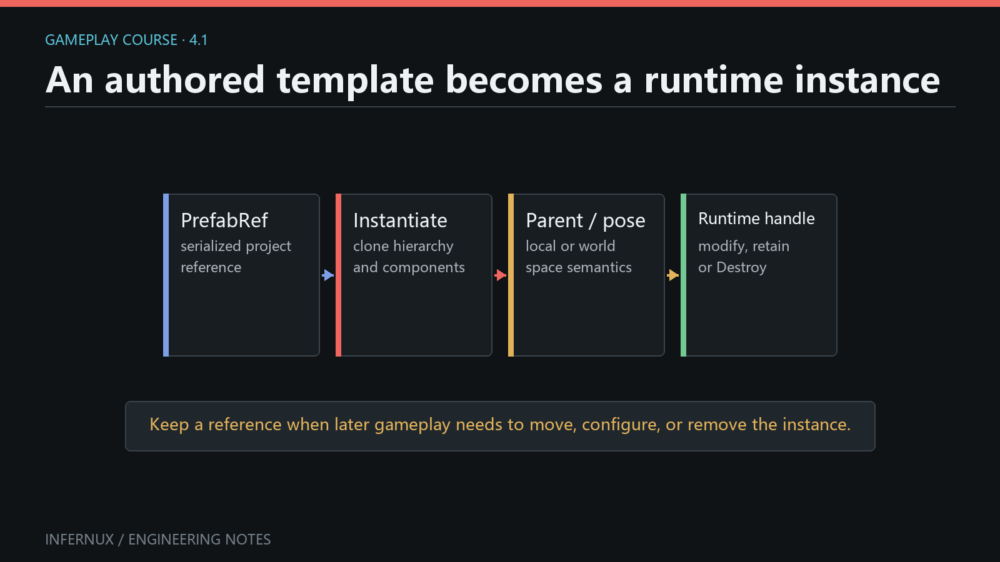

<!-- language:en -->

<span class="mini-tag">Gameplay · Chapter 4</span>

# Prefabs and runtime object lifetime

A Prefab stores an authored GameObject hierarchy as an asset. `Instantiate` turns that asset, or an existing scene GameObject, into a new live hierarchy. `Destroy` ends the lifetime of a live GameObject. This chapter builds a small spawner and makes the parent-space rules explicit.

<div class="learn-article-toc"><strong>In this chapter</strong><a href="#author-a-prefab">Author a Prefab</a><a href="#build-runtime-spawner">Build the spawner</a><a href="#instantiate-semantics">Instantiate semantics</a><a href="#parent-space-semantics">Parent and space</a><a href="#destroy-semantics">Destroy semantics</a><a href="#prefab-runtime-errors">Common errors</a><a href="#verify-prefab-runtime">Verify the result</a></div>

<figure class="learn-figure">
  
  <figcaption>One authored Prefab can produce independent runtime hierarchies, each with its own parent and lifetime.</figcaption>
</figure>

## Author a Prefab asset {#author-a-prefab}

**Prerequisites.** Continue from Chapter 3 with a saved scene and the Hierarchy, Project, Inspector, Game, and Console panels visible. The scene needs an enabled Camera that can see the origin.

1. In **Project**, open the `Assets` folder where the Prefab should be stored.
2. In **Hierarchy**, create a Cube and rename it `SpawnedCube`. Set its local position to `(0, 0, 0)` and choose a visible scale and material.
3. Add any child objects that should be cloned with it. `Instantiate` copies the complete hierarchy and its components.
4. Right-click `SpawnedCube` in Hierarchy and choose **Save as Prefab**. The editor creates a `.prefab` asset in the current Project folder and links the source hierarchy to it.
5. Confirm that the Prefab appears in Project, then delete the source `SpawnedCube` from the scene. The asset remains available for runtime creation.
6. Create an Empty GameObject in Hierarchy, rename it `SpawnRoot`, and set its position to `(0, 0, 0)`.

<div class="learn-note"><strong>Asset reference and scene object have different jobs.</strong><p><code>PrefabRef</code> stores a Prefab GUID and path hint. It does not identify a live scene object, and its current <code>resolve()</code> result is always <code>None</code>. Call <code>Instantiate</code> or <code>PrefabRef.instantiate()</code> to create a live GameObject.</p></div>

## Build a runtime spawner {#build-runtime-spawner}

1. In Project, right-click the target folder and choose **Create > Script (.py)**. Name it `PrefabSpawner`.
2. Replace the generated script with the complete component below.
3. Return to the editor, select `SpawnRoot`, click **Add Component**, and add `PrefabSpawner`.
4. Drag the `.prefab` asset from Project onto the component's **Prefab** field in Inspector. A Project asset dropped on this `GAME_OBJECT` field becomes a `PrefabRef`.
5. Save the scene.

```python
from Infernux import (
    Debug,
    Destroy,
    FieldType,
    InxComponent,
    Instantiate,
    PrefabRef,
    Vector3,
    serialized_field,
)
from Infernux.input import Input, KeyCode


class PrefabSpawner(InxComponent):
    prefab: PrefabRef = serialized_field(
        default=PrefabRef(),
        field_type=FieldType.GAME_OBJECT,
        tooltip="Prefab created when Space is pressed",
    )

    def start(self):
        self._last_instance = None

    def update(self, delta_time: float):
        if Input.get_key_down(KeyCode.SPACE):
            self.spawn()

        if Input.get_key_down(KeyCode.DELETE):
            self.destroy_last()

    def spawn(self):
        if not self.prefab:
            Debug.log_warning("PrefabSpawner needs a Prefab asset")
            return

        instance = Instantiate(self.prefab, parent=self.game_object)
        if instance is None:
            Debug.log_error("Prefab instantiation failed")
            return

        instance.transform.local_position = Vector3(0.0, 0.0, 2.0)
        self._last_instance = instance
        Debug.log(f"Spawned {instance.name}")

    def destroy_last(self):
        if self._last_instance is None:
            return

        Destroy(self._last_instance)
        self._last_instance = None
        Debug.log("Destroyed the last spawned instance")
```

Enter Play mode and click the Game panel. Each Space press creates a fresh Prefab instance under `SpawnRoot`. Delete removes the most recently created instance. Earlier instances remain because the component stores only the latest returned GameObject.

## What Instantiate accepts and returns {#instantiate-semantics}

The public `Instantiate(original, *args, **kwargs)` dispatcher currently supports these sources:

- A `GameObject`, producing a deep copy of its hierarchy and components.
- A `GameObjectRef`, after resolving its live scene object.
- A `PrefabRef`, by loading the referenced `.prefab` asset.
- A Python `Material` or native `InxMaterial`, producing a material clone. Parent and Transform overloads do not apply to materials.

For GameObject and Prefab sources, the scalar overload returns the new root `GameObject`, or `None` when no instance can be created. Check that result before accessing `name`, `transform`, or components.

`Instantiate` also restores Python components on the copied hierarchy. Each instance receives its own component objects and runtime state; the source hierarchy stays unchanged.

## Choose parent and Transform space {#parent-space-semantics}

The current scalar overloads provide three useful placement patterns:

```python
from Infernux import Instantiate, Vector3, quatf

# No parent argument: create at the scene root and preserve source world TRS.
root_instance = Instantiate(prefab)

# A parent argument: preserve source local TRS under this parent.
local_instance = Instantiate(prefab, parent=spawn_root)

# Parent plus True: keep source world TRS while adopting the parent.
world_instance = Instantiate(prefab, spawn_root, True)

# Position and rotation are world-space values; the parent is optional.
placed_instance = Instantiate(
    prefab,
    Vector3(5.0, 0.0, 2.0),
    quatf(),
    spawn_root,
)
```

`parent` may be a `GameObject`, `Transform`, `GameObjectRef`, or `None`. The explicit boolean is named `instantiate_in_world_space` when passed by keyword.

| Call shape | Parent result | Transform result |
| --- | --- | --- |
| `Instantiate(source)` | Scene root | Preserve source world transform |
| `Instantiate(source, parent=target)` | Child of `target` | Preserve source local transform |
| `Instantiate(source, target, True)` | Child of `target` | Preserve source world transform |
| `Instantiate(source, position, rotation, target)` | Child of `target` | Apply the supplied world position and rotation |

This distinction becomes visible when the source or target parent is translated, rotated, or scaled. The tutorial intentionally uses `parent=self.game_object`, then assigns `local_position`, so every spawned Cube appears two local Z units from `SpawnRoot`.

An explicit `parent=None` uses the parent-overload path and preserves local TRS. Omitting the parent argument preserves world TRS. They can produce different positions when cloning a scene GameObject that already has a parent.

After creation, hierarchy changes use matching APIs:

```python
# GameObject API: parent is a GameObject.
instance.set_parent(spawn_root, world_position_stays=True)

# Transform API: parent is a Transform.
instance.transform.set_parent(
    spawn_root.transform,
    world_position_stays=False,
)
```

`world_position_stays=True` keeps the current world transform while calculating new local values. `False` keeps the current local values and lets the new parent determine the resulting world transform.

## End an instance lifetime with Destroy {#destroy-semantics}

The top-level `Destroy` function currently accepts a live `GameObject` only:

```python
Destroy(instance)
```

Destruction enters the scene's pending-destroy flow. Treat the object and all descendants as unavailable after requesting destruction, clear references you own, and let lifecycle cleanup run. Active Python components receive their disable and destroy cleanup as the pending operation is processed.

The `delay` parameter exists in the current signature, but delayed destruction has not been implemented. `Destroy(instance, 3.0)` does not schedule a three-second lifetime. For timed cleanup, track elapsed time in a component or use the coroutine timing APIs introduced later in the course.

`Destroy(component)` raises `TypeError`. A Python component can remove itself with its `destroy()` method; that is a separate component-lifetime operation.

## Common errors {#prefab-runtime-errors}

**Space creates nothing.** Click the Game panel, confirm that the Prefab field is assigned, and inspect the Console. `Instantiate` returns `None` when the Prefab asset cannot be found or no live source can be resolved.

**The field contains a scene object.** A `GAME_OBJECT` Inspector field accepts both Hierarchy objects and Project Prefabs. Drag the `.prefab` asset from Project when the script should store a `PrefabRef`.

**Calling `prefab.resolve()` gives `None`.** That is the current `PrefabRef` contract. Use `Instantiate(prefab)` to create a scene object.

**The instance jumps after parenting.** Select the intended rule explicitly: preserve local TRS with `parent=target`, or preserve world TRS with `target, True`. Follow-up `set_parent()` calls use `world_position_stays` for the same choice.

**A destroyed reference is used again.** Set owned references to `None` immediately after `Destroy`, as the spawner does. Store every returned instance in a list when the design needs to manage more than the latest one.

**Delayed destruction does not wait.** The current `delay` argument is reserved. Implement the timer in gameplay code before calling `Destroy(instance)`.

## Verify the result {#verify-prefab-runtime}

The chapter passes when all of these checks succeed:

1. `SpawnRoot` shows an assigned Prefab asset in the Inspector before Play mode.
2. Each Space press adds one independent `SpawnedCube` hierarchy below `SpawnRoot` during Play mode.
3. Every new root has local position `(0, 0, 2)`, so moving or rotating `SpawnRoot` changes where its children appear.
4. Delete removes the latest spawned hierarchy and writes one cleanup line to Console.
5. Leaving Play mode removes all runtime-created instances and restores the authored scene.

You can now turn authored hierarchies into controlled runtime objects and choose their coordinate-space behavior deliberately. [Chapter 5: Physics and collision callbacks](gameplay-physics-events.html) adds colliders, rigid bodies, fixed-step motion, and contact events to these instances.

<!-- language:zh -->

<span class="mini-tag">Gameplay · 第 4 章</span>

# Prefab 与运行时对象生命周期

Prefab 会把编写好的 GameObject 层级保存成资产。`Instantiate` 可以根据该资产或现有场景 GameObject 创建新的活动层级，`Destroy` 则结束活动 GameObject 的生命周期。本章会制作一个小型生成器，并明确 parent 参数的空间规则。

<div class="learn-article-toc"><strong>本章内容</strong><a href="#author-a-prefab_1">编写 Prefab</a><a href="#build-runtime-spawner_1">制作运行时生成器</a><a href="#instantiate-semantics_1">Instantiate 语义</a><a href="#parent-space-semantics_1">父级与空间</a><a href="#destroy-semantics_1">Destroy 语义</a><a href="#prefab-runtime-errors_1">常见错误</a><a href="#verify-prefab-runtime_1">验证结果</a></div>

<figure class="learn-figure">
  
  <figcaption>一份编写好的 Prefab 可以生成多个独立运行时层级，每个层级都有自己的父级与生命周期。</figcaption>
</figure>

## 编写 Prefab 资产 {#author-a-prefab_1}

**准备条件。** 从第 3 章的已保存场景继续，并显示 Hierarchy、Project、Inspector、Game 与 Console 面板。场景中需要一台能看到原点的已启用 Camera。

1. 在 **Project** 中打开准备保存 Prefab 的 `Assets` 目录。
2. 在 **Hierarchy** 中创建 Cube，命名为 `SpawnedCube`，把局部位置设为 `(0, 0, 0)`，再选择容易看清的缩放与材质。
3. 按需添加需要一起复制的子物体。`Instantiate` 会复制完整层级及其组件。
4. 在 Hierarchy 中右键单击 `SpawnedCube`，选择 **保存为预制体**。编辑器会在 Project 当前目录创建 `.prefab` 资产，并把源层级链接到该资产。
5. 确认 Prefab 已出现在 Project 中，然后从场景删除源 `SpawnedCube`。该资产仍可用于运行时创建。
6. 在 Hierarchy 中创建空 GameObject，命名为 `SpawnRoot`，位置设为 `(0, 0, 0)`。

<div class="learn-note"><strong>资产引用与场景对象职责不同。</strong><p><code>PrefabRef</code> 保存 Prefab GUID 与路径提示，不指向活动场景对象；当前 <code>resolve()</code> 固定返回 <code>None</code>。请调用 <code>Instantiate</code> 或 <code>PrefabRef.instantiate()</code> 创建活动 GameObject。</p></div>

## 制作运行时生成器 {#build-runtime-spawner_1}

1. 在 Project 中右键单击目标目录，选择 **创建 > 脚本 (.py)**，命名为 `PrefabSpawner`。
2. 用下面的完整组件替换生成的脚本。
3. 回到编辑器，选中 `SpawnRoot`，点击 **添加组件**，加入 `PrefabSpawner`。
4. 从 Project 把 `.prefab` 资产拖到 Inspector 中该组件的 **Prefab** 字段。Project 资产放入这个 `GAME_OBJECT` 字段后会成为 `PrefabRef`。
5. 保存场景。

```python
from Infernux import (
    Debug,
    Destroy,
    FieldType,
    InxComponent,
    Instantiate,
    PrefabRef,
    Vector3,
    serialized_field,
)
from Infernux.input import Input, KeyCode


class PrefabSpawner(InxComponent):
    prefab: PrefabRef = serialized_field(
        default=PrefabRef(),
        field_type=FieldType.GAME_OBJECT,
        tooltip="Prefab created when Space is pressed",
    )

    def start(self):
        self._last_instance = None

    def update(self, delta_time: float):
        if Input.get_key_down(KeyCode.SPACE):
            self.spawn()

        if Input.get_key_down(KeyCode.DELETE):
            self.destroy_last()

    def spawn(self):
        if not self.prefab:
            Debug.log_warning("PrefabSpawner needs a Prefab asset")
            return

        instance = Instantiate(self.prefab, parent=self.game_object)
        if instance is None:
            Debug.log_error("Prefab instantiation failed")
            return

        instance.transform.local_position = Vector3(0.0, 0.0, 2.0)
        self._last_instance = instance
        Debug.log(f"Spawned {instance.name}")

    def destroy_last(self):
        if self._last_instance is None:
            return

        Destroy(self._last_instance)
        self._last_instance = None
        Debug.log("Destroyed the last spawned instance")
```

进入 Play 模式并单击 Game 面板。每次按下空格键，`SpawnRoot` 下都会出现一个新的 Prefab 实例。Delete 会移除最近创建的实例；更早的实例会保留，因为组件只保存了最后一次返回的 GameObject。

## Instantiate 接受什么、返回什么 {#instantiate-semantics_1}

公共入口 `Instantiate(original, *args, **kwargs)` 当前支持以下来源：

- `GameObject`：深拷贝它的层级与组件。
- `GameObjectRef`：先解析对应的活动场景对象。
- `PrefabRef`：加载引用的 `.prefab` 资产。
- Python `Material` 或原生 `InxMaterial`：创建材质克隆；parent 与 Transform 重载不适用于材质。

来源为 GameObject 或 Prefab 时，标量重载会返回新根节点 `GameObject`；无法创建时返回 `None`。访问 `name`、`transform` 或组件前应先检查结果。

`Instantiate` 还会恢复复制层级中的 Python 组件。每个实例都有独立的组件对象与运行时状态，源层级保持原值。

## 选择父级与 Transform 空间 {#parent-space-semantics_1}

当前标量重载提供三种常用放置方式：

```python
from Infernux import Instantiate, Vector3, quatf

# 省略 parent：创建在场景根级，并保留源对象的世界 TRS。
root_instance = Instantiate(prefab)

# 传入 parent：挂到该父级下，并保留源对象的局部 TRS。
local_instance = Instantiate(prefab, parent=spawn_root)

# parent 加 True：挂到父级下，同时保留源对象的世界 TRS。
world_instance = Instantiate(prefab, spawn_root, True)

# position 与 rotation 使用世界空间；parent 可省略。
placed_instance = Instantiate(
    prefab,
    Vector3(5.0, 0.0, 2.0),
    quatf(),
    spawn_root,
)
```

`parent` 可以是 `GameObject`、`Transform`、`GameObjectRef` 或 `None`。使用关键字传递时，显式布尔参数名为 `instantiate_in_world_space`。

| 调用形式 | 父级结果 | Transform 结果 |
| --- | --- | --- |
| `Instantiate(source)` | 场景根级 | 保留源对象世界变换 |
| `Instantiate(source, parent=target)` | 成为 `target` 的子节点 | 保留源对象局部变换 |
| `Instantiate(source, target, True)` | 成为 `target` 的子节点 | 保留源对象世界变换 |
| `Instantiate(source, position, rotation, target)` | 成为 `target` 的子节点 | 应用给定世界位置与旋转 |

源对象或目标父级存在平移、旋转、缩放时，这个区别会清楚呈现。教程特意使用 `parent=self.game_object`，随后设置 `local_position`，因此每个 Cube 都出现在 `SpawnRoot` 的局部 Z 轴前方 2 个单位处。

显式传入 `parent=None` 会进入 parent 重载并保留局部 TRS；省略 parent 参数则保留世界 TRS。复制一个已经有父级的场景 GameObject 时，两种写法可能得到不同位置。

创建后调整层级，可以使用对应 API：

```python
# GameObject API：parent 参数使用 GameObject。
instance.set_parent(spawn_root, world_position_stays=True)

# Transform API：parent 参数使用 Transform。
instance.transform.set_parent(
    spawn_root.transform,
    world_position_stays=False,
)
```

`world_position_stays=True` 会保持当前世界变换，并计算新的局部值。设为 `False` 会保持当前局部值，再由新父级决定最终世界变换。

## 用 Destroy 结束实例生命周期 {#destroy-semantics_1}

顶层 `Destroy` 函数当前只接受活动 `GameObject`：

```python
Destroy(instance)
```

销毁请求会进入场景的待处理销毁流程。发出请求后，应把该对象及其所有后代视为不可再用，清空自己保存的引用，并让生命周期清理继续执行。活动 Python 组件会在处理待销毁操作时收到停用与销毁清理。

当前签名包含 `delay` 参数，但延迟销毁尚未实现。`Destroy(instance, 3.0)` 不会安排三秒生命周期。需要定时清理时，可以在组件中累计时间，或使用课程后面介绍的协程计时 API。

`Destroy(component)` 会抛出 `TypeError`。Python 组件可以调用自身的 `destroy()` 方法移除自己，这是另一种组件生命周期操作。

## 常见错误 {#prefab-runtime-errors_1}

**按空格键没有创建对象。** 单击 Game 面板，确认 Prefab 字段已赋值，再检查 Console。找不到 Prefab 资产，或无法解析活动源对象时，`Instantiate` 会返回 `None`。

**字段里保存了场景对象。** Inspector 的 `GAME_OBJECT` 字段同时接受 Hierarchy 对象与 Project Prefab。脚本需要保存 `PrefabRef` 时，应从 Project 拖入 `.prefab` 资产。

**调用 `prefab.resolve()` 得到 `None`。** 这符合当前 `PrefabRef` 契约。请用 `Instantiate(prefab)` 创建场景对象。

**设置父级后实例跳到别处。** 明确选择空间规则：用 `parent=target` 保留局部 TRS，或用 `target, True` 保留世界 TRS。后续 `set_parent()` 则通过 `world_position_stays` 做同样选择。

**销毁后又使用旧引用。** 调用 `Destroy` 后立刻把自己保存的引用设为 `None`，示例生成器已经这样处理。需要管理多个实例时，应保存每次返回值到列表。

**延迟销毁没有等待。** 当前 `delay` 参数仅作预留。请先在游戏逻辑中完成计时，再调用 `Destroy(instance)`。

## 验证结果 {#verify-prefab-runtime_1}

下面各项都满足时，本章练习通过：

1. 进入 Play 模式前，`SpawnRoot` 的 Inspector 已显示所赋值的 Prefab 资产。
2. Play 模式中每按一次空格键，`SpawnRoot` 下都会增加一套独立的 `SpawnedCube` 层级。
3. 每个新根节点的局部位置都是 `(0, 0, 2)`；移动或旋转 `SpawnRoot` 会改变子节点的最终位置。
4. 按 Delete 会移除最近生成的层级，Console 同时写入一行清理记录。
5. 退出 Play 模式后，所有运行时创建的实例消失，场景恢复为编写状态。

现在你可以把编写好的层级转为受控运行时对象，也能主动选择它们的坐标空间行为。[第 5 章：物理与碰撞回调](gameplay-physics-events.html)会为这些实例添加 Collider、Rigidbody、固定步长运动与接触事件。
