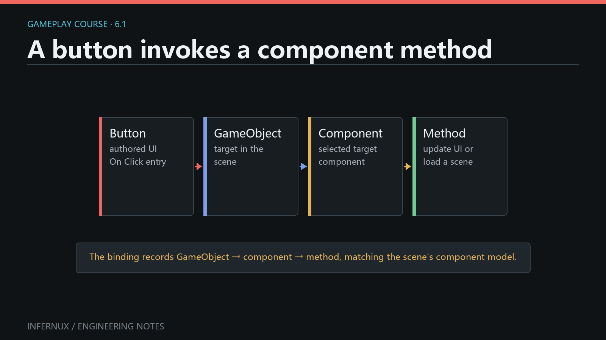

<!-- language:en -->

<span class="mini-tag">Gameplay Foundations · Chapter 6</span>

# UI actions and scene flow

A menu Button can call a public method on an attached Python component. That method can validate the action, record a useful message, and ask `inx.SceneManager` to load another authored scene from the build list.

This chapter builds a two-scene loop: `MainMenu.scene` contains a Play Button, and `Level01.scene` contains a Return Button. Both use persistent **On Click ()** bindings configured in the Inspector.

<div class="learn-article-toc"><strong>In this chapter</strong><a href="#prepare-scenes">Prepare two scenes</a><a href="#scene-actions-component">Write the scene actions</a><a href="#bind-button">Bind the Button</a><a href="#build-list">Configure Build Settings</a><a href="#verify-ui-scenes">Verify the flow</a><a href="#ui-scene-errors">Common errors</a></div>

<figure class="learn-figure">
  
  <figcaption>Each Button stores a target GameObject, Python component name, and public method name; the method requests the next scene.</figcaption>
</figure>

## Prepare two authored scenes {#prepare-scenes}

Create an `Assets/Scenes` folder, then prepare these saved scene assets:

1. Save the first scene as `Assets/Scenes/MainMenu.scene`.
2. In Hierarchy, create **UI > Canvas**.
3. Create **UI > Button** as a child of the Canvas. Rename its GameObject to `PlayButton` and set its `UIButton` label to `Play`.
4. Create an empty GameObject named `SceneFlow`. It will own the component that the Button calls.
5. Save the scene.
6. Create a second scene and save it as `Assets/Scenes/Level01.scene`.
7. Add a Canvas, a child Button named `ReturnButton` with label `Return to menu`, and an empty `SceneFlow` GameObject. Save again.

A Button created through **UI > Button** already has a `UIButton` component. Its `interactable` state, visual transition settings, label, fill, and persistent **On Click ()** list are available in the Inspector.

A new Canvas defaults to Screen Overlay. Two render modes exist: **Screen Overlay** draws after display encoding, on top of the finished image; **Camera Overlay** draws into the scene before post-processing, so scene effects can process the UI along with the geometry. Menu and HUD screens usually stay on Screen Overlay; choose Camera Overlay when the UI must react to bloom, color grading, or motion blur.

## Write the scene actions component {#scene-actions-component}

Create `Assets/Scripts/scene_actions.py` with this complete component:

```python
import infernux as inx


class SceneActions(inx.InxComponent):
    def load_level_one(self):
        if inx.SceneManager.load_scene("Level01"):
            inx.Debug.log("Level01 scene load accepted.")
        else:
            inx.Debug.log_error("Could not request Level01. Check Build Settings.")

    def load_main_menu(self):
        if inx.SceneManager.load_scene("MainMenu"):
            inx.Debug.log("MainMenu scene load accepted.")
        else:
            inx.Debug.log_error("Could not request MainMenu. Check Build Settings.")
```

Attach `SceneActions` to the `SceneFlow` GameObject in both scenes. The two method names are public, take no arguments, and therefore appear in the Button method picker.

`inx.SceneManager.load_scene(...)` accepts a build index or a string resolved against the build list. A bare name such as `"Level01"` matches the scene filename without its extension. The return value reports whether the request was accepted. During Play mode, the editor defers the replacement to a safe frame boundary, so `True` does not mean that the new scene has already completed loading inside the current method call.

<div class="learn-note"><strong>Use the runtime scene API.</strong><p>Gameplay scripts import <code>SceneManager</code> from <code>infernux</code>. <code>Infernux.engine.SceneFileManager</code> owns editor file operations such as save prompts and authoring-time scene opening.</p></div>

## Bind a Button to a component method {#bind-button}

Configure the Play Button first:

1. Open `MainMenu.scene` and select `PlayButton` in Hierarchy.
2. In the `UIButton` Inspector, expand **On Click ()** and use its add control to create one entry.
3. Drag the `SceneFlow` GameObject from Hierarchy into the entry's **Target** field, or choose it with the object picker.
4. In **Component**, choose `SceneActions`.
5. In **Method**, choose `load_level_one`.
6. Save `MainMenu.scene`.

Repeat the process in `Level01.scene` for `ReturnButton`, choosing the local `SceneFlow`, `SceneActions`, and `load_main_menu`.

The persistent entry is serialized with the scene as a target GameObject reference plus component and method names. The component list contains Python components attached to the selected target. The method list contains public callable methods and excludes lifecycle methods such as `start`, `update`, and `on_destroy`.

For events that need authored arguments, the same Inspector can reflect positional parameters typed as `bool`, `int`, `float`, `str`, GameObject, or component references. This chapter keeps both callbacks parameterless so the scene transition remains easy to verify.

### Runtime subscription when the target is discovered in code

Persistent Inspector binding is the best fit for authored menus. A component may also subscribe a zero-argument listener at runtime through the public `UIEvent` API:

```python
import infernux as inx


class RuntimeButtonBinding(inx.InxComponent):
    def start(self):
        button_object = inx.GameObject.find("PlayButton")
        if button_object is None:
            return

        button = button_object.get_component(inx.ui.UIButton)
        if button is not None:
            button.on_click.add_listener(self.handle_click)

    def handle_click(self):
        print("PlayButton clicked")
```

Use one binding route for one action. If the same method is present in **On Click ()** and added with `add_listener`, one click invokes it twice.

## Add both scenes to Build Settings {#build-list}

`SceneManager` resolves only scenes listed for the build. Add both assets before testing:

1. Open `MainMenu.scene`.
2. Open **Window > Build Settings**.
3. In **Scenes In Build**, choose **Add Open Scene**. Keep `MainMenu.scene` at index `0`.
4. Open `Level01.scene`, return to Build Settings, and choose **Add Open Scene** again. Keep `Level01.scene` at index `1`.
5. Save both scenes after their Button bindings are complete.

The string calls in `SceneActions` continue to work if the list order changes because they resolve by scene filename. Build-index loading is also public: `inx.SceneManager.load_scene(1)` requests the scene currently stored at index `1`.

## Verify the scene loop {#verify-ui-scenes}

1. Open `MainMenu.scene`, clear the Console, and enter Play mode.
2. Move the pointer over `PlayButton`; its configured highlighted and pressed states should respond when the Button is interactable.
3. Click `Play`. Confirm the Console reports `Level01 scene load accepted.` and the Game view changes to `Level01` after the deferred scene replacement completes.
4. Click `Return to menu`. Confirm the Console reports `MainMenu scene load accepted.` and the menu scene becomes active again.
5. Stop Play mode. The editor returns to its authored scene state.

For an explicit API check, temporarily change `"Level01"` to `"MissingScene"`. The click should log the component's error, `load_scene` should return `False`, and the active scene should remain unchanged. Restore the valid name after the test.

## Common errors {#ui-scene-errors}

**The Button changes color but no method runs.** Open **On Click ()** and confirm that Target, Component, and Method are all set. The target must be the GameObject that actually owns `SceneActions`.

**`SceneActions` does not appear in the Component menu.** Attach the script component to the selected target GameObject, allow the script to reload without import errors, then reselect the target in the event entry.

**The callback method does not appear.** Use a public method name without a leading underscore. Lifecycle methods are filtered from the picker. Save the script and confirm the Console has no compilation or import error.

**Clicking logs “scene not found in build list.”** Add the saved `.scene` asset through **Window > Build Settings**. The bare string must match its filename; `"Level01"` resolves `Level01.scene`.

**The click runs twice.** Check for both a persistent **On Click ()** entry and a runtime `on_click.add_listener(...)` subscription for the same action. Keep one registration.

**The Button never receives pointer input.** Confirm the Button and Canvas are enabled, `interactable` is enabled, the Button lies inside the Canvas, and no frontmost UI element configured as a raycast target covers it.

**Code after `load_scene` assumes the new scene is active.** Treat a `True` return as an accepted request. Put new-scene setup in components belonging to the destination scene, using their `awake` and `start` callbacks.

## Next chapter

You now have a complete authored action path: pointer click, serialized component method, accepted scene request, and destination lifecycle. [Audio and gameplay signals](gameplay-audio-events.html) uses the same event-oriented structure to trigger one-off sound while keeping continuous state updates separate.

<!-- language:zh -->

<span class="mini-tag">玩法基础 · 第 6 章</span>

# UI 操作与场景流程

菜单 Button 可以调用 Python 组件的公开方法。这个方法可以检查操作、记录结果，再通过 `inx.SceneManager` 请求加载 Build Settings 中的另一个场景。

本章会完成一个双场景循环：`MainMenu.scene` 提供 Play Button，`Level01.scene` 提供 Return Button。两个按钮都通过 Inspector 中的持久化 **On Click ()** 完成绑定。

<div class="learn-article-toc"><strong>本章内容</strong><a href="#prepare-scenes_1">准备两个场景</a><a href="#scene-actions-component_1">编写场景操作</a><a href="#bind-button_1">绑定 Button</a><a href="#build-list_1">配置 Build Settings</a><a href="#verify-ui-scenes_1">验证流程</a><a href="#ui-scene-errors_1">常见错误</a></div>

<figure class="learn-figure">
  
  <figcaption>每个 Button 会保存目标 GameObject、Python 组件名和公开方法名；该方法负责发起场景请求。</figcaption>
</figure>

## 准备两个场景 {#prepare-scenes_1}

创建 `Assets/Scenes` 文件夹，再准备以下场景资产：

1. 把第一个场景保存为 `Assets/Scenes/MainMenu.scene`。
2. 在 Hierarchy 中创建 **UI > Canvas**。
3. 在 Canvas 下创建 **UI > Button**。把 GameObject 重命名为 `PlayButton`，并把 `UIButton` 的 label 设为 `Play`。
4. 创建空 GameObject，命名为 `SceneFlow`。它将承载 Button 要调用的组件。
5. 保存场景。
6. 创建第二个场景，保存为 `Assets/Scenes/Level01.scene`。
7. 添加 Canvas、子级 Button 和空的 `SceneFlow`。把 Button 命名为 `ReturnButton`，label 设为 `Return to menu`，然后保存场景。

通过 **UI > Button** 创建的对象已经带有 `UIButton`。Inspector 中可以设置 `interactable`、视觉过渡、label、填充和持久化 **On Click ()** 列表。

新建 Canvas 默认是 Screen Overlay。Canvas 有两种渲染模式：**Screen Overlay** 在显示编码之后绘制，覆盖在成品图像上；**Camera Overlay** 在后处理之前画进场景，场景效果可以把 UI 与几何一起处理。菜单与 HUD 通常留在 Screen Overlay；需要 UI 参与 Bloom、调色或运动模糊时才选择 Camera Overlay。

## 编写场景操作组件 {#scene-actions-component_1}

创建 `Assets/Scripts/scene_actions.py`，写入以下完整组件：

```python
import infernux as inx


class SceneActions(inx.InxComponent):
    def load_level_one(self):
        if inx.SceneManager.load_scene("Level01"):
            inx.Debug.log("Level01 scene load accepted.")
        else:
            inx.Debug.log_error("Could not request Level01. Check Build Settings.")

    def load_main_menu(self):
        if inx.SceneManager.load_scene("MainMenu"):
            inx.Debug.log("MainMenu scene load accepted.")
        else:
            inx.Debug.log_error("Could not request MainMenu. Check Build Settings.")
```

在两个场景的 `SceneFlow` 上都挂载 `SceneActions`。这两个方法是无参数公开方法，因此会出现在 Button 的方法选择器中。

`inx.SceneManager.load_scene(...)` 接受 Build Index，也接受按构建列表解析的字符串。`"Level01"` 这样的裸名称会匹配去掉扩展名后的场景文件名。返回值表示请求是否被接受。Play 模式中，编辑器会把场景替换推迟到安全的帧边界；方法返回 `True` 时，新场景仍可能处于待切换状态。

<div class="learn-note"><strong>使用运行时场景 API。</strong><p>玩法脚本应从 <code>infernux</code> 导入 <code>SceneManager</code>。<code>Infernux.engine.SceneFileManager</code> 负责保存提示、编辑状态打开场景等文件操作。</p></div>

## 把 Button 绑定到组件方法 {#bind-button_1}

先配置 Play Button：

1. 打开 `MainMenu.scene`，在 Hierarchy 中选中 `PlayButton`。
2. 在 `UIButton` Inspector 中展开 **On Click ()**，使用添加控件创建一条记录。
3. 把 Hierarchy 中的 `SceneFlow` 拖到该记录的 **Target** 字段，也可以使用对象选择器。
4. 在 **Component** 中选择 `SceneActions`。
5. 在 **Method** 中选择 `load_level_one`。
6. 保存 `MainMenu.scene`。

在 `Level01.scene` 中重复以上步骤。为 `ReturnButton` 选择当前场景的 `SceneFlow`、`SceneActions` 与 `load_main_menu`。

持久化记录会随场景保存，其中包含目标 GameObject 引用、组件名和方法名。Component 列表会显示目标物体上的 Python 组件；Method 列表会显示公开可调用方法，并过滤 `start`、`update`、`on_destroy` 等生命周期方法。

当事件需要可编辑参数时，Inspector 还能反射带位置参数的方法，支持 `bool`、`int`、`float`、`str`、GameObject 与组件引用。本章使用无参数回调，验证场景切换会更直接。

### 在代码中发现目标后订阅

持久化 Inspector 绑定很适合已编辑好的菜单。组件也可以通过公开 `UIEvent` API 在运行时订阅无参数 Listener：

```python
import infernux as inx


class RuntimeButtonBinding(inx.InxComponent):
    def start(self):
        button_object = inx.GameObject.find("PlayButton")
        if button_object is None:
            return

        button = button_object.get_component(inx.ui.UIButton)
        if button is not None:
            button.on_click.add_listener(self.handle_click)

    def handle_click(self):
        print("PlayButton clicked")
```

一项操作保留一种绑定方式即可。如果同一方法既存在于 **On Click ()**，又通过 `add_listener` 添加，一次点击会调用两次。

## 把两个场景加入 Build Settings {#build-list_1}

`SceneManager` 只解析构建列表中的场景。测试前完成以下设置：

1. 打开 `MainMenu.scene`。
2. 打开 **Window > Build Settings**。
3. 在 **Scenes In Build** 中选择 **Add Open Scene**，让 `MainMenu.scene` 保持在索引 `0`。
4. 打开 `Level01.scene`，回到 Build Settings，再次选择 **Add Open Scene**，让 `Level01.scene` 保持在索引 `1`。
5. 完成 Button 绑定后，再保存两个场景。

`SceneActions` 使用场景文件名解析，因此调整列表顺序后仍可工作。Build Index 加载也是公开 API：`inx.SceneManager.load_scene(1)` 会请求当前位于索引 `1` 的场景。

## 验证场景循环 {#verify-ui-scenes_1}

1. 打开 `MainMenu.scene`，清空 Console，进入 Play 模式。
2. 把指针移到 `PlayButton` 上。`interactable` 开启时，Button 应按当前配置显示 Highlighted 与 Pressed 状态。
3. 点击 `Play`。确认 Console 显示 `Level01 scene load accepted.`，延迟场景替换完成后，Game 视图切换到 `Level01`。
4. 点击 `Return to menu`。确认 Console 显示 `MainMenu scene load accepted.`，菜单场景再次成为活动场景。
5. 停止 Play 模式。编辑器恢复到已编辑的场景状态。

还可以把 `"Level01"` 暂时改为 `"MissingScene"` 做一次明确检查。点击后，组件应记录错误，`load_scene` 返回 `False`，活动场景保持不变。检查完成后恢复有效名称。

## 常见错误 {#ui-scene-errors_1}

**Button 有颜色反馈，方法没有运行。** 展开 **On Click ()**，确认 Target、Component、Method 都已设置。Target 必须指向真正挂有 `SceneActions` 的 GameObject。

**Component 菜单中没有 `SceneActions`。** 先把脚本组件挂到目标 GameObject，等待脚本无错误重载，再在事件记录中重新选择目标。

**方法没有出现在列表中。** 使用不以下划线开头的公开方法名。生命周期方法会被选择器过滤。保存脚本，并确认 Console 没有编译或导入错误。

**点击后提示场景不在构建列表。** 通过 **Window > Build Settings** 添加已保存的 `.scene` 资产。裸字符串要与文件名一致；`"Level01"` 会解析 `Level01.scene`。

**一次点击运行两次。** 检查同一操作是否同时存在持久化 **On Click ()** 记录和运行时 `on_click.add_listener(...)` 订阅，保留一处注册。

**Button 收不到指针输入。** 确认 Button 与 Canvas 已启用、`interactable` 已开启、Button 位于 Canvas 内，并检查前方是否有启用 Raycast Target 的 UI 元素遮挡它。

**`load_scene` 后的代码立即使用新场景。** `True` 表示请求已接受。新场景初始化应放在目标场景组件的 `awake` 与 `start` 中。

## 下一章

现在已经形成完整的用户操作路径：指针点击、持久化组件方法、场景请求与目标场景生命周期。下一章 [音频与游戏信号](gameplay-audio-events.html) 会沿用事件驱动结构触发一次性声音，并把持续状态更新单独管理。
