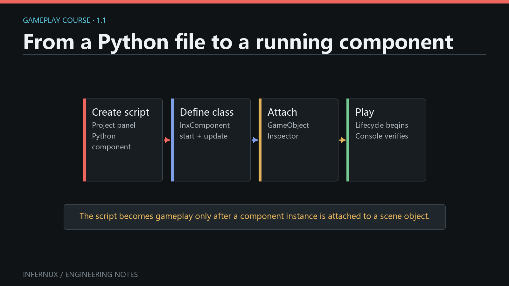

<!-- language:en -->

<span class="mini-tag">Plugins · Chapter 1</span>

# Build your first plugin

This chapter turns a component and a text file into a reusable `.inxpkg`. You
need Infernux 0.4.0 to test it. Packaging the repository itself only needs Python:
the official packer uses the standard library, without importing the engine.

<div class="learn-article-toc"><strong>In this chapter</strong><a href="#layout">Choose a layout</a><a href="#component">Write a component</a><a href="#pages">Add documentation</a><a href="#package">Package and install</a><a href="#release">Publish and update</a></div>

<figure class="learn-figure">
  
  <figcaption>Plugin components use the same GameObject, Inspector and lifecycle model as project components. We will verify our packaged component through the Console.</figcaption>
</figure>

## Choose a layout {#layout}

Start from the [official plugin template](https://github.com/ChenlizheMe/infernux_plugin_template).
Keep its standalone `package.py` and release workflow. Replace the example
payload with the following files; do not keep sample code you are not shipping.

```text
hello-plugin/
  README.md                         # GitHub documentation only
  package.py                        # standalone packer from the template
  .github/workflows/                # release automation
  package/                          # only this directory enters .inxpkg
    inx_package.json
    runtime/
      hello_resource.py
      data/message.txt
    plugin_pages/
      guide.md
      guide.zh-CN.md
```

Use lowercase, snake_case Python filenames. Set `package/inx_package.json` to:

```json
{
  "reference": "my_studio/hello_plugin",
  "name": "Hello Plugin",
  "version": "0.1.0",
  "engine": ">=0.4,<0.5",
  "intro": "A component that reads its packaged text resource."
}
```

Choose your own unique reference before publishing. Do not change it between
updates. The manifest does not need `requirements` or `dependencies` keys.
This example has no third-party dependencies.

Prefer local authoring? Create `Packages/hello_plugin/` inside a project and put
the **contents of `package/`** directly there. There is no second wrapper. A
manifest is optional: exporting this folder as `hello_plugin.inxpkg` generates
the default name and reference `hello_plugin`. With an explicit manifest, its
identity wins. A manifest under `Assets/` is not discovered as a plugin.

## Write the component and resource {#component}

Put `Hello from my plugin!` in `runtime/data/message.txt`. Then create
`runtime/hello_resource.py`:

```python
from pathlib import Path

import infernux as inx


class HelloResource(inx.InxComponent):
    def start(self) -> None:
        path = inx.Application.package_path(
            "my_studio/hello_plugin", "runtime/data/message.txt"
        )
        message = Path(path).read_text(encoding="utf-8").strip()
        inx.Debug.log(message, self)
```

The reference in this example matches the **installed** package. While authoring
directly in `Packages/hello_plugin/`, use `hello_plugin` as the lookup reference:
local Player identity follows the actual project directory, not a future
distribution reference. To use the example unchanged locally, create
`Packages/my_studio/hello_plugin/` and include the explicit manifest above.

`package_path` returns a readable filesystem path in the Editor and Player. Raw
runtime directories keep their relative layout, so JSON can refer to a sibling
TXT and external libraries can find adjacent resources. Do not build paths from
the current working directory or a preload script's `__file__`. The general
`Application.asset_path("Assets/Data/message.txt")` API also resolves authored
asset paths through the Player's cooked GUID catalog.

This is not permission to execute every file everywhere: a Windows DLL cannot
run on Linux, and a browser cannot launch a native EXE or Java process. Supply
target-compatible libraries and state supported platforms in your documentation.
Use `Application.persistent_data_path()` for writes, not packaged content.

For package-local Python imports, use explicit relative imports and normal
`__init__.py` files where needed. For startup hooks, subclass `InxPreload`; inside
`preload(context)`, `context.package_path("runtime/data/message.txt")` resolves
the same content without hard-coding the reference. See the
[plugin API guide](../wiki/site/en/plugin-package-content.html) for lifecycle details.

## Separate runtime, editor and documentation {#pages}

| Payload | Installed location | Included in a Player? |
| --- | --- | --- |
| `runtime/` | `Packages/<reference>/runtime/` | Yes |
| `editor/` | `Packages/<reference>/editor/` | No |
| `plugin_pages/` | `Packages/<reference>/plugin_pages/` | No |
| Ordinary assets, such as `materials/` | `Assets/Plugins/materials/` | Through the asset pipeline |

Keep files needed verbatim by a runtime, such as JARs, DLLs, Wasm or nested data
directories, under `runtime/`. Put Editor-only helpers under `editor/`. A plugin
is not restricted to Python: your build can use Java, C++, Rust or another tool.
Build configuration and intermediate output stay outside `package/`; the build
places only distributable payloads inside it.

Write a short installation and usage guide in `plugin_pages/guide.md`, and its
Chinese translation in `guide.zh-CN.md`. Images use relative paths and must be
inside the package. The repository's README is for GitHub; it is not a plugin
panel page. Keep existing `.meta` files when editing, renaming or releasing
assets: they preserve identity across imports and updates. `Packages/` scripts
and assets participate in normal refresh, including newly authored components.

## Package and verify in a fresh project {#package}

With the current official template, run these commands at the repository root:

```sh
python package.py build dist/hello_plugin.inxpkg
python package.py verify dist/hello_plugin.inxpkg
```

This produces the native InxPack container, not a renamed ZIP. Only `package/`
is packed; the outer README, CMake/Gradle files and `dist/` are excluded.

1. Open a separate test project in the Editor and open **Plugins**.
2. Choose **Add plugin**, select the `.inxpkg`, review its contents and import it.
3. Confirm **Hello Plugin** shows its introduction page in the selected language.
4. Add `HelloResource` to an active GameObject, save the scene and enter Play.
5. The Console must show `Hello from my plugin!` without an import or path error.
6. Export a game through an installed platform plugin. Run it and confirm the
   same message is read. Check the packaged `Content.inxpkg`, not a loose project
   `Assets/` tree. This is binary content packaging, not irreversible encryption.

For local authoring, select the package root folder in the Project/File Manager
and use **Export InxPackage**. Export the folder itself, not only its runtime
script, so the resource and optional metadata remain part of the package.

## Publish and update {#release}

Keep the template's release workflow, set the manifest version, commit the
payload and `.meta` files, then push the matching tag (for example `v0.1.0`).
The workflow publishes an `.inxpkg` and release metadata. Check its success and
download the release into a fresh project before announcing it. Users can add
the repository URL through the plugin panel; publishing a repository does not
automatically add it to the engine's official catalog.

For an update, retain the reference and existing GUIDs, increment the version,
and publish another matching release. Users explicitly choose a compatible
release on **Versions**. **Refresh catalog** updates discovery only, not installed
versions. Test updating an existing project as well as a fresh installation;
local edits must not be silently overwritten.

For larger examples, browse the [MCP](https://github.com/ChenlizheMe/infernux_mcp),
[Windows](https://github.com/ChenlizheMe/infernux_windows),
[Linux](https://github.com/ChenlizheMe/infernux_linux),
[Android](https://github.com/ChenlizheMe/infernux_android) and
[Web](https://github.com/ChenlizheMe/infernux_web) repositories. Platform plugins
ship precompiled Players; installing one does not ask game authors to run CMake.
Android additionally requires **Android support** installed through Hub.

<!-- language:zh -->

<span class="mini-tag">插件 · 第 1 章</span>

# 制作你的第一个插件

这一章把一个组件和一份文本资源做成可复用的 `.inxpkg`。测试需要 Infernux 0.4.0，
但打包仓库本身只需要 Python：官方打包脚本仅使用标准库，不导入引擎。

<div class="learn-article-toc"><strong>本章内容</strong><a href="#zh-layout">选择目录结构</a><a href="#zh-component">编写组件</a><a href="#zh-pages">添加文档</a><a href="#zh-package">打包与安装</a><a href="#zh-release">发布与更新</a></div>

<figure class="learn-figure">
  
  <figcaption>插件组件与项目组件使用相同的 GameObject、Inspector 和生命周期。这次通过 Console 验证打包后的组件。</figcaption>
</figure>

## 选择目录结构 {#zh-layout}

从[官方插件模板](https://github.com/ChenlizheMe/infernux_plugin_template)开始，保留独立的
`package.py` 和发布工作流，把示例内容替换为下面这些文件，不要留下不准备分发的模板代码。

```text
hello-plugin/
  README.md                         # 只用于 GitHub
  package.py                        # 模板自带的独立打包脚本
  .github/workflows/                # 发布流程
  package/                          # 只有这里进入 .inxpkg
    inx_package.json
    runtime/
      hello_resource.py
      data/message.txt
    plugin_pages/
      guide.md
      guide.zh-CN.md
```

Python 文件名采用小写 snake_case。将 `package/inx_package.json` 改为：

```json
{
  "reference": "my_studio/hello_plugin",
  "name": "Hello Plugin",
  "version": "0.1.0",
  "engine": ">=0.4,<0.5",
  "intro": "读取插件内文本资源的示例组件。"
}
```

正式发布前换成自己的唯一 reference，后续更新不要更换它。这个例子没有第三方依赖，
JSON 中也不需要 `requirements` 或 `dependencies` 字段。

如果直接在项目里开发，就建立 `Packages/hello_plugin/`，把上面 **package 里面的内容**
直接放进去，不要再套一层。此时 manifest 可以不写：导出为 `hello_plugin.inxpkg` 时，
默认 name 和 reference 都来自文件名 `hello_plugin`；写了 manifest 则按它的值来。
放在 `Assets/` 里面的 manifest 不会被当成插件自动加载。

## 编写组件与资源 {#zh-component}

在 `runtime/data/message.txt` 中写入 `Hello from my plugin!`，然后创建
`runtime/hello_resource.py`：

```python
from pathlib import Path

import infernux as inx


class HelloResource(inx.InxComponent):
    def start(self) -> None:
        path = inx.Application.package_path(
            "my_studio/hello_plugin", "runtime/data/message.txt"
        )
        message = Path(path).read_text(encoding="utf-8").strip()
        inx.Debug.log(message, self)
```

例子里的 reference 对应**安装后的插件**。直接在 `Packages/hello_plugin/` 开发时，
查询用 `hello_plugin`：本地 Player 的包身份跟随实际目录，而不是将来分发用的 reference。
要原样使用这段代码进行本地开发，可以建立 `Packages/my_studio/hello_plugin/`，并写入上面的显式 manifest。

`package_path` 在编辑器和 Player 中都返回可读取的文件路径。原始资源目录保留相对结构，
因此 JSON 可以引用旁边的 TXT，外部库也可以找到相邻文件。不要拼接当前工作目录，
也不要根据 preload 脚本的 `__file__` 猜资源位置。通用接口
`Application.asset_path("Assets/Data/message.txt")` 则通过 Player 的 GUID 索引查找项目资产。

找到文件不代表任意平台都能执行它：Windows DLL 不能直接在 Linux 使用，浏览器也不能启动
本地 EXE 或 Java 进程。需要提供目标兼容的库，并在文档中说明支持范围。要写入数据时使用
`Application.persistent_data_path()`，不要修改包内资源。

包内 Python 模块之间使用显式相对导入，必要时添加正常的 `__init__.py`。需要启动钩子时继承
`InxPreload`；在 `preload(context)` 里用 `context.package_path("runtime/data/message.txt")`
读取同一份资源，就不需要硬编码 reference。生命周期细节见[插件 API 指南](../wiki/site/zh/plugin-package-content.html)。

## 区分运行时、编辑器与文档 {#zh-pages}

| 包内内容 | 安装位置 | 是否进入 Player |
| --- | --- | --- |
| `runtime/` | `Packages/<reference>/runtime/` | 是 |
| `editor/` | `Packages/<reference>/editor/` | 否 |
| `plugin_pages/` | `Packages/<reference>/plugin_pages/` | 否 |
| `materials/` 等普通资产 | `Assets/Plugins/materials/` | 走正常资产管线 |

需要保留原始字节的 JAR、DLL、Wasm 或嵌套数据目录放在 `runtime/`，仅用于编辑器的工具放在
`editor/`。插件不限定开发语言，外层可以用 Java、C++、Rust 或其他工具构建；构建配置和
中间文件留在 `package/` 外面，只有准备分发的最终产物进入其中。

在 `plugin_pages/guide.md` 写安装和使用说明，在 `guide.zh-CN.md` 写中文版本。
图片使用相对路径，并且必须放在包内。仓库 README 只供 GitHub 使用，不会成为插件面板的页面。
编辑、改名或发新版本时保留已有 `.meta`，它们维持资产在导入和更新过程中的身份。
`Packages/` 的脚本和资产参与正常刷新，新写的组件也一样。

## 打包并在新项目中验证 {#zh-package}

使用当前官方模板，在仓库根目录执行：

```sh
python package.py build dist/hello_plugin.inxpkg
python package.py verify dist/hello_plugin.inxpkg
```

这会生成真正的 InxPack 容器，不是改后缀的 ZIP。只打包 `package/`，外层 README、
CMake/Gradle 配置和 `dist/` 都不会混进去。

1. 在编辑器中打开另一个测试项目，打开**插件**窗口。
2. 点击**添加插件**，选择 `.inxpkg`，检查包内内容后导入。
3. 确认 **Hello Plugin** 的介绍页能按当前语言显示。
4. 给一个激活的 GameObject 添加 `HelloResource`，保存场景，进入 Play。
5. Console 应出现 `Hello from my plugin!`，且没有导入或路径错误。
6. 用已安装的平台插件导出游戏，运行后确认仍能读取同样的文本。发布目录应该是
   `Content.inxpkg` 等封包，而不是散开的项目 `Assets/` 树。这是二进制资产封包，不是不可逆加密。

本地开发时，在 Project/File Manager 中选中包的根文件夹，使用 **Export InxPackage**。
导出整个文件夹，不要只选脚本，否则文本资源与可选的元信息可能没有一起进入包。

## 发布与更新 {#zh-release}

保留模板中的发布工作流，设置 manifest 版本，提交内容及 `.meta` 文件，再推送对应 tag
（例如 `v0.1.0`）。工作流会发布 `.inxpkg` 和 release 元信息。确认工作流成功，并在新项目中
下载测试后再对外发布。用户可以在插件面板粘贴仓库地址；公开仓库并不意味着自动进入官方列表。

更新时保留 reference 和已有 GUID，增加版本号，再发布对应版本。用户在**版本**页显式选择
兼容 Release；**刷新官方列表**只更新发现目录，不自动升级安装内容。除了全新安装，也要验证
旧项目升级，本地修改不能被无声覆盖。

更完整的示例可以参考 [MCP](https://github.com/ChenlizheMe/infernux_mcp)、
[Windows](https://github.com/ChenlizheMe/infernux_windows)、
[Linux](https://github.com/ChenlizheMe/infernux_linux)、
[Android](https://github.com/ChenlizheMe/infernux_android) 和
[Web](https://github.com/ChenlizheMe/infernux_web) 仓库。平台插件携带预编译 Player，
普通游戏作者安装后不需要运行 CMake；Android 另外要求先在 Hub 安装**安卓支持**。
