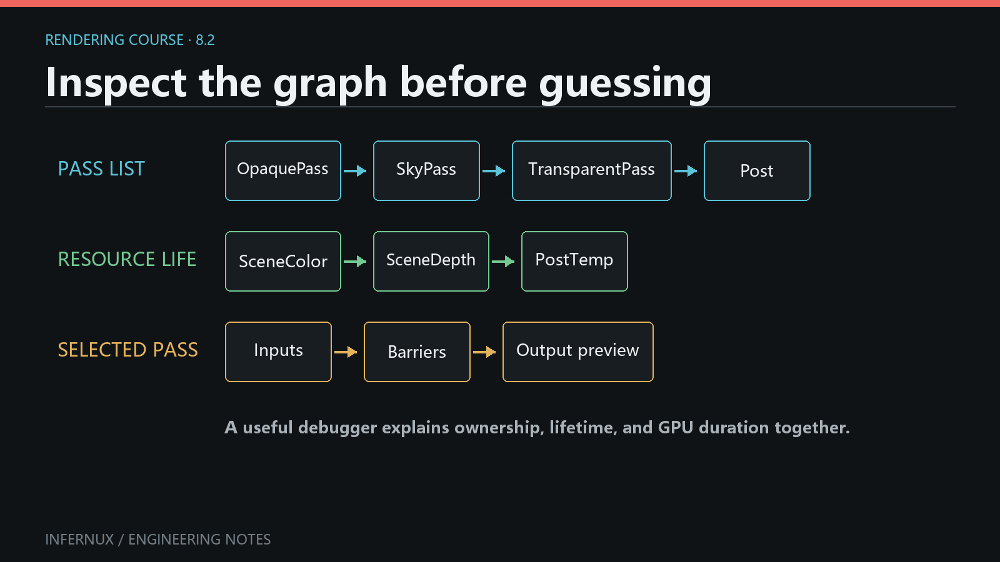

<!-- language:en -->

<span class="mini-tag">Custom Rendering · Chapter 8</span>

# RenderGraph for specialized pipelines

`RenderPipeline.define()` is the high-level authoring API from Chapter 7. The base `define_topology()` implementation compiles that DSL into explicit resources and passes. Override `define_topology(graph)` when the pipeline needs to author those details directly; the override receives a `RenderGraph`, and `define()` is no longer called.

The low-level API exposes more topology and more obligations: resource names, pass declarations, reads and writes, sample counts, EffectStage contracts, and final output all become part of the pipeline.

<div class="learn-article-toc"><strong>In this chapter</strong><a href="#when">Choose the API level</a><a href="#host-matrix">Host capability matrix</a><a href="#minimal-graph">Complete RenderStack graph</a><a href="#providers">Provider contracts</a><a href="#pass-results">PassResult and handle lifetime</a><a href="#resource-usage">Resource usage and MSAA</a><a href="#current-boundaries">Current boundaries</a><a href="#debugging">Validation and recovery</a></div>

<div class="learn-note"><strong>First-pass finish line.</strong><p>Use the complete <code>BaseColorPresentPipeline</code>, select it through a RenderStack host, and confirm that its color reaches the Game view and Present without validation errors. This chapter is the low-level path; Provider details, handle lifetime, resource usage, and MSAA are diagnostic references after the complete graph runs.</p></div>

<figure class="learn-figure">
  
  <figcaption>Concept only, with the top lane showing authored pass order. The native compiler derives dependencies, barriers, and dead-pass removal from declared accesses. This is not an Editor capture; the current Editor has no graphical RenderGraph debugger.</figcaption>
</figure>

## Choose the API level {#when}

Use `define(pipeline)` for frame policy, opaque and transparent Queue routes, Forward/Forward+/Deferred selection, layers, sky, and Effect mount points. Use `define_topology(graph)` for a custom target layout, a nonstandard GBuffer, a pass dependency outside the route DSL, or a new source-scoped semantic buffer.

Keep the ownership chain in mind: the scene owns a RenderStack, the RenderStack owns the selected RenderPipeline and the ordered EffectSlots, the pipeline records topology on the Python RenderGraph builder, and `graph.build()` serializes that topology into a `RenderGraphDescription`. The native engine then compiles the description into a per-camera graph and reuses it across steady frames, keyed by the description's `source_revision`. The pipeline authors the topology; the engine executes it.

The two methods operate at different levels:

- `define(pipeline)` receives a `PipelineBuilder`. It validates domain ownership and compiles routes, intermediate images, resolves, and composition passes.
- `define_topology(graph)` receives a `RenderGraph`. The pipeline creates textures and buffers, declares passes, publishes results, and chooses the output.

Choose one method for each pipeline class. The built-in pipelines remain useful references for low-level code because they currently implement `define_topology(graph)` directly.

## RenderStack and standalone capability matrix {#host-matrix}

`RenderPipeline.render(context, camera)` is the standalone host. RenderStack has a separate build path that installs Effect callbacks, sets the pipeline's private defining-graph state, completes the standard tail, and applies failure recovery. Those differences are observable in the current source:

| Capability in an overridden `define_topology(graph)` | Through RenderStack | Standalone `RenderPipeline.render()` |
| --- | --- | --- |
| `graph.create_texture()`, pass builders, `graph.set_output()` | Supported | Supported |
| `self.require_buffer()` | Supported while RenderStack calls the override | **Unsupported currently:** raises because `_defining_graph` was not set |
| `self.publish_result()` and `self.write_buffer()` | Supported while RenderStack calls the override | **Unsupported currently:** same `_defining_graph` limitation |
| Direct `graph.require_geometry_buffers()`, `graph.publish_pass_result()`, `graph.write_buffer()` | Supported | Supported |
| `@geometry_buffer` plus `self.geometry_stage()` | Supported; RenderStack also adds mounted Effect requirements | Supported only when requirements are set directly on `graph` |
| Mounted RenderStack Effects and stage-local resource buses | Compiled at declared stages | No RenderStack instance is present, so stages are declarations only |
| Missing standard post-process and Screen UI tail | RenderStack appends the safety net | Pipeline must call the needed section helpers itself |
| Failed rebuild | Keeps a previous valid graph or uses the documented first-build Editor fallback | No fallback cache; the build exception leaves `_standalone_desc` unset and the next call retries |

The three `self.*` helpers are not promised for a standalone override in the current implementation. A standalone author can use the direct `graph.*` result methods. Setting `self._defining_graph` manually relies on private state and is excluded from the supported contract. The complete example below intentionally targets RenderStack.

In both hosts, return from `define_topology()` after recording declarations; the host calls `graph.build()`. Call `build()` directly only in an isolated topology test like the verification used for this chapter.

## Complete RenderStack graph: provider to present {#minimal-graph}

Save this class under `Assets`, select **Base Color Present** on the scene RenderStack, and use an active Camera with an opaque MeshRenderer. It performs a depth prepass, lazily materializes a custom base-color Provider, publishes that texture through a `PassResult`, copies it to the camera target, runs the canonical UI/display tail, and presents the result.

```python
import infernux as inx


class BaseColorPresentPipeline(inx.renderstack.RenderPipeline):
    name = "Base Color Present"

    @inx.renderstack.geometry_buffer("preview_color", dependencies={"depth"})
    def provide_preview_color(self, context):
        target = context.graph.create_texture(
            f"{context.source}_preview_color",
            format=inx.rendergraph.Format.RGBA16_SFLOAT,
        )
        with context.graph.add_pass(
            f"{context.source}_preview_color"
        ) as render_pass:
            render_pass.read(context.sample("depth"))
            render_pass.write_color(target)
            render_pass.set_clear(color=(0.0, 0.0, 0.0, 0.0))
            render_pass.draw_renderers(
                queue_range=context.queue_range,
                sort_mode=context.sort_mode,
                material_pass="base_color",
            )
        return target

    def define_topology(self, graph):
        graph.set_msaa_samples(1)
        depth = graph.create_texture(
            "depth", format=inx.rendergraph.Format.D32_SFLOAT
        )

        with graph.add_pass("DepthPrepass") as render_pass:
            render_pass.write_depth(depth)
            render_pass.set_clear(depth=1.0)
            render_pass.draw_renderers(
                queue_range=(0, 2500),
                sort_mode="front_to_back",
                material_pass="depth",
            )

        requested = self.require_buffer("preview_color")
        opaque = self.geometry_stage(
            graph,
            "opaque",
            buffers={"depth": depth},
            queue_range=(0, 2500),
        )
        preview = self.sample_buffer(opaque, requested)

        color = graph.create_texture("color", camera_target=True)
        with graph.add_pass("CopyToCamera") as render_pass:
            render_pass.set_texture("_SourceTex", preview)
            render_pass.write_color(color)
            render_pass.fullscreen_quad("Fullscreen Blit")

        camera_result = self.write_buffer(
            opaque,
            "color",
            color,
            source="camera",
        )

        with graph.pass_result(camera_result):
            graph.screen_ui_section(resources={"color", "depth"})

        with graph.add_present_pass("Present") as present_pass:
            present_pass.present(color)
```

`present(color)` is a typed terminal action and also calls `set_output(color)`. A graph may use `set_output()` without a Present pass, but this example makes the camera-target/export boundary visible. `graph.build()` also chooses the first camera target when no explicit output exists; production pipelines should express the intended output directly.

To verify the example, check that the camera shows unlit base color, the RenderStack topology contains the standard tail and **Present**, and the Console has no graph validation error. Temporarily add `print(graph.get_debug_string())` as the final line of `define_topology()` to record the authored resources, actions, accesses, and output, then remove the print after diagnosis.

Logical names are graph-wide resource identities. Reusable fragments can use `graph.name_scope()` to keep generated names unique. Pass order is recorded as authored, while declared accesses give the native compiler dependency and transition information. The native compiler can cull work that has no path to an output or explicit side effect, so authored order alone does not prove execution.

`screen_ui_section()` places Camera UI, post-process points, display encoding, and Screen UI at that location. A graph built through RenderStack also receives the required post-process points and Screen UI tail when they are missing. Calling the method explicitly keeps their position clear. Standalone use of `RenderPipeline.render()` has no RenderStack safety net, so the pipeline must complete its own output contract.

The standard tail expects the logical `color` resource. A specialized RenderStack pipeline can set another final output, though it still needs a valid `color` path for the standard UI and display-encoding sections.

## Provider contracts {#providers}

Geometry-buffer providers are methods registered on a pipeline class with `@geometry_buffer`. The registration key is `(semantic, phase)`; the default phase is `opaque`. Dependencies are semantic names, and the compiler orders providers topologically.

```python
import infernux as inx


class ObjectIndexPipeline(inx.renderstack.RenderPipeline):
    name = "Object Index"

    @inx.renderstack.geometry_buffer("object_index", dependencies={"depth"})
    def provide_object_index(self, context):
        target = context.graph.create_texture(
            f"{context.source}_object_index",
            format=inx.rendergraph.Format.RG32_UINT,
        )
        with context.graph.add_pass(
            f"{context.source}_object_index"
        ) as render_pass:
            render_pass.read(context.sample("depth"))
            render_pass.write_color(target)
            render_pass.draw_renderers(
                queue_range=context.queue_range,
                sort_mode=context.sort_mode,
                material_pass="picking",
            )
        return target
```

A Provider receives a `GeometryBufferProviderContext`. It may read `context.graph`, `context.source`, `context.phase`, `context.queue_range`, `context.msaa_samples`, `context.sort_mode`, `context.clear`, and already available semantic textures through `context.sample()`. It must return a non-null graph `TextureHandle`; `geometry_stage()` publishes that handle under the decorator's semantic. Dependencies name other semantics that must already exist or have a Provider in the same phase.

A derived class can replace a built-in provider by declaring the same semantic and phase. Two providers for the same key in one class are ambiguous and rejected. Missing dependencies and dependency cycles also fail topology construction with the source and dependency chain in the error. Provider methods run during each topology build when their semantic is requested; the API defines no cross-graph Provider instance cache. Keep build-local handles in the context and keep persistent CPU policy on the pipeline instance.

During `define_topology()`, call `self.require_buffer("object_index")` before the relevant `geometry_stage()`. The stage starts from its supplied buffers, runs only the providers needed by current requirements, and returns a `PassResult`. Effects mounted in RenderStack contribute their declared geometry requirements before the pipeline topology is built, so unused built-in providers such as normal or motion remain unmaterialized.

```python
requested = self.require_buffer("object_index")
result = self.geometry_stage(
    graph,
    "opaque",
    buffers={"color": color, "depth": depth},
    queue_range=(0, 2500),
)
object_index = self.sample_buffer(result, requested)
```

`require_buffer()` is valid only while RenderStack or the base DSL implementation has set the defining graph. The returned `BufferHandle` is a semantic request from `Infernux.renderstack`; it is separate from the transient GPU `BufferHandle` returned by `graph.create_buffer()`. Standalone overrides use `graph.require_geometry_buffers({"object_index"})`, then pass the same graph into `geometry_stage()`.

## PassResult, handles, and native actions {#pass-results}

A `PassResult` is a source-scoped map from semantic names such as `color`, `depth`, `normal`, and `motion` to texture handles. `source` must be unique within one graph build. The graph assigns an increasing `revision` each time it publishes or derives a result.

```python
before = self.publish_result(
    "opaque",
    {"color": color, "depth": depth},
)

copied = graph.create_texture(
    "post_color",
    format=inx.rendergraph.Format.RGBA16_SFLOAT,
)
with graph.add_pass("CopyColor") as render_pass:
    render_pass.set_texture("_SourceTex", before.sample("color"))
    render_pass.write_color(copied)
    render_pass.fullscreen_quad("Fullscreen Blit")

after = self.write_buffer(
    before,
    "color",
    copied,
    source="post_copy",
)
```

`write_buffer()` derives a result with one semantic replaced. The parent still refers to the earlier texture, so later topology can deliberately sample either revision. The revision number is local to the graph build: it expresses publication order, not a frame number, persistent asset ID, or mutable GPU-resource version.

Lazy geometry providers may add a missing semantic to the result that owns them. Once a write derives a new result, earlier semantic bindings stay intact.

`publish_pass_result()` accepts only semantic names mapped to graph `TextureHandle` objects, and every `source` must be unique in that graph build. `PassResult.sample()` returns the logical handle; `snapshot` returns a read-only copy of the current semantic mapping. Result publication does not allocate, copy, or mutate a GPU image. A pass declaration must still write the texture, and a downstream pass must declare its read.

Texture and GPU Buffer handles are lightweight logical-name records owned by one builder run. Do not retain them on the pipeline instance, reuse them after a rebuild, or pass them into another graph. The Python handle type does not carry a graph ID, so a same-name cross-graph mistake can evade early identity checks. The resulting `RenderGraphDescription` contains names and resource descriptions; the native per-camera graph creates the actual resources.

All camera targets in one graph alias the camera's physical color target. Declaring more than one emits a warning, and there is no public alias-control API for other transient resources. The implementation contains `create_temporal_history()`, but the current public `graph.pyi` omits it; treat temporal-history authoring as outside the supported project API in this chapter.

A pass builder records one typed action such as `draw_renderers()`, `fullscreen_quad()`, `copy_texture()`, or `present()`. Calling an action method replaces the previous action on that pass. Python receives no native pass callback, command encoder, Vulkan handle, or resolved GPU resource. `graph.build()` serializes declarations into `GraphPassDesc` and `GraphCommandDesc`; `context.apply_graph()` hands that description to the native compiler and executor.

## Resource usage and MSAA {#resource-usage}

The Python texture API currently derives usage from pass declarations:

- `write_color()` and `write_depth()` declare attachment writes.
- `read()` declares a texture dependency; `set_texture()` also adds the read and records the shader binding.
- `write_resolve()` declares a color resolve target.
- `copy_texture()` declares transfer source and destination access for a copy pass.

`create_texture()` therefore has no public `usage=` parameter. Every actual use still needs a matching pass declaration. A sampled depth texture must appear as a read or sampler binding; an attachment declaration alone does not make the sampling dependency visible to the graph.

Transient GPU buffers use explicit creation flags:

```python
draw_data = graph.create_buffer(
    "draw_data",
    64 * 1024,
    storage=True,
    indirect=True,
    transfer_destination=True,
)
```

`read_buffer()` and `write_buffer()` validate storage, indirect, or transfer access against those flags. `copy_buffer()` adds transfer source/destination flags to its two handles. These declarations describe access and synchronization; an executable pass action still has to use the resource.

For MSAA, `graph.set_msaa_samples(1|2|4|8)` sets the frame policy, and `set_msaa_samples(0)` leaves the current setting unchanged. A camera target and a scene-sized depth texture default to `samples=0`, which inherits that policy. Other transient textures default to one sample. All color and depth attachments in a raster pass must resolve to the same sample count.

Use `write_resolve()` when a multisampled color result must become a single-sample texture:

```python
graph.set_msaa_samples(4)
msaa_color = graph.create_texture(
    "route_msaa",
    format=inx.rendergraph.Format.RGBA16_SFLOAT,
    samples=4,
)
resolved = graph.create_texture(
    "route_color",
    format=inx.rendergraph.Format.RGBA16_SFLOAT,
    samples=1,
)
depth = graph.create_texture("depth", format=inx.rendergraph.Format.D32_SFLOAT)

with graph.add_pass("Route") as render_pass:
    render_pass.write_color(msaa_color)
    render_pass.write_depth(depth)
    render_pass.write_resolve(resolved)
    render_pass.draw_renderers(queue_range=(0, 2500))
```

The pass must have exactly one color output at slot `0`. The source must be multisampled; the target must be a transient, single-sample color texture with matching format and extent. The current Python API has no depth-resolve operation.

## Current boundaries {#current-boundaries}

The public Python RenderGraph currently exposes three pass types:

- `add_pass()` creates a raster pass for renderer draws, sky, Screen UI, or fullscreen work.
- `add_copy_pass()` creates a copy pass for `copy_texture()` or `copy_buffer()`.
- `add_present_pass()` exports a color texture with `present()`.

Compute dispatch is outside the current Python API. There is no `add_compute_pass()`, `dispatch()`, or Python `GraphPassType.COMPUTE`. Storage and indirect Buffer usage flags are available for resource contracts, though they do not add a dispatch or indirect-draw command.

Choose an available path by workload:

- For image-space math that maps cleanly to fragment work, use a Raster pass with `fullscreen_quad()` and declared texture inputs.
- For ordinary scene submission, use `draw_renderers()` and Material Queue filtering; the engine owns renderer batching and draw submission.
- For GPU particle simulation and GPU-driven particle drawing, use the Particle Graph subsystem, whose compute and indirect path is engine-owned.
- For a generic compute kernel, GPU-generated indirect draw, custom queue, or custom native resource import, the Python RenderGraph is currently the wrong extension surface. That work requires an engine-owned native feature and a new public binding/IR contract before a project pipeline can call it.

Transfer support is deliberately narrow. Texture copies require distinct transient textures with matching formats; camera targets are excluded. Buffer copies accept an optional byte count and cannot exceed the smaller buffer. Arbitrary blits, format conversion, queue selection, and custom transfer commands have no public Python builder entry point today.

## Validation, diagnostics, and recovery {#debugging}

`graph.build()` checks duplicate resource and pass names, missing resources, action/pass-type mismatches, Buffer usage, attachment formats, sample-count agreement, resolve contracts, extension-point placement, and final output. The native compiler then validates and schedules the resulting graph.

RenderStack keeps the last valid graph when a topology rebuild fails and logs `Pipeline graph rebuild rejected`. The Inspector also keeps its last valid topology probe and appends the topology exception to its effect diagnostics. If no valid graph exists yet in the Editor, RenderStack attempts Default Forward; a packaged Player preserves the failure and skips rendering. Repairing a watched pipeline file or changing a pipeline parameter invalidates the failed state and causes a later build attempt.

Standalone `RenderPipeline.render()` has no last-valid or Default Forward recovery. A failed `define_topology()` or `build()` leaves `_standalone_desc` unset, so the exception remains visible and a later render call retries. After an accepted code replacement, `dispose()` clears an older standalone description when the pipeline is retired.

There is currently no graphical RenderGraph debugger in the Editor. Use `graph.get_debug_string()` for a text summary of resources, pass actions, reads, writes, resolves, and output, then confirm behavior in both Editor and a build. This string describes one topology artifact, so it cannot distinguish camera-local native instances. For multi-camera runtime logs, include the camera identity available to your host, `context.graph_instance_id`, and `RenderGraphDescription.source_revision`; `graph_instance_id` distinguishes native graph instances while the source revision identifies the shared Python topology.

Before shipping a low-level pipeline, check these points:

1. Every consumed texture or Buffer has the corresponding read/access declaration and an upstream producer.
2. Attachment sample counts agree, and every sampled MSAA color path resolves at the intended point.
3. EffectStage input/output contracts match the semantic resources available at that source.
4. Each camera receives its own graph-backed runtime resources and camera-local light/shadow state.
5. The graph has one final color output, one display encode, and intentional Camera UI and Screen UI placement.

<!-- language:zh -->

<span class="mini-tag">自定义渲染 · 第 8 章</span>

# 面向特殊管线的 RenderGraph

`RenderPipeline.define()` 是第 7 章介绍的高层编写 API。基类的 `define_topology()` 会把这套 DSL 编译为显式资源与 Pass。需要直接编写这些细节时，可以覆盖 `define_topology(graph)`；覆盖后收到的是 `RenderGraph`，系统也不会再调用 `define()`。

进入低层 API 后，拓扑控制范围更大，相应契约也更多：资源名、Pass 声明、读写、采样数、EffectStage Contract 与最终输出都由管线负责。

<div class="learn-article-toc"><strong>本章内容</strong><a href="#when_1">选择 API 层级</a><a href="#host-matrix_1">Host 能力矩阵</a><a href="#minimal-graph_1">完整 RenderStack Graph</a><a href="#providers_1">Provider 契约</a><a href="#pass-results_1">PassResult 与 Handle 生命周期</a><a href="#resource-usage_1">资源 Usage 与 MSAA</a><a href="#current-boundaries_1">当前能力边界</a><a href="#debugging_1">校验与恢复</a></div>

<div class="learn-note"><strong>第一次阅读的完成点。</strong><p>使用完整的 <code>BaseColorPresentPipeline</code>，通过 RenderStack Host 选中它，确认颜色进入 Game 画面并完成 Present，且没有 Validation Error。本章属于低层路径；Provider 细节、Handle 生命周期、资源 Usage 与 MSAA 适合在完整 Graph 跑通后作为诊断资料查阅。</p></div>

<figure class="learn-figure">
  
  <figcaption>仅用于解释概念，顶行表示编写时的 Pass 顺序。Native Compiler 根据已声明的 Access 推导依赖、Barrier 与 Dead-pass Removal。本图不是 Editor 截图；当前 Editor 没有图形化 RenderGraph Debugger。</figcaption>
</figure>

## 选择 API 层级 {#when_1}

`define(pipeline)` 适合帧策略、不透明与透明 Queue 路由、Forward/Forward+/Deferred 选择、Layer、天空和 Effect 挂载点。`define_topology(graph)` 适合自定义 Target 布局、非标准 GBuffer、Route DSL 词汇之外的 Pass 依赖，以及新的源作用域语义 Buffer。

记住这条所有权链：场景拥有 RenderStack，RenderStack 拥有选中的 RenderPipeline 与有序 EffectSlot，管线把拓扑记录到 Python RenderGraph 构建器上，`graph.build()` 再把拓扑序列化成 `RenderGraphDescription`。原生引擎随后把描述编译成每相机的图，并在稳态帧中按描述的 `source_revision` 复用。管线负责编写拓扑，引擎负责执行。

两个方法处在不同层级：

- `define(pipeline)` 收到 `PipelineBuilder`，负责校验 Domain 所有权，并编译 Route、中间图像、Resolve 与合成 Pass。
- `define_topology(graph)` 收到 `RenderGraph`，由管线创建 Texture 与 Buffer、声明 Pass、发布 Result，并选定输出。

每个管线类选择一个方法。内置管线当前直接实现 `define_topology(graph)`，可作为低层代码参考。

## RenderStack 与 standalone 能力矩阵 {#host-matrix_1}

`RenderPipeline.render(context, camera)` 是 standalone Host。RenderStack 使用另一条构建路径，它会安装 Effect Callback、设置管线的私有 Defining Graph 状态、补全标准帧尾并执行失败恢复。当前源码中的差异如下：

| 覆盖 `define_topology(graph)` 后的能力 | 通过 RenderStack | Standalone `RenderPipeline.render()` |
| --- | --- | --- |
| `graph.create_texture()`、Pass Builder、`graph.set_output()` | 支持 | 支持 |
| `self.require_buffer()` | RenderStack 调用 Override 期间支持 | **当前不支持：** `_defining_graph` 未设置，会抛出异常 |
| `self.publish_result()` 与 `self.write_buffer()` | RenderStack 调用 Override 期间支持 | **当前不支持：** 受同一 `_defining_graph` 限制 |
| 直接调用 `graph.require_geometry_buffers()`、`graph.publish_pass_result()`、`graph.write_buffer()` | 支持 | 支持 |
| `@geometry_buffer` 与 `self.geometry_stage()` | 支持；RenderStack 还会加入已挂载 Effect 的需求 | 需要直接在 `graph` 上设置需求后使用 |
| 已挂载的 RenderStack Effect 与 Stage 局部 Resource Bus | 在声明位置编译 | 没有 RenderStack 实例，Stage 只保留声明信息 |
| 缺失的标准后处理与 Screen UI 帧尾 | RenderStack 会追加安全网 | 管线必须自行调用所需 Section Helper |
| 重建失败 | 保留上一份有效 Graph，或使用已说明的 Editor 首次构建回退 | 没有回退缓存；异常后 `_standalone_desc` 为空，下次调用重试 |

当前实现没有承诺三项 `self.*` Helper 可用于 standalone Override。Standalone 作者可以改用直接的 `graph.*` Result 方法。手动设置 `self._defining_graph` 会依赖私有状态，不属于受支持契约。下面的完整样例明确以 RenderStack 为 Host。

两种 Host 都要求 `define_topology()` 记录完声明后直接返回，由 Host 调用 `graph.build()`。只有独立拓扑测试才应直接调用 `build()`，例如本章样例采用的验证方式。

## 完整 RenderStack Graph：从 Provider 到 Present {#minimal-graph_1}

把这个类保存到 `Assets` 下，在场景 RenderStack 中选择 **Base Color Present**，并准备一台活动 Camera 和一个不透明 MeshRenderer。样例先执行 Depth Prepass，再惰性生成自定义 Base-color Provider，通过 `PassResult` 发布纹理，把结果复制到 Camera Target，执行标准 UI/显示帧尾，最后 Present。

```python
import infernux as inx


class BaseColorPresentPipeline(inx.renderstack.RenderPipeline):
    name = "Base Color Present"

    @inx.renderstack.geometry_buffer("preview_color", dependencies={"depth"})
    def provide_preview_color(self, context):
        target = context.graph.create_texture(
            f"{context.source}_preview_color",
            format=inx.rendergraph.Format.RGBA16_SFLOAT,
        )
        with context.graph.add_pass(
            f"{context.source}_preview_color"
        ) as render_pass:
            render_pass.read(context.sample("depth"))
            render_pass.write_color(target)
            render_pass.set_clear(color=(0.0, 0.0, 0.0, 0.0))
            render_pass.draw_renderers(
                queue_range=context.queue_range,
                sort_mode=context.sort_mode,
                material_pass="base_color",
            )
        return target

    def define_topology(self, graph):
        graph.set_msaa_samples(1)
        depth = graph.create_texture(
            "depth", format=inx.rendergraph.Format.D32_SFLOAT
        )

        with graph.add_pass("DepthPrepass") as render_pass:
            render_pass.write_depth(depth)
            render_pass.set_clear(depth=1.0)
            render_pass.draw_renderers(
                queue_range=(0, 2500),
                sort_mode="front_to_back",
                material_pass="depth",
            )

        requested = self.require_buffer("preview_color")
        opaque = self.geometry_stage(
            graph,
            "opaque",
            buffers={"depth": depth},
            queue_range=(0, 2500),
        )
        preview = self.sample_buffer(opaque, requested)

        color = graph.create_texture("color", camera_target=True)
        with graph.add_pass("CopyToCamera") as render_pass:
            render_pass.set_texture("_SourceTex", preview)
            render_pass.write_color(color)
            render_pass.fullscreen_quad("Fullscreen Blit")

        camera_result = self.write_buffer(
            opaque,
            "color",
            color,
            source="camera",
        )

        with graph.pass_result(camera_result):
            graph.screen_ui_section(resources={"color", "depth"})

        with graph.add_present_pass("Present") as present_pass:
            present_pass.present(color)
```

`present(color)` 是带类型的终止 Action，同时会调用 `set_output(color)`。Graph 也可以只使用 `set_output()`，省略 Present Pass；本例显式展示 Camera Target 与导出边界。没有显式输出时，`graph.build()` 会选取第一张 Camera Target，生产管线仍应明确表达目标输出。

验证时应看到 Camera 输出未受光照的 Base Color，RenderStack 拓扑包含标准帧尾与 **Present**，Console 中没有 Graph 校验错误。诊断期间可以在 `define_topology()` 最后一行暂时加入 `print(graph.get_debug_string())`，记录资源、Action、Access 与输出；检查完成后删除该输出。

逻辑名称是 Graph 范围内的资源身份。可复用片段可以使用 `graph.name_scope()`，避免生成的名称冲突。Pass 顺序按书写顺序记录；声明的 Access 为 Native Compiler 提供依赖与转换信息。Native Compiler 可以剔除无法到达输出且未声明 Side Effect 的工作，因此编写顺序本身不能证明执行。

`screen_ui_section()` 会把 Camera UI、后处理挂点、显示编码和 Screen UI 放在调用位置。通过 RenderStack 构建 Graph 时，缺失的标准后处理挂点和 Screen UI 帧尾也会由安全网补齐。显式调用可以清楚控制它们的位置。单独使用 `RenderPipeline.render()` 时没有这层 RenderStack 安全网，管线需要自行完成输出契约。

标准帧尾使用逻辑资源 `color`。特殊 RenderStack 管线可以把另一张纹理设为最终输出，同时仍需为标准 UI 与显示编码保留有效的 `color` 路径。

## Provider 契约 {#providers_1}

Geometry Buffer Provider 是使用 `@geometry_buffer` 注册在管线类上的方法。注册键为 `(semantic, phase)`，默认 Phase 是 `opaque`。依赖项使用语义名，编译器按拓扑顺序安排 Provider。

```python
import infernux as inx


class ObjectIndexPipeline(inx.renderstack.RenderPipeline):
    name = "Object Index"

    @inx.renderstack.geometry_buffer("object_index", dependencies={"depth"})
    def provide_object_index(self, context):
        target = context.graph.create_texture(
            f"{context.source}_object_index",
            format=inx.rendergraph.Format.RG32_UINT,
        )
        with context.graph.add_pass(
            f"{context.source}_object_index"
        ) as render_pass:
            render_pass.read(context.sample("depth"))
            render_pass.write_color(target)
            render_pass.draw_renderers(
                queue_range=context.queue_range,
                sort_mode=context.sort_mode,
                material_pass="picking",
            )
        return target
```

Provider 接收 `GeometryBufferProviderContext`。它可以读取 `context.graph`、`context.source`、`context.phase`、`context.queue_range`、`context.msaa_samples`、`context.sort_mode`、`context.clear`，并通过 `context.sample()` 取得已有 Semantic Texture。Provider 必须返回非空的 Graph `TextureHandle`；`geometry_stage()` 会以 Decorator 中的 Semantic 发布该 Handle。Dependency 表示同一 Phase 中必须已存在或可由 Provider 生成的其它 Semantic。

派生类声明相同的 Semantic 与 Phase，即可替换内置 Provider。同一个类里为同一注册键声明两个 Provider 会产生歧义并被拒绝。依赖缺失或形成环时，拓扑构建也会失败，错误中会带 Source 与依赖链。每次拓扑构建只会在 Semantic 被请求时运行相关 Provider；API 没有定义跨 Graph 的 Provider 实例缓存。构建局部 Handle 应留在 Context 中，持久 CPU 策略可以保存在 Pipeline 实例上。

在 `define_topology()` 中，应先调用 `self.require_buffer("object_index")`，再进入对应的 `geometry_stage()`。Stage 从传入的 Buffer 集合开始，只运行当前需求涉及的 Provider，最后返回 `PassResult`。RenderStack 中已挂载 Effect 声明的 Geometry 需求会在管线构建前加入 Graph，因此未使用的内置 Normal、Motion 等 Provider 不会生成资源。

```python
requested = self.require_buffer("object_index")
result = self.geometry_stage(
    graph,
    "opaque",
    buffers={"color": color, "depth": depth},
    queue_range=(0, 2500),
)
object_index = self.sample_buffer(result, requested)
```

`require_buffer()` 只在 RenderStack 或基础 DSL 实现已设置 Defining Graph 时有效。它返回的是 `Infernux.renderstack` 中的语义请求 `BufferHandle`；`graph.create_buffer()` 返回的是瞬态 GPU Buffer Handle，两者类型职责不同。Standalone Override 应先调用 `graph.require_geometry_buffers({"object_index"})`，再把同一 Graph 传给 `geometry_stage()`。

## PassResult、Handle 生命周期与 Native Action {#pass-results_1}

`PassResult` 是带 Source 作用域的语义映射，把 `color`、`depth`、`normal`、`motion` 等名称指向 Texture Handle。`source` 在一次 Graph 构建中必须唯一。每次发布或派生 Result 时，Graph 都会分配递增的 `revision`。

```python
before = self.publish_result(
    "opaque",
    {"color": color, "depth": depth},
)

copied = graph.create_texture(
    "post_color",
    format=inx.rendergraph.Format.RGBA16_SFLOAT,
)
with graph.add_pass("CopyColor") as render_pass:
    render_pass.set_texture("_SourceTex", before.sample("color"))
    render_pass.write_color(copied)
    render_pass.fullscreen_quad("Fullscreen Blit")

after = self.write_buffer(
    before,
    "color",
    copied,
    source="post_copy",
)
```

`write_buffer()` 会派生一份替换了单个 Semantic 的 Result。Parent 仍指向较早的纹理，后续拓扑可以有意采样任一 Revision。Revision 只在当前 Graph 构建内表示发布顺序，不代表帧号、持久资产 ID 或可变 GPU 资源版本。

惰性 Geometry Provider 可以把缺失的 Semantic 加入拥有它的 Result。一次写入派生出新 Result 后，早期 Result 的语义绑定仍保持原值。

`publish_pass_result()` 只接受由 Semantic 名称映射到 Graph `TextureHandle` 的数据，同一次 Graph 构建中的 `source` 必须唯一。`PassResult.sample()` 返回逻辑 Handle；`snapshot` 返回当前 Semantic 映射的只读副本。发布 Result 不会分配、复制或修改 GPU Image。仍需由 Pass 声明写入纹理，并由下游 Pass 声明读取。

Texture Handle 与 GPU Buffer Handle 是一次 Builder 运行所拥有的轻量逻辑名称记录。不要把它们保存在 Pipeline 实例上，不要在重建后继续使用，也不要传给另一个 Graph。Python Handle 类型不携带 Graph ID，因此同名的跨 Graph 错误可能绕过早期身份检查。最终的 `RenderGraphDescription` 保存名称与资源描述，实际资源由每相机 Native Graph 创建。

同一个 Graph 中的所有 Camera Target 都会别名到相机物理 Color Target。声明多张时会产生警告；其它瞬态资源没有公开的 Alias 控制 API。实现代码中存在 `create_temporal_history()`，当前公开 `graph.pyi` 没有列出它；本章不把 Temporal-history Authoring 视为受支持的项目 API。

Pass Builder 记录一个带类型的 Action，例如 `draw_renderers()`、`fullscreen_quad()`、`copy_texture()` 或 `present()`。再次调用 Action 方法会替换该 Pass 的前一项 Action。Python 不会收到 Native Pass Callback、Command Encoder、Vulkan Handle 或已解析的 GPU 资源。`graph.build()` 把声明序列化为 `GraphPassDesc` 与 `GraphCommandDesc`；`context.apply_graph()` 再把描述交给 Native Compiler 与 Executor。

## 资源 Usage 与 MSAA {#resource-usage_1}

当前 Python Texture API 从 Pass 声明中推导 Usage：

- `write_color()` 与 `write_depth()` 声明 Attachment 写入。
- `read()` 声明 Texture 依赖；`set_texture()` 还会同时记录 Shader 绑定。
- `write_resolve()` 声明 Color Resolve 目标。
- `copy_texture()` 在 Copy Pass 中声明 Transfer Source 与 Destination Access。

因此，`create_texture()` 没有公开的 `usage=` 参数。每项实际用途仍需对应的 Pass 声明。需要采样的 Depth Texture 必须出现在 Read 或 Sampler Binding 中；只有 Attachment 声明时，Graph 看不到采样依赖。

瞬态 GPU Buffer 在创建时显式声明标志：

```python
draw_data = graph.create_buffer(
    "draw_data",
    64 * 1024,
    storage=True,
    indirect=True,
    transfer_destination=True,
)
```

`read_buffer()` 与 `write_buffer()` 会根据这些标志校验 Storage、Indirect 或 Transfer Access。`copy_buffer()` 会给两端 Handle 补充 Transfer Source/Destination 标志。这些声明负责描述访问与同步；资源还需要被可执行 Pass Action 实际使用。

MSAA 由 `graph.set_msaa_samples(1|2|4|8)` 设置帧策略，`set_msaa_samples(0)` 表示保持当前设置不变。Camera Target 与场景尺寸的 Depth Texture 默认使用 `samples=0`，表示继承该策略；其它瞬态 Texture 默认是单采样。同一 Raster Pass 的所有 Color 与 Depth Attachment 必须解析为相同采样数。

多采样 Color 需要变成单采样 Texture 时，使用 `write_resolve()`：

```python
graph.set_msaa_samples(4)
msaa_color = graph.create_texture(
    "route_msaa",
    format=inx.rendergraph.Format.RGBA16_SFLOAT,
    samples=4,
)
resolved = graph.create_texture(
    "route_color",
    format=inx.rendergraph.Format.RGBA16_SFLOAT,
    samples=1,
)
depth = graph.create_texture("depth", format=inx.rendergraph.Format.D32_SFLOAT)

with graph.add_pass("Route") as render_pass:
    render_pass.write_color(msaa_color)
    render_pass.write_depth(depth)
    render_pass.write_resolve(resolved)
    render_pass.draw_renderers(queue_range=(0, 2500))
```

该 Pass 必须只有 Slot `0` 这一项 Color 输出。Source 必须为多采样；Target 必须是格式与尺寸匹配的瞬态单采样 Color Texture。当前 Python API 没有 Depth Resolve 操作。

## 当前能力边界 {#current-boundaries_1}

公开的 Python RenderGraph 当前提供三种 Pass：

- `add_pass()` 创建 Raster Pass，用于 Renderer Draw、天空、Screen UI 或 Fullscreen 工作。
- `add_copy_pass()` 创建 Copy Pass，执行 `copy_texture()` 或 `copy_buffer()`。
- `add_present_pass()` 通过 `present()` 导出 Color Texture。

Compute Dispatch 尚未进入当前 Python API。现有接口没有 `add_compute_pass()`、`dispatch()` 或 Python `GraphPassType.COMPUTE`。Storage 与 Indirect Buffer Usage 标志可用于资源契约，但不会生成 Dispatch 或 Indirect Draw 命令。

可以按工作负载选择当前可用路径：

- 图像空间计算适合 Fragment 工作时，使用带 `fullscreen_quad()` 和显式 Texture Input 的 Raster Pass。
- 普通场景提交使用 `draw_renderers()` 与 Material Queue 过滤；Renderer Batching 与 Draw Submission 由引擎管理。
- GPU 粒子模拟与 GPU-driven 粒子绘制使用 Particle Graph 子系统，其 Compute 与 Indirect 路径由引擎管理。
- 通用 Compute Kernel、GPU 生成的 Indirect Draw、自定义 Queue 或自定义 Native Resource Import 当前不适合 Python RenderGraph。项目管线调用这些能力之前，需要先增加引擎管理的 Native Feature 以及新的公开 Binding/IR 契约。

Transfer 支持范围较窄。Texture Copy 要求两张不同的瞬态 Texture 格式一致，Camera Target 不参与该操作。Buffer Copy 可指定字节数，且不能超过两端较小者。任意 Blit、格式转换、队列选择与自定义 Transfer Command 目前没有公开的 Python Builder 入口。

## 校验、诊断与恢复 {#debugging_1}

`graph.build()` 会检查资源与 Pass 重名、资源缺失、Action 与 Pass Type 不匹配、Buffer Usage、Attachment 格式、采样数一致性、Resolve 契约、扩展点位置和最终输出。随后由 Native Compiler 校验并调度生成的 Graph。

拓扑重建失败时，RenderStack 会保留上一份有效 Graph，并记录 `Pipeline graph rebuild rejected`。Inspector 也会保留上一份有效的 Topology Probe，并把拓扑异常追加到 Effect Diagnostic。首次构建尚无有效 Graph 时，Editor 会尝试 Default Forward；打包 Player 会保留失败并跳过渲染。修复被监听的管线文件或修改管线参数会清除失败状态，随后再次尝试构建。

Standalone `RenderPipeline.render()` 没有上一份有效图或 Default Forward 恢复。`define_topology()` 或 `build()` 失败后，`_standalone_desc` 保持为空，异常继续可见，后续 Render 调用会重试。管线被替换时，`dispose()` 会清除旧的 Standalone Description。

当前 Editor 没有图形化 RenderGraph Debugger。可使用 `graph.get_debug_string()` 查看资源、Pass Action、读写、Resolve 与输出的文本摘要，再到 Editor 和真实构建中确认行为。这段文本描述一份 Topology Artifact，无法区分每台相机的 Native 实例。多相机运行日志应同时包含 Host 可取得的 Camera 身份、`context.graph_instance_id` 与 `RenderGraphDescription.source_revision`；Graph Instance ID 用于区分 Native Graph 实例，Source Revision 标识共享的 Python 拓扑。

低层管线交付前，至少检查以下几点：

1. 每个被消费的 Texture 或 Buffer 都有对应 Read/Access 声明和上游 Producer。
2. Attachment 采样数一致，每条会被采样的 MSAA Color 路径都在预期位置完成 Resolve。
3. EffectStage 的 Input/Output Contract 与该 Source 可用的语义资源一致。
4. 每台相机拥有独立的 Graph Runtime 资源，以及相机局部的光照和阴影状态。
5. Graph 只有一个最终 Color 输出、一次显示编码，并明确放置 Camera UI 与 Screen UI。
