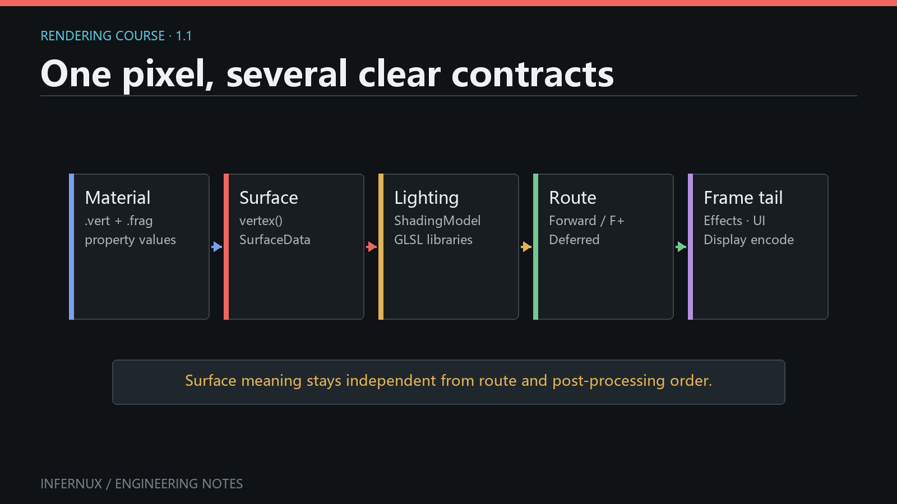

<!-- language:en -->

Custom Rendering · Chapter 1

# How authored rendering enters an Infernux frame

Infernux splits rendering decisions across Materials, vertex stages, fragment stages, shading models, pipelines, and effects. Each one owns a smaller part of the result.

This course follows the **authored rendering path**: the files and settings you choose, and the contracts between them. The engine's complete frame graph and chronological GPU pass order sit below that scope. Read it in order the first time; later, each chapter can stand on its own.

<strong>In this chapter</strong><a href="#first-result">Your first result</a><a href="#the-rendering-chain">The authored chain</a><a href="#four-levels">Four levels of customization</a><a href="#built-in-paths">Built-in paths</a><a href="#course-map">Course map</a>

<figure class="learn-figure">
  
  <figcaption>The author-facing contracts, read from mesh and Material to pipeline and final output.</figcaption>
</figure>

<strong>The frame contains more work.</strong>
The default pipelines and renderer add shadow rendering, depth work, GPU picking, motion-vector variants, and MSAA color/depth resolves around this path when a view or effect needs them. These engine-internal paths sit outside the sequence of authoring stages shown above.

## Get one material on screen first {#first-result}

**Prerequisites.** Open an Infernux project with a writable `Assets` folder and show the Hierarchy, Project, Inspector, Scene, Game, and Console panels. This exercise uses the built-in Cube mesh, `Standard` vertex stage, and `Lit` fragment stage; it needs no imported asset, custom shader, or RenderStack. Use a clean project, or first rename any project shader whose `ShaderInfo Name` is `Standard` or `Lit`: project shaders are scanned before built-ins and the current selector does not label their origin. A newly created scene already contains **Main Camera** and **Directional Light**. The camera/light steps below also cover a scene whose Hierarchy was cleared.

Reproduce the complete baseline from an otherwise empty scene:

1. Right-click empty space in **Hierarchy**, choose **Create 3D Object > Cube**, and leave the Cube Transform at position `(0, 0, 0)`. Its MeshRenderer should show one mesh and one material slot.
2. If no enabled Camera exists, right-click Hierarchy and choose **Camera**. Set its position to `(0, 1, -10)` and rotation to `(0, 0, 0)` so the Cube is inside the Game view. If no enabled light exists, choose **Light > Directional Light**; the creation command supplies a useful initial rotation.
3. In **Project**, open `Assets` or a child folder, right-click empty space, and choose **Material (.mat)**. Name it `FirstCube`. The current template creates a Material whose **Vertex** selector is `Standard` and **Fragment** selector is `Lit`; confirm both values in its Inspector.
4. Select the Cube. Under **MeshRenderer > Materials**, drag `FirstCube.mat` onto **Element 0**, or use that slot's asset picker.
5. Keep the scene free of a RenderStack for this first check. The renderer uses **Default Forward** when no RenderStack is present.
6. Open **Scene** and **Game**. Select `FirstCube.mat` and change **Base Color** to a saturated color that is easy to distinguish from white.

The baseline passes when the same Cube is visible in both views, its lit faces show different brightness, the chosen Base Color appears on the Cube, and the Material preview changes with it. The Console must contain no new shader import, stage-link, or pipeline error. Scene-visible/Game-missing usually points to the scene Camera; missing in both views points first to the Cube's mesh, enabled MeshRenderer, or **Element 0** assignment.

For a second, explicit pipeline check, create **Post Processing > RenderStack** from the Hierarchy context menu and select **Default Forward** in its Inspector. With an empty effect list, the Cube should remain visually unchanged. This comparison checks that the explicit baseline is usable; pixels alone do not prove which route produced them.

<strong>Current API boundary and evidence.</strong>
The workflow above follows <code>hierarchy_creation_service.py</code> and <code>core_context_menus.py</code> for scene/asset creation, <code>project_file_ops.py</code> for the Standard/Lit Material template, the current MeshRenderer and Material Inspectors for assignment, and <code>render_stack_pipeline.py</code> for the no-RenderStack fallback. Later chapters link the public authoring entry points for custom stages, effects, pipelines, and RenderGraph work.

## The authored rendering chain {#the-rendering-chain}

Start with one object in a scene:

1. Its **Material** chooses one `.vert` and one `.frag` by their case-sensitive `ShaderInfo Name`, then stores the property values declared by those stages.
2. The **vertex stage** decides where the mesh vertices end up. If it contains no `vertex()` hook, Infernux uses the standard object-to-clip transform.
3. The **fragment stage** samples textures and turns the material inputs into `SurfaceData`: albedo, normal, metallic, smoothness, emission, alpha, and related surface facts.
4. The **ShadingModel** decides how that surface interacts with the current camera's lights. PBR, unlit, toon, and project-specific lighting belong here.
5. The **RenderPipeline** chooses when and how the material is rendered. It can route different Material Render Queue ranges through Forward, Forward+, or Deferred.
6. The **RenderStack** binds reusable `.effect` assets to stable effect stages declared by that pipeline.
7. Camera UI, post-processing, display encoding, and Screen UI form the standard tail before the image reaches the editor viewport or game output.

The useful boundary is between *what a surface is* and *when it is drawn*. A toon material stays independent of the scene's Forward+ or mixed-pipeline choice, while the pipeline can route its queue without reimplementing toon lighting.

<figure class="learn-figure">
  
  <figcaption>A frame captured from an Infernux demo project. It is a visual reference for contrasting material styles, not a record of the hidden pipeline configuration.</figcaption>
</figure>

<strong>Evidence scope.</strong>
This capture is visual evidence that the displayed frame existed in that project and session. It does not identify the scene asset, Material or ShadingModel names, active RenderPipeline, RenderStack contents, engine commit, or capture settings. Reproduce architecture claims with the baseline workflow and current source contracts above, not by inferring hidden configuration from the pixels.

## Four levels of customization {#four-levels}

Use the lowest level that solves the problem:

| You want to change | Authoring level | Typical file |
| --- | --- | --- |
| Mesh position or varyings | Vertex stage | `.vert` |
| Material inputs and surface appearance | Fragment stage | `.frag` + `.mat` |
| How surfaces react to light | Shading model and function libraries | `.shadingmodel` + `.glsl` |
| When objects and effects are rendered | Pipeline and effect topology | Python `RenderPipeline`, `.effect`, `.effectgroup` |

Start at the lowest level that actually owns the change. Water may need only vertex deformation and surface construction. A stylized project may add a shading model. A scene with two art directions may route queue ranges differently. Raw RenderGraph work handles the gaps beyond the public pipeline API.

Again, this table maps authoring responsibilities only. A full frame also contains internal renderer paths for shadows, depth products, picking, motion vectors, and MSAA resolves. Those paths reuse compatible Material and vertex contracts. Chapter 8 looks at the lower-level graph behind these branches.

## Built-in paths {#built-in-paths}

Infernux ships with three ordinary pipeline choices:

- **Default Forward** is the default and the easiest baseline to reason about.
- **Default Forward+** uses camera-local clustered light selection for scenes with more local lights.
- **Default Deferred** writes a real GBuffer for compatible opaque materials, performs fullscreen lighting, sends explicitly unsupported shading models through a Forward+ fallback, and always renders transparent objects with Forward+.

Using `Standard` + `Lit` in a Deferred pipeline is expected. The material still describes the same surface; the render-path adapter generates the GBuffer side of the contract. A shading model declares `Unsupported [Deferred]` only when its result falls outside that contract.

<strong>What “default” means here.</strong>
A scene without a RenderStack and a scene with an empty Default Forward stack use the same baseline route. Selecting another pipeline changes routing and topology while Material property meanings stay fixed.

## Course map {#course-map}

The remaining chapters build the system in dependency order:

1. [Vertex stages and reusable deformation](vertex-stage.html) starts from the visible Cube and its Material.
2. [Fragment stages, `SurfaceData`, and Material properties](fragment-materials.html) pairs a fragment stage with the vertex-stage contract.
3. [Pipeline-independent ShadingModels and imported GLSL libraries](shading-models-glsl.html) builds on the fragment chapter's `SurfaceData` output.
4. [Reusable RenderEffect assets and fullscreen implementations](render-effects.html) starts a separate post-processing branch and requires a visible baseline scene.
5. [RenderStack stages, route scope, and UI boundaries](renderstack-mount-points.html) mounts the effect assets from the previous chapter.
6. [Declarative Python pipelines that mix Forward, Forward+, and Deferred](custom-render-pipelines.html) assumes the queue and mount-point vocabulary from Chapters 4-6.
7. [Low-level RenderGraph](rendergraph-advanced.html) is the advanced path for work outside the public pipeline DSL.

At the end, you will be able to create a pipeline where one opaque queue range uses stylized Forward shading, another uses Deferred PBR, each route receives different effects, both are composited under one sky, and final post-processing still treats Camera UI and Screen UI deliberately.

<!-- language:zh -->

自定义渲染 · 第 1 章

# 用户编写的渲染内容怎样进入 Infernux 的一帧

Infernux 没有把所有渲染决定塞进一份 Shader。Material、顶点阶段、片元阶段、ShadingModel、Pipeline 和 Effect 各自负责画面的一部分。

这套课程聚焦**用户编写路径**：你会选择哪些资产、填写哪些设置，以及这些内容怎样接入渲染器。完整 Frame Graph 与 GPU Pass 的实际执行顺序属于更底层的范围。第一次适合顺着读，之后再按问题查章节。

<strong>本章内容</strong><a href="#first-result_1">先跑通第一条路径</a><a href="#the-rendering-chain_1">用户编写链路</a><a href="#four-levels_1">四个定制层级</a><a href="#built-in-paths_1">内置路径</a><a href="#course-map_1">课程地图</a>

<figure class="learn-figure">
  
  <figcaption>从网格与 Material 到 Pipeline 和最终输出，这张图只画用户会接触的契约。</figcaption>
</figure>

<strong>一帧还包含更多工作。</strong>
默认管线和渲染器会按相机与效果的需要，在这条路径周围安排阴影、深度、GPU 拾取、运动向量变体，以及 MSAA 颜色/深度 Resolve。这些引擎内部路径位于上图所示的作者阶段序列之外。

## 先让一个材质正确出现在画面里 {#first-result_1}

**准备条件。** 打开一个 `Assets` 目录可写的 Infernux 项目，并显示 Hierarchy、Project、Inspector、Scene、Game 与 Console 面板。本练习只使用内置 Cube Mesh、`Standard` 顶点阶段和 `Lit` 片元阶段，不需要导入资产、自定义 Shader 或 RenderStack。请使用干净项目，或先给 `ShaderInfo Name` 为 `Standard`、`Lit` 的项目 Shader 改名：选择器会先扫描项目 Shader，再扫描内置 Shader，当前菜单也不显示来源。新建场景已经带有 **Main Camera** 与 **Directional Light**；下面也包含 Hierarchy 被清空后的补建步骤。

从其余内容为空的场景复现完整基线：

1. 在 **Hierarchy** 空白处右键，选择 **Create 3D Object > Cube**，保持 Cube 的 Transform 位置为 `(0, 0, 0)`。它的 MeshRenderer 应显示一个 Mesh 和一个 Material Slot。
2. 场景里没有启用的 Camera 时，在 Hierarchy 空白处右键选择 **Camera**，把位置设为 `(0, 1, -10)`、旋转设为 `(0, 0, 0)`，让 Cube 进入 Game 画面。没有启用的灯光时，选择 **Light > Directional Light**；该创建命令会提供可用的初始旋转。
3. 在 **Project** 中打开 `Assets` 或其子目录，在空白处右键选择 **Material (.mat)**，命名为 `FirstCube`。当前模板会创建 **Vertex** 为 `Standard`、**Fragment** 为 `Lit` 的 Material；在 Inspector 中确认这两个值。
4. 选中 Cube，在 **MeshRenderer > Materials** 中把 `FirstCube.mat` 拖到 **Element 0**，也可以使用该 Slot 的资产选择器。
5. 第一次检查先不创建 RenderStack。场景缺少 RenderStack 时，渲染器使用 **Default Forward**。
6. 打开 **Scene** 与 **Game**。选中 `FirstCube.mat`，把 **Base Color** 改成容易与白色区分的高饱和颜色。

以下现象同时出现就算通过：两个视图都能看到同一个 Cube；受光面有明暗变化；Cube 显示所选 Base Color；Material 预览同步变化；Console 没有新增 Shader 导入、阶段链接或 Pipeline 错误。Scene 可见但 Game 缺失时，先查场景 Camera；两个视图都缺失时，先查 Cube 的 Mesh、MeshRenderer 启用状态与 **Element 0** 赋值。

再做一次显式 Pipeline 检查：从 Hierarchy 右键菜单创建 **Post Processing > RenderStack**，在 Inspector 中选择 **Default Forward**。Effect 列表为空时，Cube 画面应保持一致。这个对照可以确认显式基线可用；仅凭像素无法证明背后的实际路由。

<strong>当前 API 边界与证据。</strong>
以上流程依据 <code>hierarchy_creation_service.py</code> 与 <code>core_context_menus.py</code> 的场景/资产创建入口、<code>project_file_ops.py</code> 的 Standard/Lit Material 模板、当前 MeshRenderer 与 Material Inspector 的赋值入口，以及 <code>render_stack_pipeline.py</code> 的无 RenderStack 回退。后续章节会链接自定义阶段、Effect、Pipeline 与 RenderGraph 的公共编写入口。

## 用户编写的渲染链 {#the-rendering-chain_1}

从场景里的一个物体开始：

1. **Material** 按区分大小写的 `ShaderInfo Name` 选择一份 `.vert` 和一份 `.frag`，并保存这些阶段声明的材质参数。
2. **顶点阶段**决定网格顶点最终在哪里。没有提供 `vertex()` Hook 时，Infernux 使用标准的物体空间到裁剪空间变换。
3. **片元阶段**采样贴图，把材质输入整理成 `SurfaceData`：基础色、法线、金属度、平滑度、自发光、透明度等表面事实。
4. **ShadingModel** 决定表面怎样和当前相机的光源交互。PBR、无光照、卡通渲染和项目独有的光照风格都属于这一层。
5. **RenderPipeline** 决定材质何时、以哪条路径被绘制。它可以把不同的 Material Render Queue 区间分别交给 Forward、Forward+ 或 Deferred。
6. **RenderStack** 把可复用的 `.effect` 资源挂到管线声明的稳定阶段上。
7. Camera UI、后处理、显示编码和 Screen UI 组成统一的帧尾，最后送到编辑器视口或游戏输出。

最实用的边界，是把“表面是什么”和“何时绘制它”分开。卡通材质不用打听场景正在走 Forward+ 还是混合管线；Pipeline 也不该为了路由 Queue 再写一遍卡通光照。

<figure class="learn-figure">
  
  <figcaption>来自 Infernux 演示项目的真实画面，用于观察两种材质风格的差异，不用于推断画面背后的管线配置。</figcaption>
</figure>

<strong>证据范围。</strong>
这份捕获只能证明该项目与会话中出现过这帧画面。它没有记录 Scene 资产、Material 或 ShadingModel 名称、活动 RenderPipeline、RenderStack 内容、引擎提交版本和捕获设置。架构结论应通过上面的基线流程与当前源码契约复现，不能从像素反推隐藏配置。

## 四个定制层级 {#four-levels_1}

优先选择能解决问题的最低层级：

| 想改变什么 | 编写层级 | 常见文件 |
| --- | --- | --- |
| 网格位置或跨阶段数据 | 顶点阶段 | `.vert` |
| 材质输入和表面外观 | 片元阶段 | `.frag` + `.mat` |
| 表面如何与光照交互 | ShadingModel 与函数库 | `.shadingmodel` + `.glsl` |
| 物体和效果何时被渲染 | 管线与效果拓扑 | Python `RenderPipeline`、`.effect`、`.effectgroup` |

从真正拥有这个变化的最低层开始。水面通常只改顶点形变和表面数据；统一画风可以增加 ShadingModel；一景多种画风则可能需要重排 Queue。只有公共 Pipeline API 表达不了的需求，才值得下到原始 RenderGraph。

这张表只覆盖作者职责。完整 Frame Graph 还包含阴影、深度产物、拾取、运动向量和 MSAA Resolve 等内部路径；兼容的 Material 与顶点契约会在其中复用。第 8 章再去看这些分支背后的底层图。

## 内置路径 {#built-in-paths_1}

Infernux 提供三条常规管线：

- **Default Forward** 是默认选择，也是最容易理解的基线。
- **Default Forward+** 使用每相机的聚簇光源选择，适合包含更多局部光源的场景。
- **Default Deferred** 为兼容的不透明材质写入真正的 GBuffer，再做全屏光照；显式不支持 Deferred 的 ShadingModel 会走 Forward+ 回退；透明物体始终使用 Forward+。

因此，在 Deferred 管线中继续使用 `Standard` + `Lit` 完全正常。材质描述的仍然是同一个表面，渲染路径适配器负责生成 GBuffer 契约。只有某种光照结果确实无法装入这份契约时，ShadingModel 才需要声明 `Unsupported [Deferred]`。

<strong>这里的“默认”是什么意思。</strong>
不挂 RenderStack，与挂一个空的 Default Forward Stack，都会走同一条基线路径。换 Pipeline 会改变路由与拓扑，但不会改变 Material 参数本身的含义。

## 课程地图 {#course-map_1}

后续章节按照依赖关系展开：

1. [顶点阶段与可复用形变](vertex-stage.html)从已经可见的 Cube 与 Material 起步。
2. [片元阶段、`SurfaceData` 与 Material 参数](fragment-materials.html)把片元阶段接到上一章的顶点契约。
3. [与管线无关的 ShadingModel 和可导入 GLSL 函数库](shading-models-glsl.html)使用片元章节输出的 `SurfaceData`。
4. [可复用 RenderEffect 资源与全屏实现](render-effects.html)开启独立的后处理分支，前提是场景基线已经可见。
5. [RenderStack 阶段、路由作用域与 UI 边界](renderstack-mount-points.html)挂载上一章创建的 Effect 资产。
6. [用声明式 Python Pipeline 混合 Forward、Forward+ 和 Deferred](custom-render-pipelines.html)沿用第 4 至第 6 章的 Queue 与挂载点术语。
7. [底层 RenderGraph](rendergraph-advanced.html)用于公共 Pipeline DSL 覆盖范围以外的高级工作。

完成课程后，你将能构造这样的管线：一段不透明 Queue 使用风格化 Forward，另一段使用 Deferred PBR；两条路由分别挂载效果，随后在同一片天空下合成；最终后处理仍然能明确区分 Camera UI 和 Screen UI。
