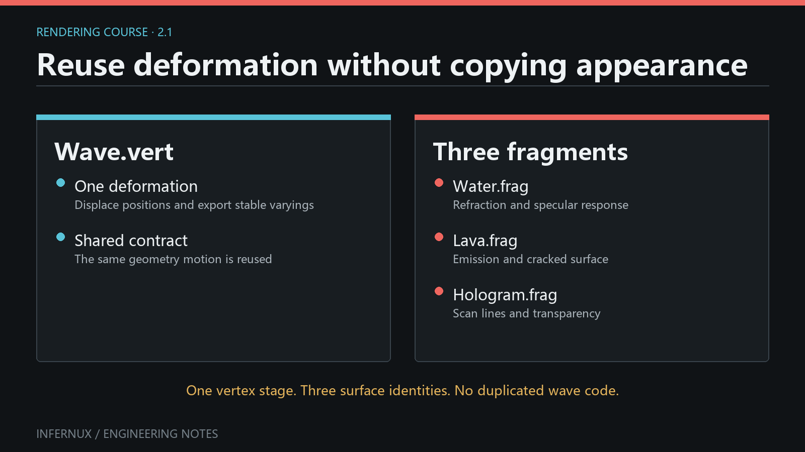
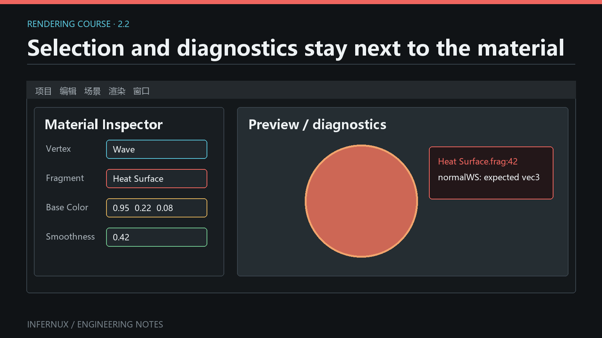

<!-- language:en -->

<span class="mini-tag">Custom Rendering · Chapter 2</span>

# Vertex stages and reusable deformation

The vertex stage answers one narrow question: **where is this vertex, and what information should reach the fragment stage?** Keeping it separate from the fragment stage lets the same deformation drive several visual styles. A wave vertex stage can support water, lava, holograms, or a depth-only utility without duplicating the motion.

<div class="learn-article-toc"><strong>In this chapter</strong><a href="#minimal-stage">The minimal stage</a><a href="#vertex-layout">Vertex layout</a><a href="#vertex-hook">The vertex hook</a><a href="#varyings">Stage interfaces</a><a href="#geometry-data">Geometry responsibilities</a><a href="#reuse">Reuse and debugging</a></div>

<figure class="learn-figure">
  
  <figcaption>Diagram: the same animated mesh shown with three materials to demonstrate stage reuse.</figcaption>
</figure>

## The minimal stage {#minimal-stage}

The standard mesh path needs only a name:

```glsl
#version 450

ShaderInfo {
    Name "Standard"
}
```

With no authored hook, Infernux supplies the normal mesh inputs and performs the standard object-to-world-to-view-to-clip transform. This is deliberate: ordinary materials should not repeat matrix boilerplate, descriptor layouts, or vertex locations.

`Name` is the exact, case-sensitive ID shown in the Material selector. The file name organizes the asset; it never becomes the selector value. A file named `wave_bent.vert` with `Name "Wave"` appears as `Wave` under **Vertex**.

### How the Material finds it

When a `.vert` or `.frag` is imported from the project's `Assets` tree, the editor reads its compiled metadata and `ShaderInfo Name`. It also scans the built-in shader directory. A `.vert` appears in the Material's **Vertex** selector, a `.frag` appears under **Fragment**, and `Hidden On` entries stay out of both menus.

The current selector is keyed only by `Name`: it scans project `Assets` before built-in shaders, duplicate IDs collapse to the first path discovered, the menu does not show origin, and it emits no duplicate-origin diagnostic. Keep names unique across project and built-in shaders; do not depend on discovery order among project files. A project stage can retain its GUID/path reference, while a built-in stage is resolved by ID. After changing `ShaderInfo Name`, save and reimport the shader, then reselect the new ID on affected Materials. Renaming only the file leaves the selector ID unchanged.

The material linker pairs the selected stages and checks their properties and varyings before Vulkan pipeline creation. To verify selection semantics, save `Assets/Shaders/wave_bent.vert` with `Name "Wave"`, wait for import, and confirm that **Vertex** lists `Wave` and does not list `wave_bent.vert`. Change only `Name` to `Wave V2`, reimport, and confirm that affected Materials require the new ID.

## Where vertex data comes from {#vertex-layout}

The hook edits `VertexInput`, but that public struct sits on top of a fixed engine vertex buffer. The buffer names below are implementation fields; shader authors use the `VertexInput` field in the next column:

| Location | Engine buffer field | `VertexInput` field | Type | Notes |
| --- | --- | --- | --- | --- |
| 0 | `pos` | `position` | `vec3` | Local-space position |
| 1 | `normal` | `normal` | `vec3` | Missing source normals face +Y |
| 2 | `tangent` | `tangent` | `vec4` | `.w` carries the bitangent sign |
| 3 | `color` | `color` | `vec3` | Defaults to white |
| 4 | `texCoord` | `texCoord` | `vec2` | Primary UV set |
| 5 | `boneIndices` | Engine-owned | `uvec4` | GPU skinning palette indices |
| 6 | `boneWeights` | Engine-owned | `vec4` | GPU skinning weights |

For example, location 0 is stored as `pos` in the C++ `Vertex` structure, then presented to user code as `v.position`. Shader code never accesses `v.pos`. The generated builtins mirror locations 0-6 and construct the public `VertexInput` contract from them. Bone attributes stay engine-owned because skinning runs after the hook. The hook sees pre-skin local data, and exposing bone values would invite per-instance logic that the current contract does not support.

Vulkan pipelines do not bind all seven attributes blindly. After SPIR-V compilation, `FilterVertexAttributesForReflection()` (`VertexInputFilter.h`) keeps only the locations the vertex shader actually reads, so a shader that never samples skinning does not create unused attribute descriptors; `MaterialPipelineManager.cpp` calls it during pipeline creation. The CPU-side buffer layout never changes.

Different geometry domains reuse or replace this layout:

- **Mesh** is the default domain: the seven-attribute buffer, the generated builtins, and the optional `vertex()` hook.
- **Sprite** renders a quad through the same mesh path (`SpriteRenderer` attaches an inline quad mesh), so it uses the identical layout and hooks.
- **Standalone** programs such as `gizmo.vert`, `grid.vert`, and `flat.vert` write their own `main()` under `Capabilities [Standalone]`. Gizmos still feed them the standard `Vertex` structure, but the author owns the whole vertex stage.
- **ParticleSprite** is a separate domain with no vertex buffer at all. The particle sprite stage declares `Capabilities [ParticleSprite]`, and the engine builds six billboard corners from instance storage buffers inside `main()`. Selecting a ParticleSprite or Fullscreen stage on a mesh Material fails with a domain error.

Evidence: the attribute table and defaults follow `InxRenderStruct.h` (`Vertex` and `getAttributeDescriptions()`); the reflection filter follows `VertexInputFilter.h` and its call site in `MaterialPipelineManager.cpp`; domain selection follows `ShaderStageLinker.cpp` and the stage capability sets.

## Add deformation with `vertex()` {#vertex-hook}

Define the fixed hook only when the geometry needs to change:

```glsl
#version 450

ShaderInfo {
    Name "Wave"
}

void vertex(inout VertexInput v) {
    float phase = v.position.x * 4.0 + _Globals._Time.x * 2.0;
    v.position.y += sin(phase) * 0.1;
}
```

The hook edits object-space `VertexInput`; the generated stage continues through the standard transforms afterwards. This preserves engine features that depend on a consistent geometry contract, including camera rendering, shadows, picking, and compatible motion data.

Choose the coordinate space intentionally. Object-space deformation follows object rotation and scale. World-space behavior needs an explicit calculation through the generated world transform or an imported helper.

`_Globals._Time` follows one source-defined convention: `.x` is unscaled seconds accumulated by the renderer, `.y` is `sin(x)`, `.z` is `cos(x)`, and `.w` is the current render-frame delta in seconds. The clock starts when the renderer is initialized, advances in Edit Mode and while gameplay is paused, does not reset on Play/Stop, and is unaffected by `Time.time_scale`; one unusually long frame contributes at most `1/3` second. `Time.shader_time` is the public CPU-side value that mirrors `_Globals._Time.x`. Restarting the renderer starts a new clock, so do not use `_Time.x` as saved gameplay time or a deterministic simulation tick.

### Generated mesh-path boundary

For ordinary mesh variants, Infernux calls `vertex()` on unskinned object-local data, records the post-hook local position, then applies current skinning and the current per-instance model transform. `VertexInput` exposes `position`, `normal`, `tangent`, `color`, and `texCoord`; it does not expose bone indices/weights, an instance ID, or custom per-instance payload. One Material hook therefore runs identically for every instance before each instance transform.

This order has concrete consequences:

- A skinned mesh carries the deformed local position through the generated bone palette. The hook cannot branch on bone data through the current `VertexInput` contract.
- Instanced meshes receive a generated current instance transform; the Motion variant also receives its previous transform. The hook has no public per-instance selector, so it cannot express instance-specific deformation. Split renderer/material configurations when instances need different hook behavior.
- The generated model normal transform uses an inverse-transpose matrix, so non-uniform object or instance scale is handled after the hook. It cannot reconstruct a normal or tangent left stale by the deformation. Skinned directions use the bone matrix's `mat3`; non-uniform scale inside bone matrices needs asset-specific visual verification.

<div class="learn-warning"><strong>Deformed geometry has more than one consumer.</strong><p>If an effect changes the visible silhouette, verify the Scene camera, Game camera, shadow caster, object picking, and motion-vector path. The generated variants reuse the hook, but bounds and previous-frame procedural deformation still have separate limits described below.</p></div>

## Stage interfaces without manual layouts {#varyings}

Infernux owns Vulkan locations, descriptor sets, generated uniform blocks, and push-constant layouts. Leave `layout(location=...)` and `layout(set=..., binding=...)` to the compiler. Structured `Inputs`, `Outputs`, `Resources`, and `PushConstants` describe intent; the shader compiler assigns the physical interface.

Here is a complete pair. Save the first file as `Assets/Shaders/wind_bent.vert`:

```glsl
#version 450

ShaderInfo {
    Name "Wind Bent"
    Outputs {
        Smooth Float2 detailUV Semantic(TexCoord7)
        Smooth Float windMask
    }
}

VertexOutput vertex(inout VertexInput v) {
    VertexOutput result;
    float phase = v.position.x * 4.0 + _Globals._Time.x * 2.0;
    float bend = sin(phase) * 0.1;
    v.position.y += bend;
    result.detailUV = v.texCoord * 2.0;
    result.windMask = clamp(abs(bend) * 10.0, 0.0, 1.0);
    return result;
}
```

Save the consumer as `Assets/Shaders/wind_surface.frag`:

```glsl
#version 450

ShaderInfo {
    Name "Wind Surface"
    ShadingModel Unlit
    Inputs {
        Smooth Float2 detailUV Semantic(TexCoord7)
        Smooth Float windMask
    }
}

void surface(out SurfaceData s) {
    s = InitSurfaceData();
    s.albedo = vec3(fragmentInput.detailUV, fragmentInput.windMask);
}
```

Create or open a Material, select `Wind Bent` under **Vertex** and `Wind Surface` under **Fragment**, then assign it to a MeshRenderer. The producer writes both members of `VertexOutput`; the consumer reads those same members from `fragmentInput`.

Names, types, interpolation, semantics, and declared spaces form one contract. `Float4` to `Float3` and `Smooth` to `Flat` both produce link errors. A missing or mismatched member is reported before Vulkan pipeline creation.

Location assignment is engine-owned as well. The built-in varyings occupy locations 0-5 (`v_WorldPos`, `v_Normal`, `v_Tangent`, `v_Color`, `v_TexCoord`, `v_ViewDepth`). Authored varyings start at location 6. The linker sorts them by semantic first, then by name, so the declaration order in the file does not decide the layout; a `mat4` consumes four consecutive locations. The ceiling is location 15, and location 15 itself is reserved for engine pass data such as the picking ID. `ShaderStageLinker` applies these rules when the stages link at import time.

Two checks enforce the contract. At import time, the stage linker pairs every fragment `Inputs` member with a vertex `Outputs` member by name and compares type, interpolation, semantic, and space. Its diagnostics cover a missing vertex output, a type mismatch, an interpolation mismatch, a semantic mismatch, a space mismatch, duplicate varyings, duplicate semantics, and the location ceiling. At runtime, when the linked program is created, `ShaderProgram::ValidateStageInterface()` reflects the compiled SPIR-V and compares each fragment input with the vertex output at the same location, including the vector width. A stage pair that passes the source-level link but disagrees in reflection fails program creation before any Vulkan pipeline is built.

Custom varyings are only needed when the fragment stage needs data beyond the standard contract. Built-in surface helpers already expose standard UVs, vertex color, world normal, and related mesh data.

`Space(World)` is a checked label with no transform behavior. The linker verifies that producer and consumer use the same label; object-to-world multiplication remains author code. Compute a value in world space first with the transform or helper available to that geometry domain, then declare it `Space(World)` on both sides. Tagging object-space `v.position` as world space creates a consistently mislabeled varying.

## Bounds, normals, and tangents {#geometry-data}

Changing `v.position` moves GPU vertices while the CPU mesh data stays unchanged. The renderer gets bounds, normals, and tangents from that mesh data, and each solves a different problem:

- **Bounds** decide whether a renderer is submitted for camera and shadow culling and also support Scene-view framing. Infernux derives local bounds from imported or inline mesh vertices, then transforms that box to world space. Shader motion is invisible to that calculation. The current Editor and Python binding expose no per-renderer bounds override; `MeshRenderer.get_world_bounds()` returns the six-value world AABB for inspection only.
- **Normal** describes the surface direction used by lighting. Translation preserves it; bending, waves, and uneven displacement usually change it. Update `v.normal` in object space when the deformation changes the local slope. The generated stage handles the later skinning and world-space normal transform.
- **Tangent** supplies the UV-aligned axis used with the normal to build the tangent basis for normal maps. If deformation rotates that axis, update `v.tangent.xyz` too and preserve or deliberately recompute its handedness in `.w`. Otherwise the silhouette can look right while normal-mapped light slides in the wrong direction.

Reproduce a bounds failure before choosing a workaround:

1. Assign the `Wave` stage to a Cube, temporarily raise the amplitude from `0.1` to `1.0`, and keep the Cube's Transform scale at `(1, 1, 1)`.
2. In Game view, move the Cube slowly toward the top edge of the camera frustum. At some phases, displaced vertices are still mathematically inside the view after the original CPU box has left it; the whole renderer then disappears. A shadow may disappear at a different light-frustum edge for the same reason.
3. With the Transform held fixed, inspect `MeshRenderer.get_world_bounds()` from an Editor script over several frames. The tuple remains constant while `_Time` changes the visible vertices. A clean Console plus this constant box distinguishes culling from a shader compile failure.
4. Restore a conservative amplitude or author/import a mesh whose CPU vertex positions cover the complete deformation envelope. For procedural geometry, calling the public `set_inline_mesh_data(...)` recomputes bounds from every supplied position; indexed data can include envelope positions that are not referenced by a triangle. There is currently no direct public call to enlarge the existing renderer bounds.

Arbitrary GLSL gives the engine no basis for inferring bounds, normals, or tangents. For a displacement texture, sample neighboring heights and rebuild the local normal/tangent from the new slope. Verify the CPU envelope separately with the frustum-edge test above.

## Reuse and debugging {#reuse}

Treat `.vert` files as geometry behavior and keep them independent of specific material names. Useful reusable stages include wind bending, water displacement, vegetation flutter, skinning variants, or a standard unmodified mesh path.

When a material disappears after changing its vertex stage, check in this order:

1. The selected value matches `ShaderInfo Name` exactly, including case, and does not collide with another project or built-in ID.
2. The shader finished import. Clear Console, save/reimport the file, assign the Material again, and treat any import, stage-link, or Vulkan pipeline error as a failed check.
3. A stage with custom `Outputs` returns a `VertexOutput`; a stage that only edits built-in geometry may use the `void vertex(inout VertexInput v)` hook.
4. Every custom output has a matching fragment input with the same name, type, interpolation, semantic, and space.
5. The stage belongs to the geometry domain expected by the Material. Fullscreen and particle programs are rejected with a domain error.

### Verify shadow, picking, and motion variants

The compiler places the same hook in compatible color, shadow/depth, picking, and motion vertex variants. Verify the observable product of each path:

1. **Color:** clear Console, reimport, assign the Material, and confirm the same animated silhouette in Scene and Game. No new shader/link/pipeline error is allowed.
2. **Shadow:** add a large Plane below the object, use a shadow-enabled Directional Light, and keep the deformed renderer's `casts_shadows` enabled. Move the light or camera until the wavy edge is legible. The shadow silhouette must move with the visible silhouette; an early disappearance near the light frustum points back to CPU bounds.
3. **Picking:** in Scene view, click a visibly displaced part that is still inside the submitted renderer. The same GameObject must become selected in Hierarchy. Repeat at two different wave phases.
4. **Object motion:** create the built-in **Motion Blur** RenderEffect, mount it in an active RenderStack's `final` stage as described in [RenderStack mount points](renderstack-mount-points.html), and animate the object's Transform during Play. Visible blur on the moving object verifies previous model transforms. Duplicate the opaque object so both MeshRenderers share one mesh and Material, then move them independently; this setup is eligible for automatic instance batching and exercises per-instance history. On a skinned test mesh, play a bone animation and check the moving limbs to verify previous bone transforms.
5. **Procedural local motion:** keep the object Transform still and observe the `_Time` wave with Motion Blur or TAA. The current Motion variant reuses the current frame's post-hook local position for both clip-space histories, then applies previous bone and model transforms. It does not evaluate the hook with previous `_Time`. Time-driven local deformation therefore has no reliable self-motion vector and may show missing blur or TAA ghosting. Accurate previous-frame procedural deformation requires work outside the current public vertex-hook contract.

<figure class="learn-figure">
  
  <figcaption>Diagram: the Vertex selector displays the `ShaderInfo Name` value <code>Wave</code>; the adjacent example shows a fragment-stage type diagnostic. This is a schematic, not a pixel-exact Editor capture.</figcaption>
</figure>

<div class="learn-note"><strong>Evidence note.</strong><p>Name discovery follows <code>inspector_shader_utils.py</code>. Hook order and generated variants follow the mesh, shadow, picking, and motion templates plus <code>InxShaderLoader.cpp</code>. The vertex attribute layout and reflection filter follow <code>InxRenderStruct.h</code> and <code>VertexInputFilter.h</code>; stage pairing, its diagnostics, and location assignment follow <code>ShaderStageLinker.cpp</code> and <code>ShaderProgram.cpp</code>. The time convention follows <code>EngineGlobals.h</code>, <code>InxRenderer.cpp</code>, and <code>timing.py</code>. The bounds boundary follows <code>MeshRenderer.cpp</code> and the Python declarations in <code>BindingScene.cpp</code>; the documented public surface includes <code>get_world_bounds()</code> and <code>set_inline_mesh_data(...)</code>, with no bounds setter.</p></div>

The next chapter keeps this geometry stage and changes only what the surface is made of.

<!-- language:zh -->

<span class="mini-tag">自定义渲染 · 第 2 章</span>

# 顶点阶段与可复用形变

顶点阶段只回答一个狭窄的问题：**这个顶点在哪里，以及哪些信息需要传给片元阶段？** 把它与片元阶段分开，同一套形变就能服务多种画面风格。一份波浪 Vert 可以同时用于水面、岩浆、全息效果或只写深度的工具 Pass，而不用复制运动逻辑。

<div class="learn-article-toc"><strong>本章内容</strong><a href="#minimal-stage_1">最小顶点阶段</a><a href="#vertex-layout_1">顶点布局</a><a href="#vertex-hook_1">vertex Hook</a><a href="#varyings_1">阶段接口</a><a href="#geometry-data_1">几何数据责任</a><a href="#reuse_1">复用与排错</a></div>

<figure class="learn-figure">
  
  <figcaption>图解：用三个材质展示同一动画网格，直观看出阶段复用。</figcaption>
</figure>

## 最小顶点阶段 {#minimal-stage_1}

标准网格路径只需要一个名字：

```glsl
#version 450

ShaderInfo {
    Name "Standard"
}
```

没有自定义 Hook 时，Infernux 会提供常规网格输入，并完成物体空间到世界、观察和裁剪空间的标准变换。普通材质不需要重复矩阵样板、描述符布局或顶点 Location，这是有意设计的结果。

`Name` 是 Material 选择器显示的精确 ID，并且区分大小写。文件名只负责整理资产，不会成为选择器值。文件 `wave_bent.vert` 若写有 `Name "Wave"`，会在 **Vertex** 中显示为 `Wave`。

### Material 怎样找到它

项目 `Assets` 目录里的 `.vert`、`.frag` 导入后，编辑器会读取编译元数据和 `ShaderInfo Name`，同时也会扫描内置 Shader 目录。`.vert` 进入 Material 的 **Vertex** 选择器，`.frag` 进入 **Fragment**；写了 `Hidden On` 的内部项不会出现在菜单里。

当前选择器只按 `Name` 建索引：它先扫描项目 `Assets`，再扫描内置 Shader；重名 ID 会折叠到先发现的路径。菜单不显示来源，也不会报告来源冲突。项目 Shader 与内置 Shader 应使用全局唯一名字，不能依赖项目文件之间的扫描顺序。项目阶段可以保留 GUID/路径引用，内置阶段则按 ID 解析。修改 `ShaderInfo Name` 后，先保存并重新导入，再让受影响的 Material 重新选择新 ID。只改文件名会保留选择器 ID。

Material 链接器会组合所选阶段，并在 Vulkan Pipeline 创建前检查属性与 Varying。可以这样验证选择语义：把带有 `Name "Wave"` 的文件保存为 `Assets/Shaders/wave_bent.vert`，等待导入，确认 **Vertex** 只列出 `Wave`，不会列出 `wave_bent.vert`。随后只把 `Name` 改为 `Wave V2` 并重新导入，确认受影响的 Material 需要选择新 ID。

## 顶点数据从哪里来 {#vertex-layout_1}

Hook 编辑的是公开结构 `VertexInput`，它建立在固定的引擎顶点缓冲之上。下表中的“引擎缓冲字段”属于底层实现；编写 Shader 时应使用旁边的 `VertexInput` 字段：

| Location | 引擎缓冲字段 | `VertexInput` 字段 | 类型 | 说明 |
| --- | --- | --- | --- | --- |
| 0 | `pos` | `position` | `vec3` | 物体空间位置 |
| 1 | `normal` | `normal` | `vec3` | 缺少源法线时朝向 +Y |
| 2 | `tangent` | `tangent` | `vec4` | `.w` 保存副切线方向符号 |
| 3 | `color` | `color` | `vec3` | 默认白色 |
| 4 | `texCoord` | `texCoord` | `vec2` | 主 UV 集 |
| 5 | `boneIndices` | 引擎内部使用 | `uvec4` | GPU 蒙皮骨骼调色板索引 |
| 6 | `boneWeights` | 引擎内部使用 | `vec4` | GPU 蒙皮权重 |

以 Location 0 为例，C++ `Vertex` 结构把它存为 `pos`，生成代码再把它映射成用户接口里的 `v.position`；用户 Shader 不应写 `v.pos`。生成的 Builtin 会镜像 Location 0 到 6，并据此构造公开的 `VertexInput`。骨骼属性保留给引擎，因为蒙皮在 Hook 之后执行。Hook 看到的是蒙皮前的局部数据，暴露骨骼值只会引出当前契约不支持的逐实例逻辑。

Vulkan Pipeline 不会盲目绑定全部七项属性。SPIR-V 编译完成后，`FilterVertexAttributesForReflection()`（`VertexInputFilter.h`）只保留顶点着色器真正读取的 Location，从不采样蒙皮的 Shader 因此不会产生未使用的属性描述符；`MaterialPipelineManager.cpp` 在创建管线时调用它。CPU 侧缓冲布局始终不变。

不同几何域复用或替换这份布局：

- **Mesh** 是默认域：七属性缓冲、生成的 Builtin，以及可选的 `vertex()` Hook。
- **Sprite** 通过同一条 Mesh 路径渲染四边形（`SpriteRenderer` 会挂载内联 Quad Mesh），使用的布局和 Hook 完全相同。
- **Standalone** 程序（`gizmo.vert`、`grid.vert`、`flat.vert` 等）在 `Capabilities [Standalone]` 下自行编写 `main()`。Gizmo 仍然把标准 `Vertex` 结构喂给它们，整个顶点阶段由作者掌控。
- **ParticleSprite** 是独立域，完全没有顶点缓冲。粒子 Sprite 阶段声明 `Capabilities [ParticleSprite]`，引擎在 `main()` 内从实例存储缓冲生成公告板的六个角点。给 Mesh Material 选择 ParticleSprite 或 Fullscreen 阶段会以域错误拒绝。

证据：属性表与默认值来自 `InxRenderStruct.h`（`Vertex` 与 `getAttributeDescriptions()`）；反射过滤来自 `VertexInputFilter.h` 及其在 `MaterialPipelineManager.cpp` 的调用点；域选择来自 `ShaderStageLinker.cpp` 与各阶段的 Capability 集合。

## 用 `vertex()` 加入形变 {#vertex-hook_1}

只有几何体确实需要改变时，才定义固定 Hook：

```glsl
#version 450

ShaderInfo {
    Name "Wave"
}

void vertex(inout VertexInput v) {
    float phase = v.position.x * 4.0 + _Globals._Time.x * 2.0;
    v.position.y += sin(phase) * 0.1;
}
```

这个 Hook 修改物体空间的 `VertexInput`，随后生成阶段继续执行标准变换。这样，相机渲染、阴影、物体拾取以及兼容的运动数据仍然可以共享同一份几何契约。

要明确选择坐标空间。物体空间形变会跟随物体的旋转与缩放；世界空间行为需要通过生成的世界变换或导入函数显式计算。

`_Globals._Time` 采用源码定义的固定约定：`.x` 是渲染器累计的未缩放秒数，`.y` 是 `sin(x)`，`.z` 是 `cos(x)`，`.w` 是当前渲染帧的秒级 Delta。时钟在渲染器初始化时开始，Edit Mode 与游戏暂停期间仍会推进，Play/Stop 不会重置它，`Time.time_scale` 也不会影响它；异常长的一帧最多累计 `1/3` 秒。`Time.shader_time` 是与 `_Globals._Time.x` 对齐的公共 CPU 侧值。重启渲染器会启动新时钟，因此 `_Time.x` 不适合充当存档游戏时间或确定性模拟 Tick。

### 生成 Mesh 路径的边界

对常规 Mesh 变体，Infernux 先在未蒙皮的物体空间数据上调用 `vertex()`，记录 Hook 处理后的局部位置，再应用当前骨骼蒙皮与当前实例 Model 变换。`VertexInput` 公开 `position`、`normal`、`tangent`、`color` 和 `texCoord`，不包含骨骼索引/权重、实例 ID 或自定义实例数据。因此，同一 Material Hook 会在各实例变换之前以相同逻辑运行。

这套顺序带来几项明确限制：

- 蒙皮 Mesh 会让形变后的局部位置继续经过生成的骨骼调色板；当前 `VertexInput` 契约无法让 Hook 按骨骼数据分支。
- 实例化 Mesh 会获得生成的当前实例变换；Motion 变体也会获得上一帧实例变换。Hook 没有公共的逐实例选择值，无法表达实例间不同的形变。实例需要不同 Hook 行为时，应拆分 Renderer/Material 配置。
- 生成的 Model 法线变换使用逆转置矩阵，因此 Hook 之后的非均匀物体或实例缩放可以被处理；它无法修复形变后仍然过期的 Normal 或 Tangent。蒙皮方向使用骨骼矩阵的 `mat3`，骨骼矩阵含非均匀缩放时需要针对资产做视觉验证。

<div class="learn-warning"><strong>形变后的几何体会进入多条路径。</strong><p>只要效果改变了轮廓，就应同时验证 Scene 相机、Game 相机、阴影投射、点击拾取和运动向量路径。生成变体会复用 Hook；Bounds 与上一帧程序化形变仍有各自限制，详见下文。</p></div>

## 不手写 layout 的阶段接口 {#varyings_1}

Vulkan Location、描述符 Set、生成的 Uniform Block 与 Push Constant 布局都由 Infernux 管理。不要手写 `layout(location=...)` 或 `layout(set=..., binding=...)`。结构化的 `Inputs`、`Outputs`、`Resources` 和 `PushConstants` 用于描述意图，Shader 编译器负责分配物理接口。

下面是一对可以直接配合的完整文件。先保存为 `Assets/Shaders/wind_bent.vert`：

```glsl
#version 450

ShaderInfo {
    Name "Wind Bent"
    Outputs {
        Smooth Float2 detailUV Semantic(TexCoord7)
        Smooth Float windMask
    }
}

VertexOutput vertex(inout VertexInput v) {
    VertexOutput result;
    float phase = v.position.x * 4.0 + _Globals._Time.x * 2.0;
    float bend = sin(phase) * 0.1;
    v.position.y += bend;
    result.detailUV = v.texCoord * 2.0;
    result.windMask = clamp(abs(bend) * 10.0, 0.0, 1.0);
    return result;
}
```

再把消费端保存为 `Assets/Shaders/wind_surface.frag`：

```glsl
#version 450

ShaderInfo {
    Name "Wind Surface"
    ShadingModel Unlit
    Inputs {
        Smooth Float2 detailUV Semantic(TexCoord7)
        Smooth Float windMask
    }
}

void surface(out SurfaceData s) {
    s = InitSurfaceData();
    s.albedo = vec3(fragmentInput.detailUV, fragmentInput.windMask);
}
```

打开 Material，在 **Vertex** 里选 `Wind Bent`，在 **Fragment** 里选 `Wind Surface`，再赋给 MeshRenderer。生产端填写 `VertexOutput` 的两个成员，消费端从 `fragmentInput` 读取同名成员，这才是一条完整 Varying 链路。

名称、类型、插值方式、Semantic 与声明空间共同组成契约。`Float4` 不能接到 `Float3`，`Smooth` 也不能接到 `Flat`；缺项或不匹配会在 Vulkan Pipeline 创建前给出诊断。

Location 分配同样归引擎。内置 Varying 固定占 location 0 到 5（`v_WorldPos`、`v_Normal`、`v_Tangent`、`v_Color`、`v_TexCoord`、`v_ViewDepth`），自定义 Varying 从 location 6 开始。链接器先按 Semantic 排序、再按名字排序，文件里的声明顺序不决定布局；`mat4` 连续占用 4 个 location。上限是 location 15，location 15 本身保留给拾取 ID 等引擎 Pass 数据。`ShaderStageLinker` 在导入期链接阶段时应用这些规则。

这套契约有两道检查。导入期，阶段链接器按名字把每个片元 `Inputs` 成员配对到顶点 `Outputs` 成员，再比较类型、插值方式、Semantic 与空间；它的诊断覆盖缺失顶点输出、类型不匹配、插值不匹配、Semantic 不匹配、空间不匹配、重复 Varying、重复 Semantic 以及 Location 上限。运行期创建链接程序时，`ShaderProgram::ValidateStageInterface()` 反射编译后的 SPIR-V，按 Location 逐项比较片元输入与顶点输出，包括向量宽度。源级链接通过但反射不一致的阶段组合，会在程序创建阶段失败，此时任何 Vulkan Pipeline 都还没有开始构建。

多数材质用不到自定义 Varying。内置 Surface Helper 已经提供常规 UV、顶点色、世界法线等网格数据；只有标准契约没带上 Frag 真正需要的值时，才值得增加接口。

`Space(World)` 只是一枚会被校验的标签，本身没有变换能力。链接器确认生产端和消费端使用同一个 Space；object-to-world 乘法仍由作者编写。先用当前几何域提供的变换或 Helper 算出真正的世界空间值，再在两端都标记 `Space(World)`。给物体空间的 `v.position` 直接贴上这个标签，会得到一条“双方一致、内容错误”的 Varying。

## Bounds、Normal 与 Tangent 各管什么 {#geometry-data_1}

修改 `v.position` 只移动 GPU 上的顶点，CPU Mesh 里的 Bounds、Normal 与 Tangent 会保持原值。三者分别解决不同问题：

- **Bounds** 决定相机与阴影裁剪时是否提交 Renderer，也用于 Scene 视图取景。Infernux 从导入或内联 Mesh 顶点得到局部 Bounds，再把盒子变换到世界空间；Shader 形变不会进入这次计算。当前 Editor 与 Python 绑定都没有逐 Renderer 的 Bounds 覆盖入口；`MeshRenderer.get_world_bounds()` 只读，返回六个数值组成的世界空间 AABB。
- **Normal** 告诉光照表面朝向。整体平移不用改它，弯曲、波浪和不均匀位移通常要改。形变改变局部坡度时，在物体空间更新 `v.normal`；之后的蒙皮与世界空间法线变换由生成阶段继续完成。
- **Tangent** 是沿 UV 方向的轴，它和 Normal 一起构成法线贴图使用的切线基。形变若旋转了这条轴，也要更新 `v.tangent.xyz`，并保留或有意重算 `.w` 中的手性。否则轮廓虽然正确，法线贴图的受光方向仍可能滑动。

先复现一次 Bounds 故障，再决定修正方式：

1. 把 `Wave` 阶段赋给 Cube，暂时把振幅从 `0.1` 提高到 `1.0`，保持 Cube 的 Transform Scale 为 `(1, 1, 1)`。
2. 在 Game 视图里把 Cube 缓慢移向相机视锥上边缘。某些相位下，CPU 原始包围盒已经离开视锥，形变顶点按公式仍会落在画面内，此时整个 Renderer 会提前消失。阴影也可能在另一处灯光视锥边缘提前消失。
3. 固定 Transform，通过 Editor 脚本连续几帧读取 `MeshRenderer.get_world_bounds()`。`_Time` 持续改变可见顶点时，这个 Tuple 仍保持不变。Console 干净且包围盒不变，可以把裁剪问题与 Shader 编译失败区分开。
4. 把振幅恢复到保守范围，或编写/导入 CPU 顶点覆盖完整形变包络的 Mesh。程序化几何调用公共 `set_inline_mesh_data(...)` 时，会根据所有传入 Position 重算 Bounds；索引数据可以包含不被三角形引用的包络 Position。当前没有直接扩大已有 Renderer Bounds 的公共调用。

引擎无法从任意 GLSL 自动推导 Bounds、Normal 或 Tangent。使用位移贴图时，可以采样邻近高度，根据新坡度重建局部 Normal 与 Tangent；CPU 包络仍需单独通过上面的视锥边缘流程验证。

## 复用与排错 {#reuse_1}

把 `.vert` 看作“几何行为”，并与具体材质名解耦。适合复用的顶点阶段包括风力弯曲、水面位移、植被摆动、蒙皮变体以及完全不修改网格的标准路径。

更换 Vert 后物体消失时，按这个顺序检查：

1. 所选值是否与 `ShaderInfo Name` 精确匹配，包括大小写，并确认它没有和项目或内置 ID 重名。
2. Shader 是否完成导入。清空 Console，保存并重新导入文件，再次赋值 Material；任何导入、阶段链接或 Vulkan Pipeline 错误都表示检查未通过。
3. 有自定义 `Outputs` 时是否返回 `VertexOutput`；只修改内置几何数据时才使用 `void vertex(inout VertexInput v)`。
4. 每个自定义输出是否都有名称、类型、插值、Semantic 与 Space 完全匹配的片元输入。
5. 该阶段是否属于 Material 需要的几何域。全屏或粒子程序会被明确的域错误拒绝。

### 验证阴影、拾取与运动变体

编译器会把同一个 Hook 放入兼容的颜色、阴影/深度、拾取与运动顶点变体。逐项检查每条路径的可观察产物：

1. **颜色：** 清空 Console，重新导入并赋值 Material，确认 Scene 与 Game 中出现相同的动画轮廓；不得出现新增 Shader、链接或 Pipeline 错误。
2. **阴影：** 在物体下方添加大 Plane，使用启用阴影的 Directional Light，并保持形变 Renderer 的 `casts_shadows` 开启。调整灯光或相机，让波浪边缘清楚可见。阴影轮廓应与可见轮廓同步；它在灯光视锥边缘提前消失时，回到 CPU Bounds 检查。
3. **拾取：** 在 Scene 视图点击仍处于已提交 Renderer 内的可见形变部位，Hierarchy 应选中同一 GameObject。换两个波浪相位重复一次。
4. **物体运动：** 创建内置 **Motion Blur** RenderEffect，按 [RenderStack 挂载点](renderstack-mount-points.html)一章把它挂到活动 RenderStack 的 `final` 阶段，并在 Play 中动画化物体 Transform。移动物体出现可见模糊，可以验证上一帧 Model 变换。复制这个不透明物体，让两个 MeshRenderer 共用同一 Mesh 与 Material，再分别移动它们；这套配置满足自动实例批处理的候选条件，可以覆盖逐实例历史。对蒙皮测试 Mesh 播放骨骼动画并检查移动肢体，可以验证上一帧骨骼变换。
5. **程序化局部运动：** 保持物体 Transform 静止，用 Motion Blur 或 TAA 观察 `_Time` 波浪。当前 Motion 变体会把本帧 Hook 处理后的局部位置用于两套裁剪空间历史，再应用上一帧骨骼与 Model 变换；它不会用上一帧 `_Time` 重新计算 Hook。因此，时间驱动的局部形变没有可靠的自身运动向量，可能缺少模糊或出现 TAA 拖影。精确的上一帧程序化形变需要超出当前公共 Vertex Hook 契约的实现工作。

<figure class="learn-figure">
  
  <figcaption>图解：Vertex 选择器显示 `ShaderInfo Name` 的值 <code>Wave</code>；旁边示例展示片元阶段类型诊断。这是一张示意图，不对应 Editor 的逐像素截图。</figcaption>
</figure>

<div class="learn-note"><strong>证据说明。</strong><p>Name 发现语义来自 <code>inspector_shader_utils.py</code>。Hook 顺序与生成变体来自 Mesh、Shadow、Picking、Motion 模板及 <code>InxShaderLoader.cpp</code>。顶点属性布局与反射过滤来自 <code>InxRenderStruct.h</code> 与 <code>VertexInputFilter.h</code>；阶段配对、配对诊断与 Location 分配来自 <code>ShaderStageLinker.cpp</code> 与 <code>ShaderProgram.cpp</code>。时间约定来自 <code>EngineGlobals.h</code>、<code>InxRenderer.cpp</code> 与 <code>timing.py</code>。Bounds 边界来自 <code>MeshRenderer.cpp</code> 和 <code>BindingScene.cpp</code> 的 Python 声明；文中公共表面包含 <code>get_world_bounds()</code> 与 <code>set_inline_mesh_data(...)</code>，没有 Bounds Setter。</p></div>

下一章会保留这份几何阶段，只改变表面由什么组成。
